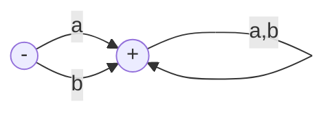
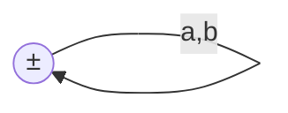
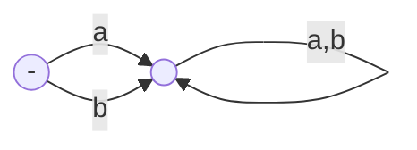
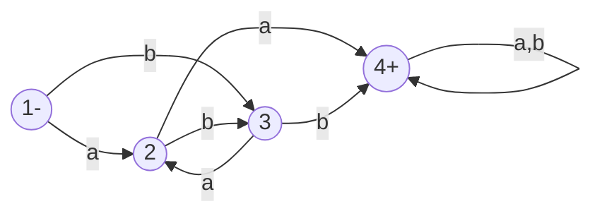
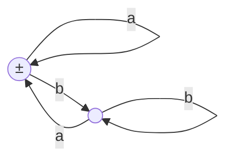
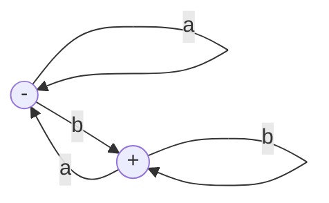
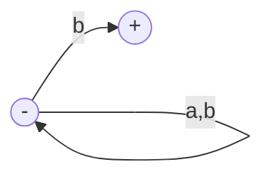

Fig1
---

```mermaid
flowchart LR
  q1(("-"))
  q2(("+"))
  q1-->|a|q2
  q1-->|b|q2
  q2-->|"a,b"|q2
```

Fig2
---

```mermaid
flowchart LR
  q2(("±"))
  q2-->|"a,b"|q2
```

Fig3
---

```mermaid
flowchart LR
  q1(("-"))
  q2((" "))
  q1-->|a|q2
  q1-->|b|q2
  q2-->|"a,b"|q2
```

Fig6
---

```mermaid
flowchart LR
  q1(("1-"))
  q2(("2"))
  q3(("3"))
  q4(("4+"))
  q1-->|a|q2
  q1-->|b|q3
  q2-->|b|q3
  q3-->|a|q2
  q2-->|a|q4
  q3-->|b|q4
  q4-->|"a,b"|q4
```

Fig7
---

```mermaid
flowchart LR
  q1(("±"))
  q2((" "))
  q1-->|a|q1
  q1-->|b|q2
  q2-->|a|q1
  q2-->|b|q2
```

Fig10
---
- FA

```mermaid
flowchart LR
  q1(("-"))
  q2(("+"))
  q1-->|a|q1
  q1-->|b|q2
  q2-->|a|q1
  q2-->|b|q2
```
- TG

```mermaid
flowchart LR
  q1(("-"))
  q2(("+"))
  q1-->|"a,b"|q1
  q1-->|b|q2
```