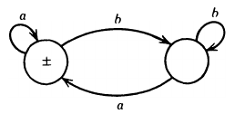

__Finite automata__

_ict chapter 5_

Introduction
---
- Finite automata (FA) are one of the mathematical models of computation
  - called finite state automata (FSA)
- A FA has a finite set of states
  - it transits from states to states based on the current states and inputs
  - it has one start state and zero or more end states

🍎 Demo
---
Run the FA with input strings `a, aa, aaa, aaaa` over $Σ=\lbrace a \rbrace$ separately:

- `⊖` is the start state, `⊕` is the final state
- if a string $s$ runs the $FA$ into its final state we say
  - FA accepts, or recognizes $s$, denoted as $s∈FA$
  - otherwise, FA rejects the string, denoted as $s∉FA$
- if $∀s∈L: s∈FA$, we say language $L$ is defined by the $FA$, or
  - $FA$ accepts $L$
- the FA above accepts string {a,aa,aaa,⋯}, i.e. the language $a^+$

Formal definition of FA
---
A FA is a 5-tuple $(Q,Σ,q_0,A,δ)$  where

- $Q$ is a finite set of states
- $Σ$ is a finite input alphabet
- $q_0∈Q$ is the initial or start state
- $A⊆Q$ is the set of accepting states
- $δ:Q×Σ→Q$ is the transition function

The transition function $δ(q,σ)$ means

- The FA transits from state $q$ to state $q'=δ(q,σ)$ 
  - if it is in state $q∈Q$ and receives the input $σ∈Σ$
- ⚠️ For each state, every letter in $Σ$ and the next state must be specified

Related terms
---
- accepting state is also called 
  - halting state, terminal state, or final state
- FA is also called
  - finite acceptor, or language recognizer, 
  - since its sole job is to accept or recognize certain input strings and reject others
- ⚠️ FAs accept no language if 
  - they have no initial or final states, or
  - their final states cannot be reached because
    - they disconnected from other states, or
    - there are no arrows pointing at them

💡 Demo
---
Let $Σ=\lbrace a,b\rbrace, Q=\lbrace x,y,z\rbrace$, and $δ:Q×Σ→Q$ be defined in the table below

| input | a | b |
|:---:|:---:|:---:|
| `⊖` x | y | z |
| y | x | z |
| `⊕` z | z | z |

The transition function can be represented with the *transition graphs* below in three conventions:

- convention 1

- convention 2

- convention 3

- or simply,

- Run the FA with `aaaabba, bbaabbbb`
- This FA accepts $`\mathbf{(a+b)^*b(a+b)^*}`$

🍎 Building FAs given REs or languages
---
- $\mathbf{(a+b)^+}$
  - the set of all strings except $\mathbf{ϵ}$

- ---
- $\mathbf{(a+b)^*}$
  - `±` means the state is both initial and final

---

Two types of FAs that accept NO languages
---
- FAs that have no final states
 
- FAs whose final states cannot be reached from the start sate
 
 

- ---
- all words over alphabet $Σ=\lbrace a,b\rbrace$ with even number of letter

  

- ---
- $\mathbf{a(a+b)^*}$
  - all words begin with $a$

- or with two final states

- or with more final states
  - ⚠️ there is no unique FA for a given language

- ---
-  L = {`aaa`, `bbb`}
  - ⚠️ any finite languages can be built similarly

- ---
- all words containing a triple letter, either `aaa` or `bbb`

䷼ Theorem
---
- A language acceptable by a FA can be defined by REs
- The language defined by a RE can be accepted by some FAs
- There are languages are neither accepted by FAs nor defined by REs

🍎 Find the language or RE accepted by a given FA
---
- path: concatenation
- branch: union
- loop: Star closure

- FA1:

- strings have a double letter in them
  - $\mathbf{(a+b)^*(aa+bb)(a+b)^*}$

- ---
- FA2

- words with b as the third letter
  - $\mathbf{(aab+abb+bab+bbb)(a+b)^*}$, or
  - $\mathbf{(a+b)^2b(a+b)^*}$

- ---
- FA3

- L={baa}

- ---
- FA4

- L={baa,ab}

- ---
- FA5

- $`\mathbf{a^*(a^*ba^*ba^*ba^*)^*(a + a^*ba^*ba^*ba^*)}`$
  - or, $\mathbf{(a + ba^*ba^*b)^+}$
  - this FA does not accept ϵ
  - to accept ϵ as well, use the FA below
    - $`\mathbf{(a^*ba^*ba^*ba^*)^*}`$

- ---
- FA6

- L = {ϵ}

- ---
- FA7

- $\mathbf{(a+b)^*a}$
  - has no ϵ

- ---
- FA8

- all words not end in b
  - $\mathbf{(a+b)^*a+ϵ}$

- ---
- FA9

- all words with an odd number of a 's
  - $`\mathbf{b^*ab^*(ab^*ab^*)^*}`$

- ---
- FA10

- all words with a double a in them somewhere
  - $`\mathbf{(a + b)^*aa(a + b)^*}`$

- ---
- FA11

- all words that have different first and last letters
  - $\bm{a(a + b)^*b+b(a + b)^*a}$

- ---
- FA12

- EVEN-EVEN: all words with  an even number of a's as well as an even number of b's
  - all words with an even number of b's will stop at state 1 and 3
  - all words with an even number of a's will stop at state 1 and 2
  - All words that end in state 1 have an even number of a's but an even number of b's
  - All words that end in state 2 have an even number of a's but an odd number of b's
  - All words that end in state 3 have an odd number of a's but an even number of b's
  - All words that end in state 4 have an odd number of a's and an odd number of b's
- $\mathbf{(aa+bb+(ab+ba)(aa+bb)^*(ab+ba))^*}$

Build a FA that can locate an English word or substring
---
- Locate dog

