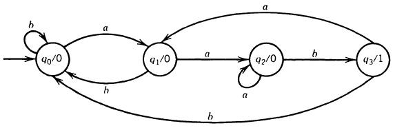

__Finite Automata with Output__

_ict chapter 8_

Two types of FAs with output
---
- Moore machines: output at each state
- Mealy Machines: output during each transition, i.e. on the edge

Moore machine
---
A Moore machine is a collection of five things:
- A finite set of states, {q0, q1, q2, ...}, with q0 as the start state
- An alphabet of *letters* for forming the input string
  - Σ = {a,b,c,...}
- An alphabet of possible output *characters*
  - Γ = {x,y,z,...}
  - not necessary the same as the input alphabet
- A transition table that shows 
  - for *each state* and *each input letter* what state is reached next
- An output table that shows 
  - what character from Γ is printed by each state as it is entered

A Moore machine usually does not define a language of accepted words even though it can do so by answering questions by its output.

🍎 Example 1
---
Given a Moore machine Mo1 with
- Input alphabet: Σ = {a,b}
- Output alphabet: Γ = {0,1}
- States: q0, q1, q2, q3 (q0 = start state)

and the transition table

| Current state | Output   at current state | Next state after input a | Next state after input b |
|:---:|:---:|:---:|:---:|
| -q0 | 1 | q1 | q3 |
| q1 | 0 | q3 | q1 |
| q2 | 0 | q0 | q3 |
| q3 | 1 | q3 | q2 |

its state transition diagram is
- the start state can be indicated with
  - an arrow pointing to it, or
  - a `-` sign
- no final states, no need for any plus signs

Trace input string `abab` on this machine,

- start at q0, output 1, read `a`
- go to q1, output 0, read `b`
- go to q1, output 0, read `a`
- go to q3, output 1, read `b`
- go to q2, output 0, done.
- so the output string is `10010`

🍎 Example 2
---
A Moore machine counts how many times the substring `aab` occurs in a long input string
- once an `aab` is consumed, a `1` is printed out as the indicator

- mark  q0 = -, q3 = +, then this machine accepts all words that end in `aab`
- An FA can be turned into a Moore machine by adding printing instructions to print
  - 0 in the start state
  - 1 in non-final states
  - 2 in final states

Mealy Machine
---
A Mealy machine is a collection of four things:
- A finite set of states, {q0, q1, q2, ...}, with q0 as the start state
- An alphabet of *letters* for forming the input string
  - Σ = {a,b,c,...}
- An alphabet of possible output *characters*
  - Γ = {x,y,z,...}
  - not necessary the same as the input alphabet
- A transition graph that shows 
  - Every state must have exactly one outgoing edge for each possible input letter
  - Each edge is labeled with i/o
    - i is an input letter and 
    - o is an output character
  - The transition is triggered by the input letter i
  - the output char­acter o is printed while traveling on the edge

🍎 Example 3
---
A Mealy machine

- tracing input string `aaabb` on this machine prints `01110`
- A Mealy machine outputs string with the same number of characters as the input string has letters
- As with the Moore machine, the Mealy machine does not define a language by accepting and rejecting input strings, so it has no final states
  - even though it can do so as well by answering questions by its output.
- the two same-direction edges between q2 and q3 can be simplified to be
  - 

🍎 Example 4
---
A Mealy machine that prints out the 1 's complement of an input bit string

- 
  - Given input `001010`, the output is `110101`

🍎 Example 5
---
An increment machine implemented by a Mealy machine that
- adds 1 to a binary string, 
- operate from right to left,
- prints out the result from right to left.
- 
- tracing `11111` on the machine prints `00000`
  - the overflow happens at state `carry`
- tracing `10011` on the machine 
  - from right to left: `11001`
  - prints `00101`, reverse it we get the result `10100`

🍎 Example 6
---
A Mealy machine that recognizes the occurrences of aa or bb in its input string by
- indicating the nth input letter is the second in a pair of dou­ble letters by printing 1 as the nth output character
- 
- a triple prints `011`
  -  since the second and third letters are both the back end of a pair of double

The equivalence of output automata
---
- Two output automata are equivalent if they print identical output for any given input
- However, a Moore machine Mo always prints 1 more character than a Mealy machine Me given the same input
  - if this extra character is deleted then they have same output for any same input, then they are equivalent
  - denoted as $Mo≡Me$

☯ Theorem
---
Mealy machine and Moore machine are functionally equivalent:
- ❶ Given a Moore machine Mo, then there is a equivalent Mealy machine Me
- ❷ Given a Mealy machine Me, then there is a equivalent Moore machine Mo

Prove by construction
---
- ❶ Given Mo, build an equivalent Me
- for each state in the Mo, move the output character to its incoming edges
  - just remove the output character if there is no incoming edges
  - leave the outgoing edges along, they will be relabeled by their destination states
- 

🍎 Example 1
---
Given a Mo,

- 

Construct the equivalent Me,

- 

- from Mo to Me, the number of states and number of edges do not change

---

- ❷ Given Me, build an equivalent Mo
  - three cases:

① Multiple outputs on the incoming edges: Make copies of state the number of outputs to avoid conflict in the state

- 

Here are two types of inputs, separate the inputs into two groups, push the output into the state, and copy everything else

- 

---

② single output on the incoming edges, just move the output into the state

- 

---
③  a loop in Me may become two edges in Mo
- one edge is a loop and the other is not
- 

④ If there is a state without incoming edges, then it can be assigned any printing instruc­tion

Note:
- the conversion of Me into Mo is not unique if we have to make copies of the start state in Me, then the Mo may have automatic start symbol 0 or 1
  - ∵ we can designate whichever of the copies of the Me start state as Mo's start state
- from Me to Mo, both the number of states and the number of edges could increase drastically due to copies
---

🍎 Example 3
---
Create a equivalent Mo for the Me below

- 
- handle q0 incoming edges: →
  - 
- handle q1 incoming edges: →
  - 
- handle q3 incoming edges: →
  - 
- handle q2 incoming edges: →
  - ⚠️ pay attention to its loop
  - 

Comparison of Automata
---
| Attrib\Machine | FA | TG | NFA | NFA-ϵ | MOORE |MEALY |
|:---:|:---:|:---:|:---:|:---:|:---:|:---:|
| Start states |  One |  One or more |  One |  One |  One |  One | 
| Final states |  Some or None |  Some or None |  Some or none |  Some or none |  none | none |
| Edge labels |  Letters from Σ |  Words from Σ* |  Letters from Σ |  Letters from Σ and ϵ | Letters from Σ | i/o: i from Σ, o from Γ |
| Number of edges from each state |  One for each  letter in Σ |  Arbitrary |  Arbitrary |  Arbitrary |  One for each letter in Σ |  One for each letter in Σ |
| Deterministic |  Yes |  No |  No |  No |  Yes |  Yes |
| Output |  No |  No |  No |  No |  Yes |  Yes |

