```mermaid
flowchart LR
s(("-"))-->|ϵ|s1
s-->|ϵ|s2
s-->|ϵ|s3
s1((1))-->|r1|q2((" "))-->f(("+"))
s2((2))-->|r2|q3((" "))-->f(("+"))
s3((3))-->|r3|q4((" "))-->f(("+"))
```

```mermaid
flowchart LR
q1((" "))-->|r1|f1(("f1"))
q2((" "))-->|r2|f1
q3((" "))-->|r3|f2(("f2"))
f2-->|r4|f2
f1-->|ϵ|f(("+"))
f2-->|ϵ|f(("+"))
```

```mermaid
flowchart LR
s(("-"))-->|ϵ|q1(("1"))
s(("-"))-->|ϵ|q3(("3"))
q1-->|r1r2*r4|q4(("4"))
q1-->|r1r2*r5|q5(("5"))
q3-->|r3r2*r4|q4(("4"))
q3-->|r3r2*r5|q5(("5"))
q4-->|ϵ|f(("+"))
q5-->|ϵ|f
```

__Kleen's Theorem__

_ict chapter 7_


Theorem: Equal capability of RE,FA and TG
---
Any language that can be defined by
- regular expression, or
- finite automaton, or
- transition graph

can be defined by all three methods.

$∀L: L \coloneqq FA → L \coloneqq TG → L \coloneqq RE → L\coloneqq FA$
- `:=` denotes `defined by`

Since they are sets of words,

$(FA⊆TG⊆RE⊆FA) ≡ (FA=TG=RE)$

Proof
---
- Part ❶: $∀L: L \coloneqq FA → L \coloneqq TG$
  - Every language that can be defined by a finite automaton can also be defined by a transition graph.
- Part ❷: $∀L: L \coloneqq TG → L\coloneqq RE$
  - Every language that can be defined by a transition graph can also be defined by a regular expression.
- Part ❸: $∀L: L\coloneqq RE → L\coloneqq FA$
  - Every language that can be defined by a regular expression can also be defined by a finite automaton.


Proof of Part ❶:
---
- $∀L: L \coloneqq FA → L \coloneqq TG$
- Every FA is a TG. Done.


Proof of Part ❷:
---
- $∀L: L \coloneqq TG → L\coloneqq RE$
- prove by construction
  - construct a RE from an arbitrarily given TG and they define the same language
- the construction algorithm must
  - work for every conceivable TG
  - complete in a finite number of steps
- steps 
  - ➀ collect the start and final states into one state for each by ε-edges
    - the start states to be one state without incoming edges and 
    - the final states to be one unique final state without outgoing edges
  - ➁ parallel edges are union-ed
  - ➂ eliminate states other than the start and final state
  - ➃ unite all edges from the start state to the final states


Step ➀: uniquefy start and final states
---
- Simplify the start states to be one start state *without incoming edges*

- is simplified to be

- ---
- Simplify the final states to be one unique final state without outgoing edges

- is simplified to be

- ---
- Simplify combined start and final states

```mermaid
flowchart LR
q1(("1"))-->|r1|f1(("±"))
f1-->|r2|f1
f1-->|r3|q3(("3"))
```

- is simplified to be


```mermaid
flowchart LR
q1(("1"))-->|r1|f1((" "))
f1-->|r2|f1
f1-->|r3|q3(("3"))
s(("-"))-->|ϵ|f1
f1-->|ϵ|f(("+"))
```

Step ➁: Unite  parallel edges
---
- loops on a single state

- is simplified to be

- ---
- unite parallel edges

- to be

- ---

Step ➂: eliminate states
---
- concatenate segments on a single path

- eliminate state 2

- ---

- eliminate state 2

- ---

- eliminate state 2

- ---
- eliminate a state with multiple incoming edges and outgoing edges
  - consider all passing routes
  - use cartesian product of the incoming edges and outgoing edges

```mermaid
flowchart LR
s(("-"))-->|ϵ|q1
s(("-"))-->|ϵ|q3
q1(("1"))-->|r1|q2(("2"))
q3(("3"))-->|r3|q2
q2-->|r2|q2
q2-->|r4|q4(("4"))
q2-->|r5|q5(("5"))
q4-->|ϵ|f(("+"))
q5-->|ϵ|f
```


- eliminate state 2

- ---

- eliminate state 2

- ---
```mermaid
flowchart LR
q1(("1"))-->|r1|q1
q2(("2"))-->|r2|q2
q1-->|r12|q2
q2-->|r21|q1
q1-->|r13|q3(("3"))
q3-->|r31|q1
q2-->|r23|q3
q3-->|r32|q2
q3-->|r3|q3
```
- eliminate state 2
```mermaid
flowchart LR
q1(("1"))
q3(("3"))
q1-->|"r1+r12r2*r21"|q1
q1-->|"r13+r12r2*r23"|q3
q3-->|"r31+r32r2*r21"|q1
q3-->|"r3+r32r2*r23"|q3
```

- ---
```mermaid
flowchart LR
q1(("1"))-->|r12|q2(("2"))
q3(("3"))-->|r32|q2
q2-->|r2|q2
q2-->|r23|q3
q3-->|r3|q3
q3-->|r31|q1
q2-->|r24|q4(("4"))
q4-->|r4|q4
q4-->|r41|q1
q2-->|r25|q5(("5"))
```
- eliminate state 2
  - incoming edges from: 1,3
  - outgoing edges: 3,4,5
- 1 →2→ 3: r12r2*r23
- 1 →2→ 4: r12r2*r24
- 1 →2→ 5: r12r2*r25
- 3 →2→ 3: r32r2*r23
- 3 →2→ 4: r32r2*r24
- 3 →2→ 5: r32r2*r25


Step ➃: unite all edges from the start state to the final states
---
```mermaid
flowchart LR
q1(("-"))-->|r1|q2(("+"))
q1-->|r2|q2
q1-->|r3|q2
```
- becomes
```mermaid
flowchart LR
q1(("-"))-->|"r1+r2+r3"|q2(("+"))
```

The state-elimination algorithm that derives the RE from an arbitrary TG
---
- Create a unique, unenterable minus state and a unique, unleaveable plus state
- bypass and eliminate all the non - or + states in the TG
  - A state is bypassed by connecting each incoming edge with each outgoing edge
  - The label of each resultant edge is the concatenation of 
    - the label on the incoming edge with
    - the label on the loop edge if there is one and 
    - the label on the outgoing edge
- When two states are joined by more than one edge going in the same direction, unify them by adding their labels
- Finally, when all that is left is one edge from - to + , the label on that edge is a regular expression that generates the same language as was recognized by the original machine


🍎 find the REs for the following TGs
---
- Example 1
```mermaid
flowchart LR
s(("-"))
s-->|"aa,bb"|q1((1))
q1-->|"a,b"|q1
q1-->|aa|e1(("+"))
q1-->|bb|e2(("+"))
```
- is simplified to be
```mermaid
flowchart LR
s(("-"))
s-->|"aa+bb"|q1((1))
q1-->|"a+b"|q1
q1-->|aa|e1((" "))
q1-->|bb|e2((" "))
e1-->|ϵ|f(("+"))
e2-->|ϵ|f
```
- →
```mermaid
flowchart LR
s(("-"))
s-->|"aa+bb"|q1((1))
q1-->|"a+b"|q1
q1-->|"aa+bb"|f(("+"))
```
- →
```mermaid
flowchart LR
s(("-"))
s-->|"(aa+bb)(a+b)*(aa+bb)"|f(("+"))
```
- ---
- Example 2
```mermaid
flowchart LR
q1(("q1±"))-->|"ab,ba"|q2(("2"))
q1-->|"aa,bb"|q1
q2-->|"aa,bb"|q2
q2-->|"ab,ba"|q1
```
- →
```mermaid
flowchart LR
s(("-"))-->|ϵ|q1
q1(("q1"))-->|"ab+ba"|q2(("2"))
q1-->|ϵ|e(("+"))
q1-->|"aa+bb"|q1
q2-->|"aa+bb"|q2
q2-->|"ab+ba"|q1
```
- →
```mermaid
flowchart LR
s(("-"))-->|ϵ|q1(("q1"))
q1-->|ϵ|e(("+"))
q1-->|"(aa+bb)+(ab+ba)(aa+bb)*(ab+ba)"|q1
```
- →
```mermaid
flowchart LR
s(("-"))-->|"((aa+bb)+(ab+ba)(aa+bb)*(ab+ba))*"|e(("+"))
```
- ---
- Example 3
```mermaid
flowchart LR
s(("-"))-->|ϵ|q1(("q1"))
q1-->|a|q2(("2"))
q1-->|"b"|q3((3))
q2-->|b|q2
q2-->|a|e(("+"))
q2-->|a|q3
q3-->|a|q3
q3-->|b|q2
q3-->|"ϵ"|e
```
- →
```mermaid
flowchart LR
q1(("q1-"))-->|a|q2(("2"))
q1-->|"b"|q3((3))
q2-->|b|q2
q2-->|a|e(("+"))
q2-->|a|q3
q3-->|a|q3
q3-->|b|q2
q3-->|"ϵ"|e
```
- eliminate state 2
  - incoming edges: 1, 3
  - outgoing edges: 3, +
- →
```mermaid
flowchart LR
q1(("q1-"))-->|"ab*a"|e(("+"))
q1-->|"ab*a"|q3
q1-->|b|q3
q3-->|a|q3(("3"))
q3-->|"bb*a"|q3
q3-->|"bb*a"|e
q3-->|"ϵ"|e
```
- →
```mermaid
flowchart LR
q1(("q1-"))-->|"ab*a"|e(("+"))
q1-->|"b+ab*a"|q3
q3-->|"a+bb*a"|q3(("3"))
q3-->|"ϵ+bb*a"|e
```
- →
```mermaid
flowchart LR
q1(("q1-"))
e(("+"))
q1-->|"ab*a+(b+ab*a)(a+bb*a)*(ϵ+bb*a)"|e
```

📝 Practice
---
- Redo example 3 by eliminating state 3


Proof of Part ❸
---
- $∀L: L\coloneqq RE → L\coloneqq FA$
- Prove by recursive definition of RE and constructive algorithm for FA side by side
- RE is recursively generated from the seeds such as letters from an alphabet Σ and the empty string ϵ by  __addition, concatenation, and closure__
  - Let's denote σ,σi as an arbitrary letter in Σ


Step ➀: Build FAs for the seeds
---
- A FA accepts only the empty string ϵ 
```mermaid
flowchart LR
q1(("q1±"))
d(("☠️")) 
q1-->|"all σ"|d
d-->|"all σ"|d
```
- A FA accepts only one specified letter σ1∈Σ 
```mermaid
flowchart LR
q1(("q1-"))
e(("+"))
d(("☠️")) 
q1-->|"σ1"|e
q1-->|"all σ except σ1"|d
d-->|"all σ"|d
e-->|"all σ"|d
```

Step ➁: Unite FAs
---
- FA1 accepts L(r1), FA2 accepts L(r2), then there is a FA3 accepts L(r1+r2). Let's denote this as FA3 = FA1+FA2.


🍎 Example
---
Given FA1 and FA2, build FA3 = FA1+FA2.
- FA1: all words with a double a in them somewhere
```mermaid
flowchart LR
  q1(("-x1"))
  q2(("x2"))
  q3(("+x3"))

  q1-->|b|q1
  q1-->|a|q2
  q2-->|b|q1
  q2-->|a|q3
  q3-->|"a,b"|q3
```

- FA2: EVEN-EVEN
```mermaid
flowchart LR
  q1(("±y1"))
  q2((y2))
  q3((y3))
  q4((y4))
  q1-->|b|q2
  q1-->|a|q3
  q2-->|b|q1
  q2-->|a|q4  
  q3-->|a|q1
  q3-->|b|q4
  q4-->|a|q2
  q4-->|b|q3  
```

- Transition table of FA1

| state\input | a | b |
|:---:|:---:|:---:|
| -x1  | x2 | x1 |
| x2 | x3 | x1 |
| +x3 | x3 | x3 |

- Transition table of FA2

| state\input | a | b |
|:---:|:---:|:---:|
| ±y1 | y3 | y2 |
|  y2 | y4 | y1 |
| y3 | y1 | y4 |
| y4 | y2 | y3 |

- FA3 tracks the transition on both FA1 and FA2, each state in FA3 will combine the states from FA1 and FA2 based on their transitions
  - $z_{start}=x_{start} \text{ or } y_{start}$
  - $z_{next}$ after letter σ = ($x_{next}$ after letter σ) or ($y_{next}$ after letter σ) 
  - +z contains at least one final state from FA1 or FA2

- Transition table of FA3

| FA3 | FA1+FA2 | a | b |
|:---:|:---:|:---:|:---:|
| ±z1 | -x1 or ±y1 | z2 | z3 |
| z2  | x2 or y3 | z4 | z5 |
| z3  | -x1 or y2 | z6 | z1 |
| +z4 | +x3 or ±y1 | z7 | z8 |
| z5  | -x1 or y4 | z9 | z10 |
| z6  | x2 or y4 | z8 | z10 |
| +z7 | +x3 or y3 | z4 | z11 |
| +z8 | +x3 or y2 | z11 | z4 |
| z9  | x2 or y2 | z11 | z1 |
| z10 | -x1 or y3 | z12 | z5 |
| +z11| +x3 or y4 | z8 | z7 |
| +z12| x2 or ±y1 | z7 | z3 |

- If a string traces through this machine and ends up at a final state, it means that it would also
  - end at a final state either on machine FA1 or on machine FA2 
  - Also, any string accepted by ei­ther FA1 or FA2 will be accepted by this FA3


📝 Practice
---
P1: Find the FA3 = FA1 + FA2

- FA1: 
```mermaid
flowchart LR
  q1(("-x1"))
  q2(("x2"))
  q3(("+x3"))

  q1-->|b|q1
  q1-->|a|q2
  q2-->|b|q1
  q2-->|a|q3
  q3-->|"a,b"|q3
```
- FA2:
```mermaid
flowchart LR
  q1(("-y1"))
  q2(("+y2"))

  q1-->|a|q1
  q1-->|b|q2
  q2-->|b|q2
  q2-->|a|q1
```
- FA3:
  - -z1 = x1 or y1
  - z2 = x2 or y1
  - z3+ = x1 or y2+
  - z4+ = x3+ or y1
  - z5+ = x3+ or y2+
```mermaid
flowchart LR
  z1(("z1-"))-->|a|z2(("z2"))
  z1-->|b|z3(("z3+"))
  z2-->|b|z3
  z3-->|a|z2
  z3-->|b|z3
  z2-->|a|z4(("z4+"))
  z4-->|a|z4
  z4-->|b|z5(("z5+"))
  z5-->|b|z5
  z5-->|a|z4
```
- ---
P2: Find the FA3 = FA1 + FA2

- FA1:  all words that end in a
```mermaid
flowchart LR
  q2(("x1-"))
  q1(("x2+"))
  q1-->|a|q1
  q1-->|b|q2
  q2-->|b|q2
  q2-->|a|q1
```

- FA2: all words with an odd number of letters
```mermaid
flowchart LR
  q1(("-y1"))
  q2(("+y2"))
  q1-->|"a,b"|q2
  q2-->|"a,b"|q1
```

- FA3:  all words that either have
an odd number of letters or end in a

```mermaid
flowchart LR
  q11(("z1-=<br>x1- or y1-"))
  q22(("z2+=<br>x2+ or y2+"))
  q12(("z3+=<br>x1- or y2+"))
  q21(("z4+=<br>x2+ or y1-"))
  q11-->|a|q22
  q22-->|b|q11
  q11-->|b|q12
  q12-->|b|q11
  q12-->|a|q21
  q21-->|b|q12
  q21-->|a|q22
  q22-->|a|q21
```

- ---
P3: Find the FA3 = FA1 + FA2
- Let's solve it in two methods
  - ⓵ build new states of FA3 as needed
  - ⓶ build all FA3 states beforehand

- FA1:  all words that end in a
```mermaid
flowchart LR
  q2(("x1-"))
  q1(("x2+"))
  q1-->|a|q1
  q1-->|b|q2
  q2-->|b|q2
  q2-->|a|q1
```

- FA2: all words that end in b
```mermaid
flowchart LR
  q1(("-y1"))
  q2(("+y2"))
  q1-->|"b"|q2
  q1-->|a|q1
  q2-->|"a"|q1
  q2-->|b|q2
```

- FA3:   all words ending in a or b, that is, all words except ϵ
  - ⓵ a new state in FA3 is built when it's needed

```mermaid
flowchart LR
  q11(("z1-=<br>x1- or y1-"))
  q12(("z2+=<br>x1- or y2+"))
  q21(("z3+=<br>x2+ or y1-"))
  q11-->|b|q12
  q12-->|b|q12
  q11-->|a|q21
  q21-->|a|q21
  q12-->|a|q21
  q21-->|b|q12
```
- ---
- ⓶ All the states in FA3 can also be built beforehand as the Cartesian product of all FA1 states and all FA2 states
  - create all the transitions
  - remove all unreachable states and their edges
    - such as state z4

```mermaid
flowchart LR
  q11(("z1-=<br>x1- or y1-"))
  q12(("z2+=<br>x1- or y2+"))
  q21(("z3+=<br>x2+ or y1-"))
  q22(("z4+=<br>x2+ or y2+"))
  q11-->|b|q12
  q12-->|b|q12
  q11-->|a|q21
  q21-->|a|q21
  q12-->|a|q21
  q21-->|b|q12
  q22-->|a|q21
  q22-->|b|q12
```

Step ③: Concatenate FAs
---
- FA1 accepts L(r1), FA2 accepts L(r2), then there is a FA3 accepts L(r1r2). Let's denote this as FA3 = FA1FA2.


💡 Demo
---
What could go wrong? 

Given FA1: all words with b as the second letter
```mermaid
flowchart LR
  q1(("q1-"))
  q2(("q2"))
  q3(("q3+"))
  q4(("q4"))

  q1-->|"a,b"|q2
  q2-->|b|q3
  q3-->|"a,b"|q3
  q2-->|a|q4
  q4-->|"a,b"|q4
```
and FA2: all words that have an odd number of a's
```mermaid
flowchart LR
  q1(("-"))
  q2(("+"))

  q1-->|b|q1
  q1-->|a|q2
  q2-->|b|q2
  q2-->|a|q1
```

- An intuitive but wrong construction of FA3=FA1FA2:
  - suppose we can jump somehow from q3+ to x1-
```mermaid
flowchart LR
  q1(("q1-"))
  q2(("q2"))
  q3(("q3+"))
  q4(("q4"))

  q1-->|"a,b"|q2
  q2-->|b|q3
  q3-->|"a,b"|q3
  q2-->|a|q4
  q4-->|"a,b"|q4

  q3-->|"↷"|qs1

  qs1(("x1-"))
  qs2(("x2+"))

  qs1-->|b|qs1
  qs1-->|a|qs2
  qs2-->|b|qs2
  qs2-->|a|qs1  
```

- Run the strings below on FA3
- ababbaa = (ab)(abbaa)
  - (ab) ∈ FA1, (abbaa) ∈ FA2
  - ∴ (ab)(abbaa)=ababbaa ∈ FA3
  - (ab) on FA1 stops at q3
  - then jump to x1 to run (abbaa)
  - and it is accepted
- ababbab = (abab)(bab)
  - (abab) ∈ FA1, (bab) ∈ FA2
  - ∴ (abab)(bab)=ababbab ∈ FA3
  - (ab) on FA1 stops at q3, 
  - if now we jump to FA2, (abbab) will be rejected
  - if we run (abab) on FA1, then (bab) will be accepted on FA2
- However, an FA must be deterministic without operator's choice.


💡 Demo
---
Another idea.

Given FA1: 

- all words with a double a in them somewhere
- $\mathbf{(a + b)^*aa(a + b)^*}$

```mermaid
flowchart LR
  q1(("x1-"))
  q2(("x2"))
  q3(("x3+"))

  q1-->|b|q1
  q1-->|a|q2
  q2-->|b|q1
  q2-->|a|q3
  q3-->|"a,b"|q3
```

and FA2:
- all words end in b
  - $\mathbf{(a+b)^*b}$
```mermaid
flowchart LR
  q1(("y1-"))
  q2(("y2+"))

  q1-->|a|q1
  q1-->|b|q2
  q2-->|b|q2
  q2-->|a|q1
```

FA3:
- z1- = x1-
- z2 = x2
- z3 = x3+ or y1-
  - *Every time we hit a final state on FA1,*
    - *we jump onto the start state of FA2 to get ready to process the remained string*
    - from this point, the remained string is running on both FAs
- z4+ = x3+ or y1- or y2+
  - *pay attention to the y1- again*
```mermaid
flowchart LR
  q1(("z1-"))
  q2(("z2"))
  q3(("z3"))
  q4(("z4+"))

  q1-->|b|q1
  q1-->|a|q2
  q2-->|b|q1
  q2-->|a|q3
  q3-->|"a"|q3
  q3-->|b|q4
  q4-->|a|q3
  q4-->|b|q4
```

Algorithm for constructing FA3 = FA1FA2
---
- make a z-state for every nonfinal x-state in FA1 before hitting its final states
- for every hitting FA1 final state, a z-state of is created = this FA1 final state or y1- in FA2, then trace the running of the remain string from there on both FAs, so a z-state is
  - in one and only one x-somestate or a set of y-somestates
- the accepted string must stop at a FA2 final state
  - so a z-final state must contain a y-final state


📝 Practice
---
Given FA1 and FA2 below, find FA3=FA1FA2

- FA1: all words that start with b
  - $\mathbf{b(a+b)^*}$
```mermaid
flowchart LR
  q1(("x1-"))
  q2(("x2"))
  q3(("x3+"))

  q1-->|a|q2
  q1-->|b|q3
  q2-->|"a,b"|q2
  q3-->|"a,b"|q3
```

- FA2: all words that end with b
  - $\mathbf{(a+b)^*b}$
```mermaid
flowchart LR
  q1(("y1-"))
  q2(("y2+"))

  q1-->|a|q1
  q1-->|b|q2
  q2-->|b|q2
  q2-->|a|q1
```
- FA3 = FA1FA2: all words begin with b and end with b
  - z1 = x1-
  - z2 = x2
  - z3 = x3 or y1
  - z4 = x3 or y1 or y2

```mermaid
flowchart LR
  q1(("z1-"))
  q2(("z2"))
  q3(("z3"))
  q4(("z4+"))

  q1-->|b|q3
  q1-->|a|q2
  q2-->|"a,b"|q2
  q3-->|"a"|q3
  q3-->|b|q4
  q4-->|a|q3
  q4-->|b|q4
```
- ---

- FA3' = FA2FA1: all words with a double b in them
- z1- = y1-
- z2 = y2 or x1-
- z3 = y1- or x2
- z4 = y2+ or x1- or x3+
- z5 = y2+ or x1- or x2
- z6 = y1- or x2 or x3+
- z7 = y2 or x1- or x2 or x3+
 
```mermaid
flowchart LR
  q1(("z1-"))
  q2(("z2"))
  q3(("z3"))
  q4(("z4+"))
  q5(("z5"))
  q6(("z6+"))
  q7(("z7+"))

  q1-->|b|q2
  q1-->|a|q1
  q2-->|"b"|q4
  q2-->|a|q3
  q3-->|"a"|q3
  q3-->|b|q5
  q5-->|a|q3
  q5-->|b|q7
  q4-->|a|q6
  q4-->|b|q4
  q6-->|b|q7
  q6-->|a|q6
  q7-->|a|q6
  q7-->|b|q7
```

📝 Practice
---
Given FA1 and FA2 below, find FA3=FA1FA2

- FA1: all words that do not contain the substring aa.

```mermaid
flowchart LR
  q1(("x1±"))
  q2(("x2+"))
  q3(("x3"))

  q1-->|b|q1
  q1-->|a|q2
  q2-->|b|q1
  q2-->|a|q3
  q3-->|"a,b"|q3
```
- FA2:  all words with an odd number of letters
```mermaid
flowchart LR
  q1(("y1-"))
  q2(("y2+"))
  q1-->|"a,b"|q2
  q2-->|"a,b"|q1
```
- FA3 = FA1FA2:  all words but ϵ
  - if  a word w has an odd number of letters, factor it as (ϵ)(w)
    - ϵ ∈ FA1, w ∈ FA2
  - if w has an even (>0) number of letters, factor its as (first letter)(the rest)
    - first letter ∈ FA1, the rest ∈ FA2
```mermaid
flowchart LR
  q1(("z1-=<br>x1 or y1"))
  q2(("z2+=<br>x2 or y1 or y2"))
  q3(("z3+=<br>x1 or y1 or y2"))
  q4(("z4+=<br>x3 or y1 or y2"))

  q1-->|a|q2
  q1-->|b|q3
  q2-->|a|q4
  q2-->|b|q3
  q3-->|"a"|q2
  q3-->|"b"|q3
  q4-->|"a,b"|q4
```

Step ④: Star-close FAs
---
- FA1 accepts L(r), then there is a FA2 accepts L(r*). Let's denote this as FA2 = FA1*.
  - ∵ ϵ ∈ r*, ∴ FA2 must have a ㊏ state

🍎 Example
---
❶ Given the language L defined by $\mathbf{r=a^*+aa^*b}$ is all strings of only a ' s and the strings of some (not 0) a 's ending in a single b, FA1 below accepts L:

```mermaid
flowchart LR
  q1(("x1±"))
  q2(("x2+"))
  q3(("x3+"))
  q4(("x4"))

  q1-->|a|q2
  q1-->|b|q4
  q2-->|a|q2
  q2-->|b|q3
  q3-->|"a,b"|q4
  q4-->|"a,b"|q4
```

- Build FA2 accepts $\mathbf{r^*=(a^*+aa^*b)^*}$:
  - `z1± = x1±` (**Case 1: x1 is a ± state**)
  - z2 = x4
  - z3+ = x1± or x2+
    - Note: same idea as in concatenation here
    - Every time hitting a final sate, we jump to x1 to get ready for processing the remain string
    - from then on, the remain string traces on the final state and x1
    - follow this pattern recursively
  - z4+ = x1± or x3+ or x4
  - z5+ = x1± or x2+ or x4
  - **key point 1**: each time we reach a final state it is possible that we have to
start over again at x1

```mermaid
flowchart LR
  q1(("z1±=<br>x1±"))
  q2(("z2=<br>x4"))
  q3(("z3+=<br>x1± or x2+"))
  q4(("z4+=<br>x1± or x3+ or x4"))
  q5(("z5+=<br>x1± or x2+ or x4"))

  q1-->|a|q3
  q1-->|b|q2
  q3-->|a|q3
  q3-->|b|q4
  q2-->|"a,b"|q2
  q4-->|b|q2
  q4-->|a|q5
  q5-->|a|q5
  q5-->|b|q4
```


__Algorithm: build FA*__

Given an FA whose states are x1, x2, ... , the FA* can be built as follows:
1. Create a state for every subset of x's. Cancel any subset that contains a final x-state but does not contain the start state
2. For all the remaining nonempty states, draw an a-edge and a b-edge to the col­lection of x-states reachable in FA from the component x's by a- and b-edges  respectively
3. Call `the null subset a ± state` and connect it to whatever states the original start state is connected to by a- and b-edges, even possibly the start state itself
4. Finally, put + signs in every state containing an x-component that is a final state of FA

---

🍎 Example
---
Given an RE: $\mathbf{r=aa^*bb^*}$ that defines the language of all words where all the a's (of which there is at least one) come before all the b's (of which there is at least one).

One FA1 that accepts this language is

```mermaid
flowchart LR
  q1(("x1-"))
  q2(("x2"))
  q3(("x3"))
  q4(("x4+"))

  q1-->|a|q2
  q1-->|b|q3
  q2-->|a|q2
  q2-->|b|q4
  q3-->|"a,b"|q3
  q4-->|a|q3
  q4-->|b|q4
```

Build an FA1* that accepts $\mathbf{r^*=(aa^*bb^*)^*}$ ,
- z1± = x1- (**case 2: the start state x1 has NO incoming edges**)
- z2 = x2
- z3 = x3
- z4+ = x1- or x4+
- z5 = x2 or x3
- z6+ = x1 or x3 or x4+

```mermaid
flowchart LR
  q1(("z1±=<br>x1-"))
  q2(("z2=<br>x2"))
  q3(("z3=<br>x3"))
  q4(("z4+=<br>x1- or x4+"))
  q5(("z5=<br>x2 or x3"))
  q6(("z6+=<br>x1- or x3 or x4+"))

  q1-->|a|q2
  q1-->|b|q3
  q2-->|a|q2
  q2-->|b|q4
  q3-->|"a,b"|q3
  q4-->|a|q5
  q4-->|b|q6
  q5-->|a|q5
  q5-->|b|q6
  q6-->|a|q5
  q6-->|b|q6
```

- ---
**Case 3: For an FA NOT accepting ϵ and its x1 has incoming edges**, to build its FA*, two separate start states are needed,
- One of them will be x1 and a final state, 
- whereas the other will be x1 and a nonfinal state

🍎 Example
---
Given FA1 that accepts the language of all words with an odd number of b's

```mermaid
flowchart LR
  q1(("x1-"))
  q2(("x2+"))

  q1-->|a|q1
  q1-->|b|q2
  q2-->|a|q2
  q2-->|b|q1
```

Build FA1*, which accepts all words but not words of only a's
- z1± = x1- and a final state
- z2 = x1- and a nonfinal state
- z3+ = x1- or x2+

```mermaid
flowchart LR
  q1(("z1±=<br>x1-"))
  q2(("z2=<br>x1-"))
  q3(("z3+=<br>x1- or x2+"))

  q1-->|a|q2
  q1-->|b|q3
  q2-->|a|q2
  q2-->|b|q3
  q3-->|"a,b"|q3
```

- ---

❷ Find the FA* for the below FA that accepts all strings that end in a 

```mermaid
flowchart LR
  q1(("x1-"))
  q2(("x2+"))

  q1-->|b|q1
  q1-->|a|q2
  q2-->|a|q2
  q2-->|b|q1
```

- build the FA*

```mermaid
flowchart LR
  q0(("z1±"))
  q1(("z2=<br>x1-"))
  q2(("z3+=<br>x1- or x2+"))

  q0-->|b|q1
  q0-->|a|q2
  q1-->|b|q1
  q1-->|a|q2
  q2-->|a|q2
  q2-->|b|q1
```

- **key point 2**: always begin the FA *-machine with a `special ± start state` that exists in addition to all the states that are subsets of x's
  - This start state should have exit­ing a- and b-edges going to the same x's that the old start state did
    - but has no incoming edges at all
  - The old start state, say, it was x 1 , still appears in the new machine but not as a start state, `just once as itself alone` and many times in combination with other x's

🎆 Summary
---
- Let's denote FA(r) as the FA that accepts the language defined by RE r, we can build an FA recursively for any given RE which can be disassembled recursively,
  - seeds: FA($\boldsymbol{ϵ}$), FA($\boldsymbol{σ}$)
  - generators: FA($\mathbf{r_1+r_2}$), FA($\mathbf{r_1r_2}$), FA($\mathbf{r^*}$), 

🍎 Example
---
Build FA($\mathbf{(ab)^*a(ab + a^*)^*}$) top-down then bottom-up
- FA($\mathbf{(ab)^*a(ab + a^*)^*}$) = FA1($\mathbf{(ab)^*a}$)FA2($\mathbf{(ab + a^*)^*}$)
- FA2($\mathbf{(ab + a^*)^*}$) = FA3($\mathbf{(ab + a^*)}$)*
- etc.


Nondeterministic finite automaton (NFA)
---
- A NFA is a TG with a unique start state
  - each of its edge labels is a single alphabet letter
- the regular deterministic finite automata are referred as DFAs
- A NFA can also be considered as an FA that 
  - allows arbitrarily many a- and b-edges coming out of each state
  - and it accepts a string if there exists a path to +

🍎 Example
---
Three NFAs,

```mermaid
flowchart LR
  q1(("x1-"))
  q2(("x2"))
  q3(("x3+"))

  q1-->|"a,b"|q1
  q1-->|a|q2
  q2-->|a|q3
  q3-->|"a,b"|q3
```

```mermaid
flowchart LR
  q1(("x1-"))
  q2(("x2"))
  q3(("x3+"))
  q4(("x4"))

  q1-->|"a"|q2
  q1-->|b|q4
  q2-->|a|q3
  q2-->|"a,b"|q2
  q4-->|"a,b"|q4
  q4-->|b|q3
```

```mermaid
flowchart LR
  q1(("x1-"))
  q2(("x2+"))
  q3(("x3"))
  q4(("x4"))
  q5(("x5+"))

  q1-->|"a"|q2
  q1-->|a|q3
  q1-->|a|q4
  q4-->|a|q5
```

🍎 Example
---
One possible use of the NFA is to eliminate all loop states in a given FA:

```mermaid
flowchart LR
  q1(("x1-"))
  q2(("x2+"))
  q3(("x3"))
  q4(("x4"))
  q5(("x5+"))
  q6(("x6"))
  q7(("x7"))

  q1-->q4
  q2-->q4
  q3-->q4
  q4-->|a|q4
  q4-->q5
  q4-->q6
  q4-->q7
```
- after the loop is removed
  - the new state x4' introduced indicates the looping occurred
```mermaid
flowchart LR
  q1(("x1-"))
  q2(("x2+"))
  q3(("x3"))
  q4(("x4"))
  q4p(("x4'"))
  q5(("x5+"))
  q6(("x6"))
  q7(("x7"))

  q1-->q4
  q2-->q4
  q3-->q4
  q4-->|a|q4p
  q4p-->|a|q4
  q4-->q5
  q4-->q6
  q4-->q7
  q4p-->q5
  q4p-->q6
  q4p-->q7  
```


🍎 Example
---
- An NFA accepts all words with a double a followed by a double b
```mermaid
flowchart LR
  q1(("x1-"))
  q2(("x2"))
  q3(("x3"))
  q4(("x4"))
  q5(("x5+"))

  q1-->|"a,b"|q1
  q1-->|a|q2
  q2-->|a|q3
  q3-->|"a,b"|q3
  q3-->|b|q4
  q4-->|b|q5
  q5-->|"a,b"|q5
```
- ambiguity: a double a followed by a double b can occur at state 1, 3, 5 as well

A more strict language: all words begin with a double a followed by a double b:
```mermaid
flowchart LR
  q1(("x1-"))
  q2(("x2"))
  q3(("x3"))
  q4(("x4"))
  q5(("x5+"))
  p1(("y1"))
  p2(("y2"))

  q1-->|a|q2
  q1-->|"b"|p1
  q2-->|a|q3
  q2-->|b|p1
  p1-->|a|q2
  p1-->|b|p2
  q3-->|"a,b"|q3
  q3-->|b|q4
  q4-->|b|q5
  q5-->|"a,b"|q5
```

䷀ Theorem
---
For every NFA, there is some FA that accepts exactly the same language.


Proof 1:
---
Use RE as the intermediary between NFA and FA,
- convert the NFA into an RE by state bypass operations
- construct an FA that accepts the same language as the regular expression


Proof 2:
---
- Construct an FA from the NFA
- use the method of constructing an FA* from an FA in Kleene's theorem
  - the states in the target FA are collections of states from the NFA
  - The start state of the target FA is the same start state of the NFA
  - transitions in the FA follow those in the NFA
  - unspecified transitions lead to the null collection Φ —— the dead state

🍎 Examples
---
- ➀ convert the NFA below

```mermaid
flowchart LR
  q1(("x1-"))
  q2(("x2"))
  q3(("x3"))
  q4(("x4+"))

  q1-->|a|q2
  q1-->|b|q3
  q2-->|b|q4
  q3-->|a|q4
```
- to an FA

```mermaid
flowchart LR
  q1(("x1-"))
  q2(("x2"))
  q3(("x3"))
  q4(("x4+"))
  d((Φ))

  q1-->|a|q2
  q1-->|b|q3
  q2-->|b|q4
  q3-->|a|q4
  q2-->|a|d
  q3-->|b|d
  q4-->|"a,b"|d
  d-->|"a,b"|d
```

- ---

- ➁ convert the NFA that accepts the language {bb,bbb}  below

```mermaid
flowchart LR
  q1(("x1-"))
  q2(("x2"))
  q3(("x3"))
  q4(("x4+"))

  q1-->|b|q2
  q2-->|b|q3
  q2-->|b|q4
  q3-->|b|q4
```
- to an FA

```mermaid
flowchart LR
  q1(("x1-"))
  q2(("x2"))
  q3(("x3 or x4+"))
  q4(("x4+"))
  d((Φ))

  q1-->|b|q2
  q2-->|b|q3
  q3-->|b|q4
  q1-->|a|d
  q2-->|a|d
  q3-->|a|d
  q4-->|a|d  
  d-->|"a,b"|d
```

- ---

- ➂ convert the NFA that accepts all inputs with a bb in them below

```mermaid
flowchart LR
  q1(("x1-"))
  q2(("x2"))
  q3(("x3+"))

  q1-->|b|q2
  q1-->|"a,b"|q1
  q2-->|b|q3
  q3-->|"a,b"|q3
```
- to an FA
```mermaid
flowchart LR
  q1(("x1-"))
  q2(["x1 or x2"])
  q3(["x2 or x3+<br>+"])

  q1-->|b|q2
  q1-->|a|q1
  q2-->|b|q3
  q2-->|a|q1
  q3-->|"a,b"|q3
```

- ---

- ➃ convert the NFA that accepts all inputs with a triple letter below

```mermaid
flowchart LR
  q1(("1-"))
  q2(("2"))
  q3(("3"))
  q4(("4+"))
  q5(("5"))
  q6(("6"))

  q1-->|a|q2
  q1-->|"a,b"|q1
  q1-->|b|q5
  q2-->|a|q3
  q3-->|a|q4
  q4-->|"a,b"|q4
  q5-->|b|q6
  q6-->|b|q4
```
- to an FA

```mermaid
flowchart LR
  q1(("1-"))
  q2(["1 or 2"])
  q3(["1 or 2 or 3"])
  q4(["1 or 2 or 3<br>+"])
  q5(["1 or 5"])
  q6(["1 or 3 or 6"])
  q7(["1 or 4<br>+"])

  q1-->|a|q2
  q1-->|b|q5
  q2-->|a|q3
  q2-->|b|q5
  q3-->|a|q4
  q3-->|b|q5
  q4-->|"a,b"|q4
  q5-->|a|q2
  q5-->|b|q6
  q6-->|a|q2
  q6-->|b|q7
  q7-->|"a,b"|q7
```

NFAs and Kleene's theorem Part ❸
---
The proofs that FA1+FA2, FA1FA2, and FA1* are all equivalent to other FAs can be done differently by employing NFAs in the process. Once done, convert the result NFAs to FAs.


Step ➀: Build NFAs for the seeds
---
- A NFA accepts only the empty string ϵ 
```mermaid
flowchart LR
q1(("q1±"))
```
- A NFA accepts only the specified letter σ∈Σ 
```mermaid
flowchart LR
q1(("-"))
e(("+"))
q1-->|"σ1"|e
```

Step ➁: Unite NFAs
---
- NFA1 accepts L(r1), NFA2 accepts L(r2), then there is a NFA3 accepts L(r1+r2). Let's denote this as NFA3 = NFA1+NFA2.
  -  Introduce a new and unique start state with two outgoing a-edges and two out­going b-edges but no incoming edges. 
     -  Connect them to the states that the start states of FA1 and FA2 are already connected to. 
     -  Do not eliminate the start states of FA1 and FA2 , but erase their - signs, leaving all their edges intact. 
     -  The new machine is an NFA that clearly accepts exactly language(FA1 ) + lan­guage(FA2)
  - convert the NFA into an FA

💡 Demo
---
Given FA1 and FA2 below,

- FA1
```mermaid
flowchart LR
  q1(("x1-"))
  q2(("x2"))
  q3(("x3"))
  q4(("x4+"))

  q1-->|a|q2
  q1-->|b|q4
  q2-->|b|q2
  q2-->|a|q3
  q3-->|a|q4
  q3-->|b|q2
  q4-->|b|q4
  q4-->|a|q1
```
- FA2
```mermaid
flowchart LR
  p1(("y1-"))
  p2(("y2+"))

  p1-->|a|p1
  p1-->|b|p2
  p2-->|"a,b"|p2
```

Construct a NFA = FA1+FA2,
```mermaid
flowchart LR
  q1(("x1"))
  q2(("x2"))
  q3(("x3"))
  q4(("x4+"))

  q1-->|a|q2
  q1-->|b|q4
  q2-->|b|q2
  q2-->|a|q3
  q3-->|a|q4
  q3-->|b|q2
  q4-->|b|q4
  q4-->|a|q1

  p1(("y1"))
  p2(("y2+"))

  p1-->|a|p1
  p1-->|b|p2
  p2-->|"a,b"|p2

  s(("-"))-->|a|p1
  s-->|b|p2
  s-->|a|q2
  s-->|b|q4
```

---
- Optional
  - For step ➂ ➃, refer to Q7 and Q9.