```mermaid
flowchart LR
s(("-"))-->|ϵ|s1
s-->|ϵ|s2
s-->|ϵ|s3
s1((1))-->|r1|q2((" "))-->f(("+"))
s2((2))-->|r2|q3((" "))-->f(("+"))
s3((3))-->|r3|q4((" "))-->f(("+"))
```

```mermaid
flowchart LR
q1((" "))-->|r1|f1(("f1"))
q2((" "))-->|r2|f1
q3((" "))-->|r3|f2(("f2"))
f2-->|r4|f2
f1-->|ϵ|f(("+"))
f2-->|ϵ|f(("+"))
```

```mermaid
flowchart LR
q1(("1"))-->|r1|f1(("±"))
f1-->|r2|f1
f1-->|r3|q3(("3"))
```

```mermaid
flowchart LR
s(("-"))-->|ϵ|q1(("1"))
s(("-"))-->|ϵ|q3(("3"))
q1-->|r1r2*r4|q4(("4"))
q1-->|r1r2*r5|q5(("5"))
q3-->|r3r2*r4|q4(("4"))
q3-->|r3r2*r5|q5(("5"))
q4-->|ϵ|f(("+"))
q5-->|ϵ|f
```

__Kleen's Theorem__

_ict chapter 7_


Theorem: Equal capability of RE,FA and TG
---
Any language that can be defined by
- regular expression, or
- finite automaton, or
- transition graph

can be defined by all three methods.

$∀L: L \coloneqq FA → L \coloneqq TG → L \coloneqq RE → L\coloneqq FA$


Proof
---
- Part ❶: $∀L: L \coloneqq FA → L \coloneqq TG$
  - Every language that can be defined by a finite automaton can also be defined by a transition graph.
- Part ❷: $∀L: L \coloneqq TG → L\coloneqq RE$
  - Every language that can be defined by a transition graph can also be defined by a regular expression.
- Part ❸: $∀L: L\coloneqq RE → L\coloneqq FA$
  - Every language that can be defined by a regular expression can also be defined by a finite automaton.


Proof of Part ❶:
---
- $∀L: L \coloneqq FA → L \coloneqq TG$
- Every FA is a TG. Done.


Proof of Part ❷:
---
- $∀L: L \coloneqq TG → L\coloneqq RE$
- prove by construction
  - construct a RE from an arbitrarily given TG and they define the same language
- the construction algorithm must
  - work for every conceivable TG
  - complete in a finite number of steps
- steps 
  - ➀ Simplify 
    - the start states to be one state without incoming edges and 
    - the final states to be one unique final state without outgoing edges
  - ➁ parallel edges are union-ed
  - ➂ eliminate states other than the start and final state
  - ➃ unite all edges from the start state to the final states


Step ➀: uniquefy start and final states
---
- Simplify the start states to be one start states *without incoming edges*

- is simplified to be

- ---
- Simplify the final states to be one unique final state without outgoing edges

- is simplified to be

- ---
- Simplify combined state and final states

- is simplified to be


```mermaid
flowchart LR
q1(("1"))-->|r1|f1((" "))
f1-->|r2|f1
f1-->|r3|q3(("3"))
s(("-"))-->|ϵ|f1
f1-->|ϵ|f(("+"))
```

Step ➁: Unite  parallel edges
---
- loops on a single state

- is simplified to be

- ---
- unite parallel edges

- to be

- ---

Step ➂: eliminate states
---
- concatenate segments on a single path

- eliminate state 2

- ---

- eliminate state 2

- ---

- eliminate state 2

- ---
- eliminate a state with multiple incoming edges and outgoing edges
  - consider all passing routes
  - use cartesian product of the incoming edges and outgoing edges

```mermaid
flowchart LR
s(("-"))-->|ϵ|q1
s(("-"))-->|ϵ|q3
q1(("1"))-->|r1|q2(("2"))
q3(("3"))-->|r3|q2
q2-->|r2|q2
q2-->|r4|q4(("4"))
q2-->|r5|q5(("5"))
q4-->|ϵ|f(("+"))
q5-->|ϵ|f
```


- eliminate state 2

- ---

- eliminate state 2

- ---
```mermaid
flowchart LR
q1(("1"))-->|r1|q1
q2(("2"))-->|r2|q2
q1-->|r12|q2
q2-->|r21|q1
q1-->|r13|q3(("3"))
q3-->|r31|q1
q2-->|r23|q3
q3-->|r32|q2
q3-->|r3|q3
```
- eliminate state 2
```mermaid
flowchart LR
q1(("1"))
q3(("3"))
q1-->|"r1+r12r2*r21"|q1
q1-->|"r13+r12r2*r23"|q3
q3-->|"r31+r32r2*r21"|q1
q3-->|"r3+r32r2*r23"|q3
```

- ---
```mermaid
flowchart LR
q1(("1"))-->|r12|q2(("2"))
q3(("3"))-->|r32|q2
q2-->|r2|q2
q2-->|r23|q3
q3-->|r3|q3
q3-->|r31|q1
q2-->|r24|q4(("4"))
q4-->|r4|q4
q4-->|r41|q1
q2-->|r25|q5(("5"))
```
- eliminate state 2
  - incoming edges from: 1,3
  - outgoing edges: 3,4,5
- 1 →2→ 3: r12r2*r23
- 1 →2→ 4: r12r2*r24
- 1 →2→ 5: r12r2*r25
- 3 →2→ 3: r32r2*r23
- 3 →2→ 4: r32r2*r24
- 3 →2→ 5: r32r2*r25


Step ➃: unite all edges from the start state to the final states
---
```mermaid
flowchart LR
q1(("-"))-->|r1|q2(("+"))
q1-->|r2|q2
q1-->|r3|q2
```
- becomes
```mermaid
flowchart LR
q1(("-"))-->|"r1+r2+r3"|q2(("+"))
```

The state-elimination algorithm that derives the RE from an arbitrary TG
---
- Create a unique, unenterable minus state and a unique, unleaveable plus state
- bypass and eliminate all the non - or + states in the TG
  - A state is bypassed by connecting each incoming edge with each outgoing edge
  - The label of each resultant edge is the concatenation of 
    - the label on the incoming edge with
    - the label on the loop edge if there is one and 
    - the label on the outgoing edge
- When two states are joined by more than one edge going in the same direction, unify them by adding their labels
- Finally, when all that is left is one edge from - to + , the label on that edge is a regular expression that generates the same language as was recognized by the original machine


🍎 find the REs for the following TGs
---
- Example 1
```mermaid
flowchart LR
s(("-"))
s-->|"aa,bb"|q1((1))
q1-->|"a,b"|q1
q1-->|aa|e1(("+"))
q1-->|bb|e2(("+"))
```
- is simplified to be
```mermaid
flowchart LR
s(("-"))
s-->|"aa+bb"|q1((1))
q1-->|"a+b"|q1
q1-->|aa|e1((" "))
q1-->|bb|e2((" "))
e1-->|ϵ|f(("+"))
e2-->|ϵ|f
```
- →
```mermaid
flowchart LR
s(("-"))
s-->|"aa+bb"|q1((1))
q1-->|"a+b"|q1
q1-->|"aa+bb"|f(("+"))
```
- →
```mermaid
flowchart LR
s(("-"))
s-->|"(aa+bb)(a+b)*(aa+bb)"|f(("+"))
```
- ---
- Example 2
```mermaid
flowchart LR
q1(("q1±"))-->|"ab,ba"|q2(("2"))
q1-->|"aa,bb"|q1
q2-->|"aa,bb"|q2
q2-->|"ab,ba"|q1
```
- →
```mermaid
flowchart LR
s(("-"))-->|ϵ|q1
q1(("q1"))-->|"ab+ba"|q2(("2"))
q1-->|ϵ|e(("+"))
q1-->|"aa+bb"|q1
q2-->|"aa+bb"|q2
q2-->|"ab+ba"|q1
```
- →
```mermaid
flowchart LR
s(("-"))-->|ϵ|q1(("q1"))
q1-->|ϵ|e(("+"))
q1-->|"(aa+bb)+(ab+ba)(aa+bb)*(ab+ba)"|q1
```
- →
```mermaid
flowchart LR
s(("-"))-->|"((aa+bb)+(ab+ba)(aa+bb)*(ab+ba))*"|e(("+"))
```
- ---
- Example 3
```mermaid
flowchart LR
s(("-"))-->|ϵ|q1(("q1"))
q1-->|a|q2(("2"))
q1-->|"b"|q3((3))
q2-->|b|q2
q2-->|a|e(("+"))
q2-->|a|q3
q3-->|a|q3
q3-->|b|q2
q3-->|"ϵ"|e
```
- →
```mermaid
flowchart LR
q1(("q1-"))-->|a|q2(("2"))
q1-->|"b"|q3((3))
q2-->|b|q2
q2-->|a|e(("+"))
q2-->|a|q3
q3-->|a|q3
q3-->|b|q2
q3-->|"ϵ"|e
```
- eliminate state 2
  - incoming edges: 1, 3
  - outgoing edges: 3, +
- →
```mermaid
flowchart LR
q1(("q1-"))-->|"ab*a"|e(("+"))
q1-->|"ab*a"|q3
q1-->|b|q3
q3-->|a|q3(("3"))
q3-->|"bb*a"|q3
q3-->|"bb*a"|e
q3-->|"ϵ"|e
```
- →
```mermaid
flowchart LR
q1(("q1-"))-->|"ab*a"|e(("+"))
q1-->|"b+ab*a"|q3
q3-->|"a+bb*a"|q3(("3"))
q3-->|"ϵ+bb*a"|e
```
- →
```mermaid
flowchart LR
q1(("q1-"))
e(("+"))
q1-->|"ab*a+(b+ab*a)(a+bb*a)*(ϵ+bb*a)"|e
```

📝 Practice
---
- Redo example 3 by eliminating state 3


Proof of Part ❸
---
- $∀L: L\coloneqq RE → L\coloneqq FA$
- Prove by recursive definition of RE and constructive algorithm for FA side by side
- RE is recursively generated from the seeds letters from an alphabet Σ and the empty string ϵ by  addition, concatenation, and closure
  - σ is an arbitrary letter in Σ


Step ➀: Build FAs for the seeds
---
- A FA accepts only the empty string ϵ 
```mermaid
flowchart LR
q1(("q1±"))
d(("☠️")) 
q1-->|"all σ"|d
d-->|"all σ"|d
```
- A FA accepts only the specified letter σ1∈Σ 
```mermaid
flowchart LR
q1(("q1-"))
e(("+"))
d(("☠️")) 
q1-->|"σ1"|e
q1-->|"all σ except σ1"|d
d-->|"all σ"|d
e-->|"all σ"|d
```