__Regular Languages__

_ict chapter 9_

Regular languages
---
- A language that can be defined by a *regular expression* is called a *regular language*

☯ Theorem: regular languages are closed under union, concatena­tion, and Kleene closure
---
- If L1 and L2 are regular languages, then L1 + L2, L1L2, and L1* are also regular languages
- The set of regular languages is closed under union, concatena­tion, and Kleene closure

Proof 1 by REs
---
- r1 defines L1, r2 defines L2,
- ∴ r1+r2 defines L1+L2, r1r2 defines L1L2, r1* defines L1*

Proof 2 by TGs
---
- Let TG1 accept L1 and TG2 accept L2,
  - suppose or make TG1 and TG2 each have a unique start state and a unique separate final state

- TS = TG1+TG2

```mermaid
flowchart LR
s(("-"))-->|ε|p1(("-"))
s-->|ε|q1(("-"))
p1-.-|TG1|p2(("+"))
p1-.-p2
q1-.-|TG2|q2(("+"))
q1-.-q2
```

- TC = TG1TG2

```mermaid
flowchart LR
p1(("-"))
q1(("2"))
p1-.-|TG1|p2(("1"))
p1-.-p2
q1-.-|TG2|q2(("+"))
q1-.-q2
p2-->|ε|q1
```

- TK = TG1*

```mermaid
flowchart LR
p1(("-"))
p1-->|ε|p2
p1-.-|TG1|p2(("+"))
p1-.-p2
p2-->|ε|p1
```

🍎 Example 1
---
Let Σ={a,b} and
- L1 = all words of two or more letters that begin and end with the same letter
  - $\mathbf{r1 = a(a+b)^*a+b(a+b)^*b}$
- L2 = all words that contain the substring aba
  - $\mathbf{r2 = (a+b)^*aba(a+b)^*}$
- their TGs are shown below
  - TG(L1) on the top and TG2(L2) on the bottom

---
- L1+L2 in REs: $\mathbf{r1+r2 = [a(a+b)^*a+b(a+b)^*b] + [(a+b)^*aba(a+b)^*]}$
- in TG

---
- L1L2 in REs: $\mathbf{r1+r2 = [a(a+b)^*a+b(a+b)^*b] [(a+b)^*aba(a+b)^*]}$
- in TG

---
- L1* in REs: $\mathbf{r1+r2 = [a(a+b)^*a+b(a+b)^*b]^*}$
- in TG

```mermaid
flowchart LR
p1(("1-"))
p2(("2"))
p3(("3"))
p4(("4"))
p1-->|ε|p3
p1-->|a|p2
p2-->|"a,b"|p2
p1-->|b|p4
p2-->|a|p3
p4-->|b|p3
p4-->|"a,b"|p4
p3-->|ε|p1
```

Complements and intersections
---
- If L is a language over alphabet Σ, its complement L' or $\bar{L}$  is the language over Σ of all words that are not in L.
  - the complement of the complement of L is L: (L')'=L

☯ Theorem: regular languages are closed under complement
---
- The complement of a regular language L is also a regular language
  - prove by FA: 
    - L is RE → FA(L), 
    - flip FA's states —— final to non-final and non-final to final
      - ⚠️ - is flipped to be ±, ± is flipped to be -
    - then, w ∈ FA → w ∉ FA' and w ∉ FA' → w ∈ FA, i.e. all words of L' are in FA'
    - ∴ L' is also a regular language

🍎 Example 2
---
- A FA accepts only `aa`:

- FA' accepts all words except `aa`:

```mermaid
flowchart LR
p1(("1±"))
p2(("2+"))
p3(("3"))
p4(("4+"))
p1-->|a|p2
p2-->|a|p3
p3-->|"a,b"|p4
p1-->|b|p4
p2-->|b|p4
p4-->|"a,b"|p4
```

☯ Theorem: regular languages are closed under intersection
---
- The intersection of two regular languages is also a regular language
- L1, L2 are REs → L1 ∩ L2 is also a regular language
- prove by DeMorgan's law: L1 ∩ L1 = (L1'+L2')'