__Regular Languages__

_ict chapter 9_


Regular languages
---
- A language that can be defined by a *regular expression* is called a *regular language*


☯ Theorem 1: regular languages are closed under union, concatena­tion, and Kleene closure
---
- If L1 and L2 are regular languages, then L1 + L2, L1L2, and L1* are also regular languages
- The set of regular languages is closed under union, concatena­tion, and Kleene closure


Proof 1 by REs
---
- r1 defines L1, r2 defines L2,
- ∴ r1+r2 defines L1+L2, r1r2 defines L1L2, r1* defines L1*


Proof 2 by TGs
---
- Let TG1 accept L1 and TG2 accept L2,
  - suppose or make TG1 and TG2 each have a unique start state and a unique separate final state


- TS = TG1+TG2
```mermaid
flowchart LR
s(("-"))-->|ε|p1((" "))
s-->|ε|q1((" "))
p1-.-|TG1|p2(("+"))
p1-.-p2
q1-.-|TG2|q2(("+"))
q1-.-q2
```
- TC = TG1TG2
```mermaid
flowchart LR
p1(("-"))
q1(("2"))
p1-.-|TG1|p2(("1"))
p1-.-p2
q1-.-|TG2|q2(("+"))
q1-.-q2
p2-->|ε|q1
```
- TK = TG1*
```mermaid
flowchart LR
p1(("-"))
p1-->|ε|p2
p1-.-|TG1|p2(("+"))
p1-.-p2
p2-->|ε|p1
```


🍎 Example 1
---
Let Σ={a,b} and
- L1 = all words of two or more letters that begin and end with the same letter
  - $\mathbf{r1 = a(a+b)^*a+b(a+b)^*b}$
- L2 = all words that contain the substring aba
  - $\mathbf{r2 = (a+b)^*aba(a+b)^*}$
- their TGs are shown below
  - TG(L1) on the top and TG2(L2) on the bottom


---
- L1+L2 in REs: $\mathbf{r1+r2 = [a(a+b)^*a+b(a+b)^*b] + [(a+b)^*aba(a+b)^*]}$
- in TG
```mermaid
flowchart LR
s(("-"))
s-->|ε|p1
s-->|ε|q1
p1(("1"))
p2(("2"))
p3(("3+"))
p4(("4"))
p1-->|a|p2
p2-->|"a,b"|p2
p1-->|b|p4
p2-->|a|p3
p4-->|b|p3
p4-->|"a,b"|p4

q1(("1'"))
q1-->|"a,b"|q1
q2(("2'+"))
q2-->|"a,b"|q2
q1-->|"aba"|q2
```
---
- L1L2 in REs: $\mathbf{r1r2 = [a(a+b)^*a+b(a+b)^*b] [(a+b)^*aba(a+b)^*]}$
- in TG

---
- L1* in REs: $\mathbf{r1^* = [a(a+b)^*a+b(a+b)^*b]^*}$
- in TG
```mermaid
flowchart LR
p1(("1-"))
p2(("2"))
p3(("3"))
p4(("4"))
p1-->|ε|p3
p1-->|a|p2
p2-->|"a,b"|p2
p1-->|b|p4
p2-->|a|p3
p4-->|b|p3
p4-->|"a,b"|p4
p3-->|ε|p1
```


Complements and intersections
---
- If L is a language over alphabet Σ, its complement L' or $\bar{L}$  is the language over Σ of all words that are not in L.
  - the complement of the complement of L is L: (L')'=L

☯ Theorem 2: regular languages are closed under complement
---
- The complement of a regular language L is also a regular language
  - prove by FA: 
    - L is RE → FA(L), 
    - flip FA's states —— final to non-final and non-final to final
      - ⚠️ - is flipped to be ±, ± is flipped to be -
    - then, w ∉ FA → w ∈ FA' and w ∈ FA → w ∉ FA', i.e. all words of L' are in FA'
    - ∴ L' is also a regular language


🍎 Example 2
---
- A FA accepts only `aa`:

- FA' accepts all words except `aa`:
```mermaid
flowchart LR
p1(("1±"))
p2(("2+"))
p3(("3"))
p4(("4+"))
p1-->|a|p2
p2-->|a|p3
p3-->|"a,b"|p4
p1-->|b|p4
p2-->|b|p4
p4-->|"a,b"|p4
```

☯ Theorem 3: regular languages are closed under intersection
---
- The intersection of two regular languages is also a regular language
- L1, L2 are REs → L1 ∩ L2 is also a regular language
- prove by DeMorgan's law: L1 ∩ L1 = (L1'+L2')'

🍎 Example 3
---
Given Σ = {a,b} and
- L1 = all strings with a double a
  - $\mathbf{r_1 = (a+b)^*aa(a+b)^*}$
- L2 = all strings with an even number of a's
  - $\mathbf{r_2 = b^*(ab^*ab^*)^*}$

- There are FA1(L1) at the top and FA2(L2) at the bottom:
```mermaid
flowchart LR
p1(("x1-"))
p2(("x2"))
p3(("x3+"))
p1-->|a|p2
p1-->|b|p1
p2-->|a|p3
p2-->|b|p1
p3-->|"a,b"|p3

q1(("y1±"))
q2(("y2"))

q1-->|a|q2
q1-->|b|q1
q2-->|a|q1
q2-->|b|q2
```
---
❶ Find L1 ∩ L2
- ① by De Morgan's Law (L1' ∪ L2')'
  - FA1' at the top and FA2' at the bottom:
```mermaid
flowchart LR
p1(("x1±"))
p2(("x2+"))
p3(("x3"))
p1-->|a|p2
p1-->|b|p1
p2-->|a|p3
p2-->|b|p1
p3-->|"a,b"|p3

q1(("y1-"))
q2(("y2+"))

q1-->|a|q2
q1-->|b|q1
q2-->|a|q1
q2-->|b|q2
```
- ② Simplify FA1' by Kleene's theorem
  - drop the rejecting state x3
```mermaid
flowchart LR
p1(("x1±"))
p2(("x2+"))
p1-->|a|p2
p1-->|b|p1
p2-->|b|p1
```
- Drag out the - and + →
```mermaid
flowchart LR
s(("-"))
e(("+"))
p1(("x1"))
p2(("x2"))
s-->|ϵ|p1
p1-->|a|p2
p1-->|b|p1
p2-->|b|p1
p1-->|ϵ|e
p2-->|ϵ|e
```
- Eliminate x2 →
```mermaid
flowchart LR
s(("-"))
e(("+"))
p1(("x1"))
s-->|ϵ|p1
p1-->|"b+ab"|p1
p1-->|"a+ϵ"|e
```
- ∴ $\mathbf{r_1'=(b+ab)^*(a+ϵ)}$

---
- ③ simplify FA2'

```mermaid
flowchart LR
s(("-"))
e(("+"))
q1(("y1"))
q2(("y2"))
s-->|ϵ|q1
q1-->|a|q2
q1-->|b|q1
q2-->|a|q1
q2-->|b|q2
q2-->|ϵ|e
```
- eliminate state 2 →
```mermaid
flowchart LR
s(("-"))
e(("+"))
q1(("y1"))
s-->|ϵ|q1

q1-->|"b+ab*a"|q1
q1-->|"ab*"|e
```
- ∴ $\mathbf{r_2'=(b+ab^*a)^*(ab^*)}$
- $\mathbf{r_1'+r_2'=(b+ab)^*(a+ϵ)+(b+ab^*a)^*(ab^*)}$
- From which, its is challenging to build an FA = $\mathbf{(r_1'+r_2')'}$ 
  - even though it can be done with Kleene's theorem
  - and the state flipping technique above
---
❷ Find FA1'+FA2' without RE as the intermediary
- from FA1' and FA2' below


- combined states
  - z1+ = x1± or y1-
  - z2+ = x1± or y2+
  - z3+ = x2+ or y1-
  - z4+ = x2+ or y2+
  - z5 = x3 or y1-
  - z6+ = x3 or y2+

- transition table

| state | a | b |
|:---:|:---:|:---:|
| z1± | z4 | z1 |
| z2+ | z3 | z2 |
| z3+ | z6 | z1 |
| z4+ | z5 | z2 |
| z5  | z6 | z5 |
| z6+ | z5 | z6 |

- FA1'+FA2'
```mermaid
flowchart LR
z1(("z1±"))
z2(("z2+"))
z3(("z3+"))
z4(("z4+"))
z5(("z5"))
z6(("z6+"))

z1-->|a|z4
z1-->|b|z1
z2-->|a|z3
z2-->|b|z2
z3-->|a|z6
z3-->|b|z1
z4-->|a|z5
z4-->|b|z2
z5-->|a|z6
z5-->|b|z5
z6-->|a|z5
z6-->|b|z6
```
- flip the states in FA1'+FA2', we get
  - FA1 ∩ FA2, i.e. L1 ∩ L2


- simplify FA1 ∩ FA2 with Kleene's theorem
- eliminate z2 and z6
```mermaid
flowchart LR
z1(("z1-"))
z3(("z3"))
z4(("z4"))
z5(("z5+"))

z1-->|a|z4
z1-->|b|z1
z3-->|b|z1
z3-->|"ab*a"|z5
z4-->|a|z5
z4-->|"bb*a"|z3
z5-->|"b+ab*a"|z5
```
- eliminate z3
```mermaid
flowchart LR
z1(("z1-"))
z4(("z4"))
z5(("z5+"))

z1-->|a|z4
z1-->|"b+abb*ab"|z1
z4-->|"a+bb*aab*a"|z5
z5-->|"b+ab*a"|z5
```
- ∴ the RE defines L1∩L2 is
  - $\mathbf{(b + abb^*ab)^*a(a + bb^*aab^*a)(b + ab^*a)^*}$
  - all words with an even num­ber of a's and a double a somewhere in it


Prove theorem 3 directly by constructing FA
---
To construct FA3=FA1 ∩ FA2, follow the way of building FA1 ∪ FA2, 
- but a z state is assigned final only when both  the corresponding x-state and the corre­sponding y-state are final states.
- Now FA 3 accepts only strings that reach final states simulta­neously on both machines.


🍎 Example 4
---
Given FA1 and FA2, build FA3 = FA1 ∩ FA2.
- FA1: all words with a double a in them somewhere
```mermaid
flowchart LR
  q1(("-x1"))
  q2(("x2"))
  q3(("+x3"))

  q1-->|b|q1
  q1-->|a|q2
  q2-->|b|q1
  q2-->|a|q3
  q3-->|"a,b"|q3
```

- FA2: EVEN-EVEN
```mermaid
flowchart LR
  q1(("±y1"))
  q2((y2))
  q3((y3))
  q4((y4))
  q1-->|b|q2
  q1-->|a|q3
  q2-->|b|q1
  q2-->|a|q4  
  q3-->|a|q1
  q3-->|b|q4
  q4-->|a|q2
  q4-->|b|q3  
```

- Transition table of FA1

| state\input | a | b |
|:---:|:---:|:---:|
| -x1  | x2 | x1 |
| x2 | x3 | x1 |
| +x3 | x3 | x3 |

- Transition table of FA2

| state\input | a | b |
|:---:|:---:|:---:|
| ±y1 | y3 | y2 |
|  y2 | y4 | y1 |
| y3 | y1 | y4 |
| y4 | y2 | y3 |

- FA3 tracks the transition on both FA1 and FA2, each state in FA3 will combine the states from FA1 and FA2 based on their transitions
  - $z_{start}=x_{start} \text{ or } y_{start}$
  - $z_{next}$ after letter σ = ($x_{next}$ after letter σ) or ($y_{next}$ after letter σ) 
  - +z contains both final states from FA1 or FA2

- Transition table of FA3

| FA3 | FA1+FA2 | a | b |
|:---:|:---:|:---:|:---:|
| -z1 | -x1 or ±y1 | z2 | z3 |
| z2  | x2 or y3 | z4 | z5 |
| z3  | -x1 or y2 | z6 | z1 |
| +z4 | +x3 or ±y1 | z7 | z8 |
| z5  | -x1 or y4 | z9 | z10 |
| z6  | x2 or y4 | z8 | z10 |
| z7 | +x3 or y3 | z4 | z11 |
| z8 | +x3 or y2 | z11 | z4 |
| z9  | x2 or y2 | z11 | z1 |
| z10 | -x1 or y3 | z12 | z5 |
| z11| +x3 or y4 | z8 | z7 |
| z12| x2 or ±y1 | z7 | z3 |

- Here, the intersection machine FA1 ∩ FA2 is identical to [the union machine FA1 ∪ FA2](./kt.md) except that it has only one final state


🍎 Example 3'
---
Rework example 2 with the shorter way as Example 4

```mermaid
flowchart LR
p1(("x1-"))
p2(("x2"))
p3(("x3+"))
p1-->|a|p2
p1-->|b|p1
p2-->|a|p3
p2-->|b|p1
p3-->|"a,b"|p3

q1(("y1±"))
q2(("y2"))

q1-->|a|q2
q1-->|b|q1
q2-->|a|q1
q2-->|b|q2
```

- the transition table of FA3 = FA1 ∩ FA2

| state | a | b |
|:---:|:---:|:---:|
| z1- = x1- or y1± | z4 | z1 |
| z2 = x1- or y2 | z3 | z2 |
| z3 = x2 or y1± | z6 | z1 |
| z4 = x2 or y2 | z5 | z2 |
| z5+ = x3+ or y1±  | z6 | z5 |
| z6 = x3+ or y2 | z5 | z6 |
- ⚠️ Here z5+ = x3+ `or` y1± ≡ accepted by FA1 `and` FA2

- FA3 = FA1 ∩ FA2
```mermaid
flowchart LR
z1(("z1-"))
z2(("z2"))
z3(("z3"))
z4(("z4"))
z5(("z5+"))
z6(("z6"))

z1-->|a|z4
z1-->|b|z1
z2-->|a|z3
z2-->|b|z2
z3-->|a|z6
z3-->|b|z1
z4-->|a|z5
z4-->|b|z2
z5-->|a|z6
z5-->|b|z5
z6-->|a|z5
z6-->|b|z6
```

🍎 Example 5
---
Given FA1 and FA2, 
- FA1: all words that begin with an a
  - $\mathbf{a(a+b)^*}$
- FA2: all words that end with an a
  - $\mathbf{(a+b)^*a}$

build FA3 = FA1 ∩ FA2,
- all words that begin and end with the letter a
  - $\mathbf{a(a+b)^*+a}$

```mermaid
flowchart LR
p1(("x1-"))
p2(("x2+"))
p3(("x3"))
p1-->|a|p2
p1-->|b|p3
p2-->|"a,b"|p2
p3-->|"a,b"|p3

q1(("y1-"))
q2(("y2+"))
q1-->|a|q2
q1-->|b|q1
q2-->|b|q1
q2-->|a|q2
```

- the transition table of FA3 = FA1 ∩ FA2

| state | a | b |
|:---:|:---:|:---:|
| z1- = x1- or y1- | z2 | z3 |
| z2+ = x2+ or y2+ | z2 | z4 |
| z3 = x3 or y1- | z5 | z3 |
| z4 = x2+ or y1- | z2 | z4 |
| z5 = x3 or y2+  | z5 | z3 |

- FA3 = FA1 ∩ FA2
```mermaid
flowchart LR
z1(("z1-"))
z2(("z2+"))
z3(("z3"))
z4(("z4"))
z5(("z5"))

z1-->|a|z2
z1-->|b|z3
z2-->|a|z2
z2-->|b|z4
z3-->|a|z5
z3-->|b|z3
z4-->|a|z2
z4-->|b|z4
z5-->|a|z5
z5-->|b|z3
```
- FA3 = FA1 ∪ FA2
  - put `+` at any state with `x2 or y2`:
```mermaid
flowchart LR
z1(("z1-"))
z2(("z2+"))
z3(("z3"))
z4(("z4+"))
z5(("z5+"))

z1-->|a|z2
z1-->|b|z3
z2-->|a|z2
z2-->|b|z4
z3-->|a|z5
z3-->|b|z3
z4-->|a|z2
z4-->|b|z4
z5-->|a|z5
z5-->|b|z3
```