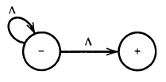

__Transition Graphs__

_ict chapter 6_

How to construct concise FA?
---

- relaxing the restriction of inputs of FA only one letter a time
-  read either one or two letters of the input string at a time 
-  change its state based on this input information

A machine that accepts only the word `baa`
---
- can read up to three letters at a time
- build with even fewer states

- or even simpler

- What will happen if we run `baabb` on these two machines?

Crash of a machine
---
- When an input string that `has not been completely read` reaches a state (final or otherwise) without outgoing edge that it can follow, 
  - we say that the input (or the machine) crashes at that state
  - Execution terminates and the input must be rejected
- An FA it is not possible for any input to crash 
  - since there is always an outgoing edge for each letter from each state
  

Two different ways that an input can be rejected
---
- trace a path ending a nonfinal state
- crash while being processed

A machine recognize all words that contain a double letter
---

- the operator decides how many letters to read from the input string each time
- run `baa` on the machine
  - (b)(a)(a) rejected
  - (b)(aa) accepted
  - (ba)(a) or (baa) crash
- a string is `accepted` by a machine if it can `get to a final state by some way`

Multiple ways to the final states
---

- `baab` can be accepted in 2 different ways
  - `(ba)(ab)` or `(baa)(b)`
- With FAs, there is only a unique path through the machine for every input string

transition graph
---
- abbreviated TG, is a collection of three things:
  1. A finite set of states
     - at least one start state
     - zero or more final states
  2. An finite alphabet Σ of letters from which input strings are formed
  3. A finite set of transitions (edge labels) that show 
     - how to go from some states to some others
       - there can be `zero or more` outgoing arrows
     - based on reading specified substrings of the input 
       - possibly even the null
string ϵ
- A `successful path` through a TG is a series of edges begin­ning at some start state (there may be several) and ending at a final state

💡 Run strings on a TG
---

- run `abbaab, abba, abbaaabba, b, abbab`
  - `abbaab`: (abb)(ϵ)(aa)(b)
  - `abba`: (abb)(ϵ)(a)
  - `abbaaabba`: (abb)(ϵ)(aa)(abb)(ϵ)(a)
  - `b`: (b)
  - `abbab` crashes
- we can go through a ϵ edge without consuming any letter

ϵ edge allow for more than one start state
---
- two equivalent TGs

- and

- every FA is a TG
  - but not every TG is a FA

🍎 Typical TGs
---
- ① TG of the null language $Φ$
  - 

- since there is no final state
  - there must be a final state to be able to accept anything
- ---
- ② TG accepts only ϵ
  - 
  - no edges for any other string
- Any TG with some start state that is also a final state will always accept ϵ
  - also true for FAs
- The following TGs also only accept ϵ
  - 
- or 

- or 
- or 

---

- ③ TG accepts only `ϵ, baa, abba`
  - how to generalize this to any finite language recognizer?

- Anything read while in the + state will cause a crash 
  - because the ⊖ state has no outgoing edges
---
- ④ TG accepts all words ending in b
  - 
- RE: $\mathbf{(a+b)^*b}$
- FA accepts the same language
  - 

---

- ⑤ TG accepts all words that begin and end with different letters

---
- ⑥ TG accepts all words in which the a 's occur only in even clumps and that end in three or more b's

---
- ⑦ EVEN-EVEN

Challenges with TG
---
- ① The possible factoring schemes must be exhausted to determine whether a given string is accepted or rejected

- Does the TG above accept `abbbabbbabba`?
  - Yes, in 3 way
- ② There are infinite ways of grouping the let­ters of an input string if ϵ-edges allowed
  - (a)(b)
  - (a)ϵ(b)
  - (a)ϵϵ(b)
  - ...
  - (a)ϵⁿ(b)

- The TG below accepts only `aa` but in infinite paths

- the ϵ edges can be removed without changing the capability of the TG
  - they are reserved only for generalization
- another equivalent TG accepts only ab
  - 

- A TG whose ϵ edges cannot be removed
  - 
- however, ϵ-edges are never necessary at all
  - Any TG with ϵ-edges always has some equivalent TGs without ϵ-edges

Generalizing TG
---

- the edge is generalized from a string to any string of a language
  - this language will be limited to regular language only

generalized transition graph (GTG)
---
A GTG is a collection of three things
- A finite set of states
  - at least one start state 
  - zero or more fi­nal states
- An alphabet Σ of input letters
- Directed edges connecting some pairs of states, each labeled with a regular expression

🍎 Examples
---
- A GTG  accepts all strings without a double b
  - 
- Notice that the word b takes a ϵ-edge from start to middle

---

- there is no difference between the Kleene star closure for regular expressions and a loop in TGs or FAs, compare the FA
  - 
- and the GTG
  - 
- In the FA, we may loop in the middle state as many times as we want or `go straight to the third state`
- In the GTG, to not loop corresponds to taking the ϵ choice from the b*

Nondeterminism
---
- A machine is nondeterministic if the path through it depends on both the input string and the operator's choice
- choices are inherent needed below
  - 
  - or in the equivalent one
  - 
- Another example of equivalence

