```mermaid
flowchart LR
  p0(("-"))
  p1(("+"))
  p0-->|ϵ|p1
```

```mermaid
flowchart LR
  p0(("-"))
  p1(("+"))
  p0-->|ϵ|p1
  p0-->|ϵ|p0
```

```mermaid
flowchart LR
  p0(("±"))
  p1(("+"))
  p2(("+"))
  p1-->|a|p2
  p2-->|bb|p1
```

__Transition Graphs__

_ict chapter 6_


How to construct concise FA?
---

- relaxing the restriction of inputs of FA only one letter a time
-  read either one or two letters of the input string at a time 
-  change its state based on this input information


A machine that accepts only the word `baa`
---
- can read up to three letters at a time
- build with even fewer states

- or even simpler
```mermaid
flowchart LR
  p0(("-"))
  p1(("+"))
  p0-->|baa|p1
``````
- What will happen if we run `baabb` on these two machines?


Crash of a machine
---
- When an input string that `has not been completely read` reaches a state (final or otherwise) without outgoing edge that it can follow, 
  - we say that the input (or the machine) crashes at that state
  - Execution terminates and the input must be rejected
- An FA it is not possible for any input to crash 
  - since there is always an outgoing edge for each letter from each state
  

Two different ways that an input can be rejected
---
- trace a path ending a nonfinal state
- crash while being processed


A machine recognize all words that contain a double letter
---
```mermaid
flowchart LR
  p0(("-"))
  p1(("+"))
  p0-->|"aa,bb"|p1
  p0-->|"a,b"|p0
  p1-->|"a,b"|p1
```
- the operator decides how many letters to read from the input string each time
- run `baa` on the machine
  - (b)(a)(a) rejected
  - (b)(aa) accepted
  - (ba)(a) or (baa) crash
- a string is `accepted` by a machine if it can `get to a final state by some way`


Multiple ways to the final states
---

- `baab` can be accepted in 2 different ways
  - `(ba)(ab)` or `(baa)(b)`
- With FAs, there is only a unique path through the machine for every input string


transition graph
---
- abbreviated TG, is a collection of three things:
  1. A finite set of states
     - at least one start state
     - zero or more final states
  2. An finite alphabet Σ of letters from which input strings are formed
  3. A finite set of transitions (edge labels) that show 
     - how to go from some states to some others
       - there can be `zero or more` outgoing arrows
     - based on reading specified substrings of the input 
       - possibly even the null
string ϵ
- A `successful path` through a TG is a series of edges begin­ning at some start state (there may be several) and ending at a final state


💡 Run strings on a TG
---

- run `abbaab, abba, abbaaabba, b, abbab`
  - `abbaab`: (abb)(ϵ)(aa)(b)
  - `abba`: (abb)(ϵ)(a)
  - `abbaaabba`: (abb)(ϵ)(aa)(abb)(ϵ)(a)
  - `b`: (b)
  - `abbab` crashes
- we can go through a ϵ edge without consuming any letter

ϵ edge allow for more than one start state
---
- two equivalent TGs

```mermaid
flowchart LR
  m(("-"))
  p1((1))
  p2((2))
  p3((3))
  p(("+"))
  m-->|ϵ|p1
  m-->|ϵ|p2
  m-->|ϵ|p3
  p1-->|a|p
  p2-->|b|p
  p3-->|aba|p
```

- and

- every FA is a TG
  - but not every TG is a FA


🍎 Typical TGs
---
- ① TG of the null language $Φ$

- since there is no final state
  - there must be a final state to able to accept anything
- ---
- ② TG accepts only ϵ

```mermaid
flowchart LR
  s(("±"))
```

- no edges for any other string
- Any TG with some start state that is also a final state will always accept ϵ
  - also true for FAs
- The following TGs also only accept ϵ

```mermaid
flowchart LR
  s(("±"))
  s-->|ϵ|s
```

- or

- or

- or

---
- ③ TG accepts only `ϵ, baa, abba`
  - how to generalize this to any finite language recognizer?

```mermaid
flowchart LR
  s1(("-"))
  s2(("-"))
  s3(("-"))
  f(("+"))
  s1-->|ϵ|f
  s2-->|baa|f
  s3-->|abba|f
```

- Anything read while in the + state will cause a crash 
  - because the ⊖ state has no outgoing edges
---
- ④ TG accepts all words ending in b

- RE: $\mathbf{(a+b)^*b}$
- FA accepts the same language

---
- ⑤ TG accepts all words that begin and end with different letters

---
- ⑥ TG accepts all words in which the a 's occur only in even clumps and that end in three or more b's

---
- ⑦ EVEN-EVEN

```mermaid
flowchart LR
  p1(("±"))
  p2((" "))
  p1-->|"aa,bb"|p1
  p1-->|"ab,ba"|p2
  p2-->|"aa,bb"|p2
  p2-->|"ab,ba"|p1
```



Challenges with TG
---
- ① The possible factoring schemes must be exhausted to determine whether a given string is accepted or rejected

- Does the TG above accept `abbbabbbabba`?
  - Yes, in 3 way
- ② There are infinite ways of grouping the let­ters of an input string if ϵ-edges allowed
  - (a)(b)
  - (a)ϵ(b)
  - (a)ϵϵ(b)
  - ...
  - (a)ϵⁿ(b)
- The TG below accepts only `ab` but in infinite paths
```mermaid
flowchart LR
  p0(("-"))
  p1((" "))
  p2(("+"))
  p0-->|ϵ|p0
  p0-->|a|p1
  p1-->|ϵ|p1
  p1-->|b|p2
```
- the ϵ edges can be removed without changing the capability of the TG
  - they are reserved only for generalization
- another equivalent TG accepts only ab
```mermaid
flowchart LR
  p0(("-"))
  p1((" "))
  p2((" "))
  p3(("+"))
  p0-->|a|p1
  p1-->|ϵ|p2
  p2-->|ϵ|p1
  p2-->|b|p3
```
- A TG whose ϵ edges cannot be removed
```mermaid
flowchart LR
  p0(("-"))
  p1((" "))
  p2((" "))
  p3(("+"))
  p0-->|a|p1
  p1-->|"a,ϵ"|p2
  p2-->|"b,ϵ"|p1
  p2-->|b|p3
```
- however, ϵ-edges are never necessary at all
  - Any TG with ϵ-edges always has some equivalent TGs without ϵ-edges


Generalizing TG
---
```mermaid
flowchart LR
  p0(("1-"))
  p1(("2"))
  p2(("3+"))
  p0-->|L1|p1
  p1-->|L2|p1
  p1-->|L3|p2
  p2-->|L5|p2
  p0-->|L4|p2
```
- the edge is generalized from a string to any string of a language
  - this language will be limited to regular language only


generalized transition graph (GTG)
---
A GTG is a collection of three things
- A finite set of states
  - at least one start state 
  - zero or more fi­nal states
- An alphabet Σ of input letters
- Directed edges connecting some pairs of states, each labeled with a regular expression


🍎 Examples
---
- A GTG  accepts all strings without a double b
```mermaid
flowchart LR
  p0(("±"))
  p1((" "))
  p2(("+"))
  p0-->|a*|p0
  p0-->|"(ab+a)*"|p1
  p1-->|"(b+ϵ)"|p2
  p2-->|a*|p2
```
- Notice that the word b takes a ϵ-edge from start to middle

---

- there is no difference between the Kleene star closure for regular expressions and a loop in TGs or FAs, compare the FA
```mermaid
flowchart LR
  p0(("-"))
  p1((" "))
  p2(("+"))
  p0-->|"a,b"|p1
  p1-->|a|p2
  p1-->|b|p1
  p2-->|"a,b"|p2
```
- and the GTG
```mermaid
flowchart LR
  p0(("-"))
  p1((" "))
  p2((" "))
  p3(("+"))
  p0-->|"(a+b)"|p1
  p1-->|"b*"|p2
  p2-->|a|p3
  p3-->|"(a+b)*"|p3
```
- In the FA, we may loop in the middle state as many times as we want or `go straight to the third state`
- In the GTG, to not loop corresponds to taking the ϵ choice from the b*


Nondeterminism
---
- A machine is nondeterministic if the path through it depends on both the input string and the operator's choice
- choices are inherent needed below
```mermaid
flowchart LR
  p0(("1"))
  p1(("2"))
  p2(("3"))
  p0-->|aba|p1
  p0-->|aba|p2
```
- or in the equivalent one
```mermaid
flowchart LR
  p0(("1"))
  p1(("2"))
  p2(("3"))
  p((" "))
  p3(("4"))
  p0-->|ϵ|p
  p-->|aba|p1
  p0-->|ab|p2
  p2-->|a|p3
```