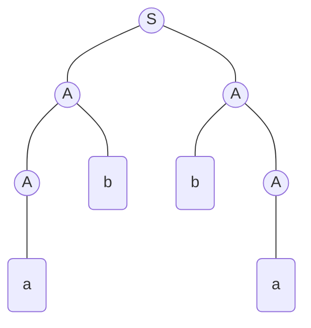
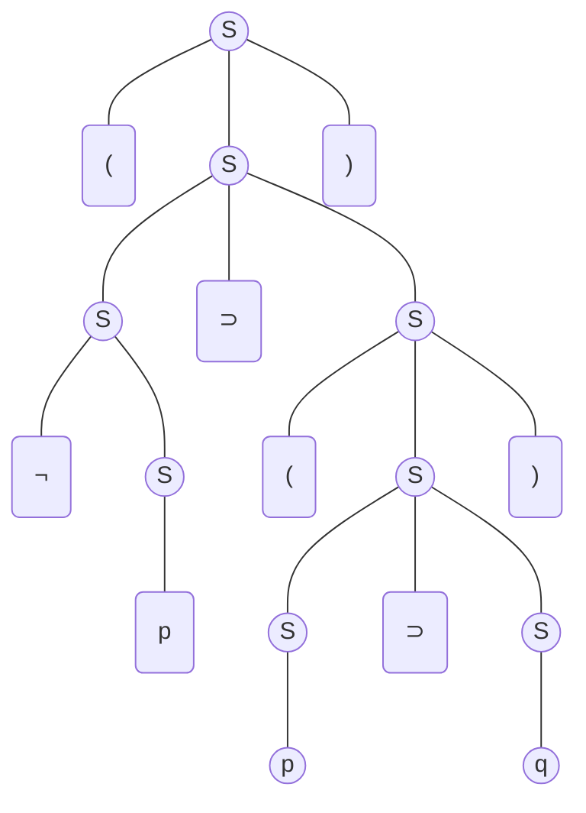

__Context-free grammars__

_ict chapter 12_

Generative grammars
---
Recursive definition is one of the generative grammars:
- arithmetic expression (AE)
  - seeds:  Any number is an AE
  - generators: if x, y are AEs, then so are
    - (x), -(x), (x + y), (x - y), (x * y),  (x/y), (x^y)
- `compiler` is a program used to translate one language into another language
  - such as C to assembly

Natural language grammar is generative
---
The rules of English grammar:
- sentence → subject ⊢ predicate
- subject → noun-phrase
- noun-phrase → adjective ⊢ noun-phrase
- noun-phrase → article ⊢ noun-phrase
- noun-phrase → noun
- predicate → verb ⊢ noun-phrase
- noun → apple | bear | cat | dog
- verb → eat | follow | get | run
- adjective → lovely | furry
- article → a | an | the

🍎 Generate a sentence with the English grammar
---
- sentence ⇒ subject ⊢ predicate
- sentence ⇒ noun-phrase ⊢ verb ⊢ noun-phrase
- sentence ⇒ article ⊢ noun-phrase ⊢ verb ⊢ noun
- sentence ⇒ article ⊢ noun ⊢ verb ⊢ noun
- sentence ⇒ the bear eat apple

Terminals and nonterminals
---
- Terminals can NOT be replaced by others
  - they can only be on the right side of →
- Nonterminals must be replaced by others
  - they can be on both sides of →

A generative grammar for AE
---
- Start → (AE)
- AE → (AE + AE)
- AE → (AE - AE)
- AE → (AE * AE)
- AE → (AE / AE)
- AE → (AE ^ AE)
- AE → (AE)
- AE → -(AE)
- AE → NUMBER
- NUMBER → FIRST-DIGIT
- FIST-DIGIT → FIST-DIGIT OTHER-DIGIT
- FIST-DIGIT → 1|2|3|4|5|6|7|8|9
- OTHER-DIGIT → 0|1|2|3|4|5|6|7|8|9 

🍎 Example 1
---
Generate a number with the above AE grammar
- FIST-DIGIT ⇒ FIST-DIGIT OTHER-DIGIT
- FIST-DIGIT ⇒ 69

Generations and productions
---
- The `sequence of applications of the rules` that produces the `finished string of termi­nals` `from the starting symbol` is called a `derivation` or a `generation` of the string 
- The grammatical rules are often called `productions`

Context-free grammar (CFG)
---
is a collection of three things:
- ❶ An alphabet Σ of letters called `terminals` from which we are going to make strings that will be the words of a language
- ❷ A set of symbols called `nonterminals`, one of which is the symbol `S`, standing for "start here"
- ❸ A finite set of `productions` of the form:
  - one nonterminal → finite string of terminals and/or nonterminals
  - at least one production has `S` as its left side
  - the right side of a production could even be the empty string ε

Context-free language (CFL)
---
- generated by a CFG
- the set of all `strings of terminals` that can be produced `from the start symbol S` using the `productions as substitutions`

🍎 Example 2: generate regular languages with CFG
---
- CFG1
  - ❶ S → Sa
  - ❷ S → ε
- the CFL1 generated from CFG1
  - apply ❶ n times: S ⇒ Saⁿ
  - then apply ❷ once: S ⇒ aⁿ
  - with S ⇒ ε
  -  $\mathbf{a^*}$ can be generated
  -  no words other than $\mathbf{a^*}$ can be generated
- ∴ CFL1 = $\mathbf{a^*}$

---

- CFG2
  - ❶ S → SS
  - ❷ S → a
  - ❸ S → ε
- the CFL2 generated from CFG2
  - apply ❶ n times: S ⇒ (SS)ⁿ
  - then apply ❷ 2n times: S ⇒ a²ⁿ
  - or apply ❷ 2n-1 times, then apply ❸ once on the last S: S ⇒ a²ⁿ⁻¹
  - with S ⇒ ε
  -  $\mathbf{a^*}$ can be generated
  -  no words other than $\mathbf{a^*}$ can be generated
- ∴ CFL2 = $\mathbf{a^*}$

---

- CFG3
  - ❶ S → aS
  - ❷ S → bS
  - ❸ S → a
  - ❹ S → b
- the CFL3 generated from CFG3
  - apply ❶ and ❷ in any order and any number of times: S ⇒ $\mathbf{(a+b)^+}$S
  - then apply ❸ or ❹: S ⇒ $\mathbf{(a+b)^+(a+b)}$
  - $\mathbf{(a+b)^+}$ can be generated
  -  no words other than $\mathbf{(a+b)^+}$ can be generated
- ∴ CFL3 = $\mathbf{(a+b)^+}$

---

- CFG4
  - ❶ S → X
  - ❷ S → Y
  - ❸ X → ε
  - ❹ Y → aY
  - ❺ Y → bY
  - ❻ Y → a
  - ❼ Y → b
- the CFL4 generated from CFG4
  - ❷ ❹ ❺ ❻ ❼ can be used to generate $\mathbf{(a+b)^+}$ as CFG3
  - ❶ ❸ can be used to generate ε
- ∴ CFL4 = $\mathbf{(a+b)^*}$

---

- CFG5
  - ❶ S → aS
  - ❷ S → bS
  - ❸ S → a
  - ❹ S → b
  - ❺ S → ε
- the CFL5 generated from CFG5
  - ❶ ❷ ❸ ❹ can be used to generate $\mathbf{(a+b)^+}$ as CFG3
  - apply ❺ get S ⇒ ε
- ∴ CFL5 = $\mathbf{(a+b)^*}$

---

- CFG6
  - ❶ S → XaaX
  - ❷ X → aX
  - ❸ X → bX
  - ❹ X → ε
- the CFL6 generated from CFG6
  - apply ❷ and ❸ in any order and any number of times: X ⇒ $\mathbf{(a+b)^+}$X
  - with ❹: X ⇒ $\mathbf{(a+b)^*}$
  - then apply ❶
- ∴ CFL6 = $\mathbf{(a+b)^*aa(a+b)^*}$

---

- CFG7
  - ❶ S → XY
  - ❷ X → aX
  - ❸ X → bX
  - ❹ X → a
  - ❺ Y → Ya
  - ❻ Y → Yb
  - ❼ Y → a
- the CFL7 generated from CFG7
  - apply ❷ and ❸ in any order and any number of times: X ⇒ $\mathbf{(a+b)^+}$X
  - then apply ❹: X ⇒ $\mathbf{(a+b)^+}$a
  - apply ❺ and ❻ in any order and any number of times: Y ⇒ Y$\mathbf{(a+b)^+}$
  - then apply ❼: Y ⇒ a$\mathbf{(a+b)^+}$
  - then apply ❶: S ⇒ $\mathbf{(a+b)^+}$aa$\mathbf{(a+b)^+}$
  - together with ❶❹❼: aa
- ∴ CFL7 = $\mathbf{(a+b)^*aa(a+b)^*}$

---

- CFG8
  - ❶ S → SS
  - ❷ S → B S
  - ❸ S → S B
  - ❹ S → ε
  - ❺ S → U S U
  - ❻ B → aa
  - ❼ B → bb
  - ❽ U → ab
  - ❾ U → ba
- the CFL8 generated from CFG8
  - S ⇒ $\mathbf{aa|bb|(ab+ba)(aa+bb)^*(ab+ba)}$
  - ❶❹: S ⇒ S*
- ∴ CFL8 = EVEN-EVEN = $\mathbf{[aa+bb+(ab+ba)(aa+bb)^*(ab+ba)]^*}$

---

🍎 Example 3
---
Generate nonregular languages with:
- CFG1
  - ❶ S → aSb
  - ❷ S → ε
- generates CFL1:
  - {aⁿbⁿ} 

---

- CFG2
  - ❶ S → aSa
  - ❷ S → bSb
  - ❸ S → ε
- generates CFL2:
  - EVENPALINDROME =  all palindromes with even length and no center letter

---

- CFG3
  - ❶ S → aSa
  - ❷ S → bSb
  - ❸ S → a
  - ❹ S → b
- generates CFL3:
  - ODDPALINDROME =  all palindromes with odd length

---

- CFG4
  - ❶ S → aSa
  - ❷ S → bSb
  - ❸ S → a
  - ❹ S → b
  - ❺ S → ε
- generates CFL4:
  - PALINDROME 

---

- CFG5
  - ❶ S → aSa
  - ❷ S → b
- generates CFL5:
  - {aⁿbaⁿ} 

---

- CFG6
  - ❶ S → aB
  - ❷ S → bA
  - ❸ A → a
  - ❹ A → aS
  - ❺ A → bAA
  - ❻ B → b
  - ❼ B → bS
  - ❽ B → aBB
- generates CFL6
  - EQUAL = all strings that have an equal number of a's and b's in them
    - = {ab, ba, aabb, abab, abba, baab, baba, bbaa, aaabbb, ...}

Short notation of productions with same nonterminal on the left
---
- ❶ S → aSa
- ❷ S → bSb
- ❸ S → a
- ❹ S → b
- ❺ S → ε
- short-noted as: S → aSa | bSb | a | b | ε
- ---
- ❶ S → aB
- ❷ S → bA
- ❸ A → a
- ❹ A → aS
- ❺ A → bAA
- ❻ B → b
- ❼ B → bS
- ❽ B → aBB
- short-noted as: 
  - S → aB | bA
  - A → a | aS | bAA
  - B → b | bS | aBB

Other notations of CFG
---
- ::= for →
- `variable` for `nonterminal`
- nonterminal is enclosed with `<>` such as `<S>`
- `BNF`, which stands for Backus normal form or `Backus - Naur form`
   - arrows, vertical bars, termi­nals, and nonterminals
- CFG is used to define the grammar for many popular programming languages such as
  - FORTRAN, C, PASCAL, BASIC, PL/I, etc.

🍎 Example 4
---
The CFG for FORTRAN identifier:
- up to six alphanumeric characters long but must start with a letter
- IDENTIFIER → LETTER XXXXX
- X → LETTER | DIGIT | ε
- LETTER → A|B|C|...|Z
- DIGIT → 0|1|2|...|9

Parse trees
---
- also called `syntax` trees,`generation` trees, `production` trees, or `derivation` trees
- used to analyze the syntax of words of a CFL by its CFG
- for example, given a CFG
  - S → AA
  - A → bA | Ab | a
- parse `abba`

- the root node is `S (start here)`
- leaf nodes are terminal nodes
- non-leaf nodes are nontermials

🍎 Example 5
---
① Given a CFG:
- `S → (S) | S⊃S | ¬S | p | q`

Find the parse tree for
- (¬p⊃(p⊃q))

---

② Given a CFG:
- `S→AA`
- `A→AAA|bA|Ab|a`

(p1) Find a parse tree for word `bbaaaab`

Lukasiewicz notation
---
- also called Polish notation, including
  - operator prefix notation
  - operator postfix notation
- used to remove the the ambiguity in AE such as
  - `3+4*5` generated from
- the CFG AMB
  - `S → S + S | S * S | number`
  - `3+4*5` could be `(3+4)*5`
  - or `3+(4*5)` without further information such as operator priority
- this can be fixed with parentheses in CFG INFIX
  - `S → (S + S) | (S * S) | number`
  - `((3+4)*5)` or `(3+(4*5))`
  - called operator infix notation

Operator prefix notation
---
- generated with the CFG PREFIX below
  - `S → + | * | number`
  - `+ → ++ | +* |+number|*+|**|*number|number+|number*|number number`
  - `* → ++ | +* |+number|*+|**|*number|number+|number*|number number`
- (p2) generates the CFL: operator prefix notation such as
  - `+ 3 * 4 5` for `((3+4)*5)`
  - `* + 3 4 5` for `(3+(4*5))`

🍎 Example 6
---
Convert infix notation to prefix notation:
- `(( 1 + 2) * (3 + 4) + 5 ) * 6`
- steps (p4)
  - draw its parse tree following CFG INFIX
  - read around this tree depth-first to get the equivalent prefix notation expression
  - `* + * + 1 2 + 3 4 5 6`

Ambiguity
---
- A CFG is called `ambiguous` if 
  - for at least one word in the language that it generates 
  - there are two possible derivations of the word that correspond to different syntax trees 
- If a CFG is not ambiguous, it is called unambiguous

🍎 Example 7
---
- CFG1 without ambiguity
  - ❶ S → AB
  - ❷ A → a
  - ❸ B → b
- (p5) i.e. the order of applying optional rules does not matter
  - ❶ ❷ ❸ = ❶ ❸ ❷  = ab
  - the syntax tree of ❶ ❷ ❸ is the same as that of ❶ ❸ ❷

---

- (p6) CFG2 for PALINDROME below is unambiguous
  - S → aSa | bSb | a | b | ε

---

- CFG3 for the language of all non-null strings of a 's  below is ambiguous
  - S → aS | Sa | a 
  - (p7) find the four different trees of a³
- (p8) CFG4 for the same language but unambiguous
  - s → aS | a
  - or CFG5: s → Sa | a

The total language tree (TLT)
---
- derivation trees help resolve ambiguity
- all the words in the language of a CFG can be simultaneously depicted in 
  - one big (possibly infinite) tree
  - called the `total language tree` of the CFG

🍎 Example 8
---
- draw the `total language tree` of the CFG1 below
  - S → aa | bX | aXX
  - X → ab | b
- CFL1 has only 7 different words. 
- Four of its words (abb, aabb, abab,aabab) have two different possible derivations
  - (p9①) because they appear as terminal nodes in this TLT in two different places
  - (p9②) However, the words are not generated by two dif­ferent derivation trees 
    - ∴ the grammar is unambiguous

---

- (p10) draw the `total language tree` of the CFG2 below
  - S → aSb | bS | a
- CFL2 is infinite so its TLT
  - CFL2 = {a,ba,aab,bba,...}

---

- (p11) draw the `total language tree` of the CFG3 below
  - S → SAS | b
  - A → ba | b
- Every string with some S's and some A 's has many possible productions that apply to it
  - two for each S and two for each A

---

- (p12) draw the `total language tree` of the CFG4 below
  - S → X | b | a
  - X → aX
- X is a bad mistake; it leads to no words 
- the TLT is infinite causing by X
  - but the language has only finitely many words 