__CFG=PDA__

_ict chapter 15_

☯ Theorem 1: CFG=PDA
---
The set of all languages accepted by PDAs is the same as the
set of all languages generated by CFGs:
- 🅐 CFG→PDA: Given a CFG that generates the language L, there is a PDA that accepts exactly L
- 🅑 PDA→CFG: Given a PDA that accepts the language L, there exists a CFG that generates exactly L

🅐 CFG→PDA
---
Prove by construction for CFG in CNF:
- S = X₁ → X₂X₃
- X₁ → X₃X₄
- X₂ → X₂X₂
- ⋯
- X₃ → a
- X₄ → a
- X₅ → b
- ⋯

- begin with S = X₁
  - 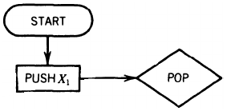
- For each production of the form
  - Xᵢ → XⱼXₖ
  - include this circuit from the POP back to itself:
  - 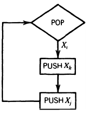

- For all productions of the form
  - Xᵢ→ σ
  - include this circuit:
  - 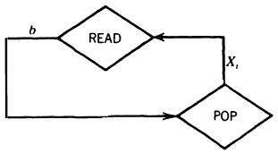

- When the stack is finally empty, 
  - which means we have converted our last nonterminal to a terminal 
  - and the terminals have matched the INPUT TAPE, include this circuit
  - 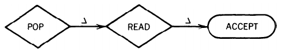

- for CFL include ϵ, add  a simple loop at the POP
  - This kills the nonterminal S without replacing it with anything 
  - and the next time we enter the POP, we get a blank and proceed to accept the word
  - 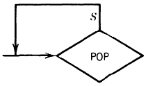

---

🍎 Example 1
---
- ① CFG in CNF
  - S → SB | AB
  - A → CC
  - B → b
  - C → a
- construct a nPDA with
  - STACK alphabet Γ={S,A,B,C}
  - TAPE alphabet Σ={a,b}
  - 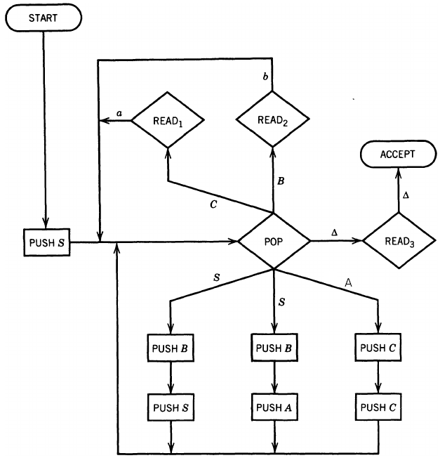

- 📝 run `aab` on the PDA.
  - generate `aab` by `leftmost derivation` whose working string has the form
    - (string of terminals)(string of nonterminals)
  - run `aab` on the PDA following the same sequence of productions
    - keep the STACK contents the same as `the substring of nonterminals` in the working string
- the `nondeterminism` at state `POP` from those branches needs operator's choice of the intended branch

- Show the stack and the tape

| working-string generation | production used | stack ∼ tape |
|:--:|:--:|:--:|
| S | Start | 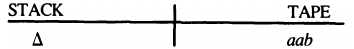 |
| | | 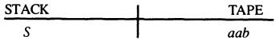 |
| S⇒AB | S → AB | 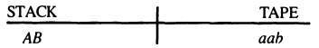 |
| ⇒CCB | A → CC | 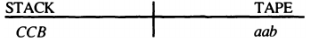 |
| ⇒aCB | C → a | 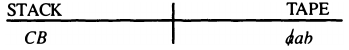 |
| ⇒aaB | C → a | 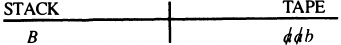 |
| ⇒aab | B → b | 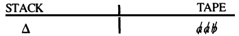 |

---

🍎 Example 2
---
- ① CFG in CNF
  - S → AB
  - A → BB | a
  - B → AB | a | b
- construct a nPDA with
  - STACK alphabet Γ={S,A,B}
  - TAPE alphabet Σ={a,b}
  - 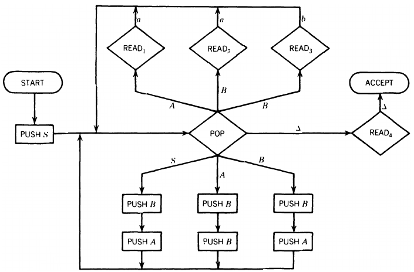

- 📝 trace simultaneously
  - how the word `baaab` can be generated by this CFG 
  - and how it can be accepted by this PDA
  - 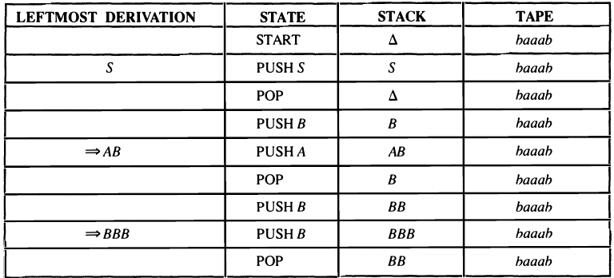
  - 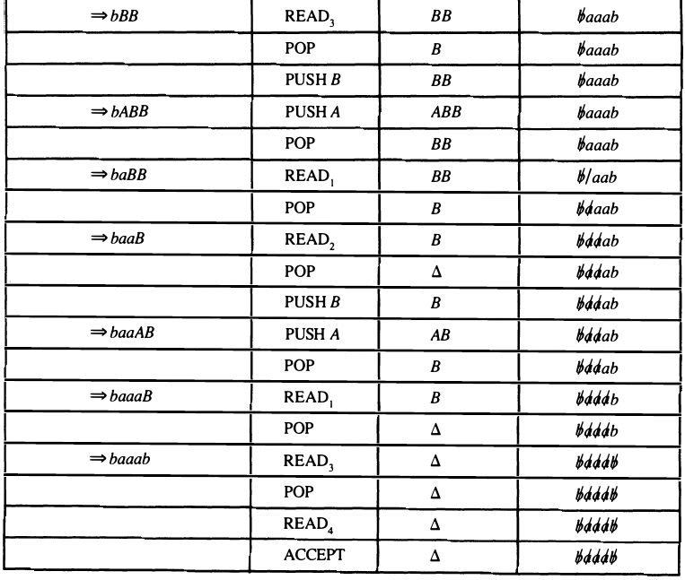
- At every stage
  - Working string=(letters cancelled from TAPE) (string of Nonterminals from STACK)
- At the beginning, this means
  - Working string = S
  - Letters cancelled = none
  - String of Nonterminals in STACK = S
- At the end, this means
  - Working string = the whole word
  - Letters cancelled = all
  - STACK = Δ

---

🍎 Example 3
---
The language PALINDROME (including ϵ) can be generated by the following CFG in CNF 
(plus one ϵ-production):
- S → AR₁ | BR₂ | AA | BB | a | b | `ϵ`
- R₁ → SA
- R₂ → SB
- A → a
- B → b

- The equivalent PDA built following Theorem 1.❶ CFG→PDA
- 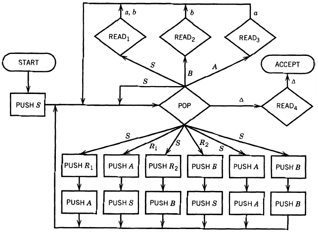

- 📝 trace string ` abaaba` on this PDA 
- 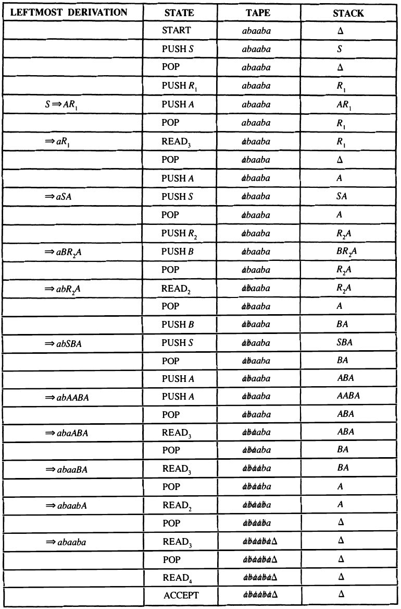

🅑 PDA→CFG
---
Prove by construction in several steps:
- turn the PDA into `conversion form`
- find the `summary table` of the conversion form
- determine a `CFG(R)` that generates all the words in the `Row language` of the summary table
- convert the `CFG(R)` to a `CFG(P)` that generates all the words accepted by the PDA

PDA conversion form
---
A PDA is in `conversion form` if it meets all the following conditions:
- There is only `one ACCEPT` state and `zero REJECT` state
  - ❶ merge all `ACCEPT` states into one
  - ❷ erase all `REJECT` states and their incoming edges
- Every `READ` or `HERE` is followed immediately by a POP
  - A `HERE` state is a `marker state` --- a state without status
    - does not read the TAPE nor pop the STACK
    - used to describe `being on the edge as being in a state`
    - permit `nondeterministic branching` to occur at such points
    - have no labels on its outgoing edges
    - 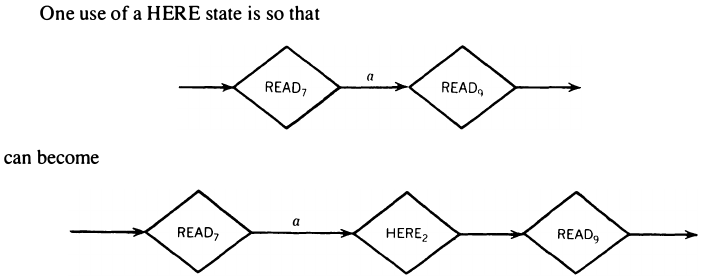
  - ❸ insert a POP into two consecutive `RoH (READ or HERE)` 
    - and immediately PUSH back what's popped from the STACK by this additional POP 
      - have a PUSH for every letter of Γ
    - From 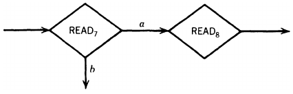
    - To 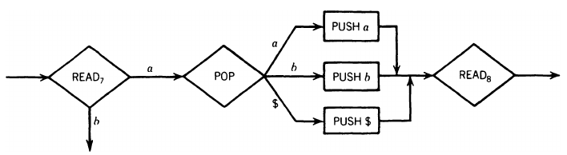

- POPs must be separated by READs or HEREs
  - ❹ insert a HERE state if needed
  - From 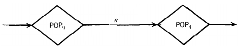
  - to 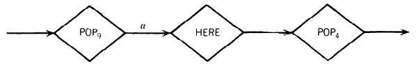

- All `branching`, deterministic, or nondeterministic, occurs at `RoH` states, none at POP states, and `every edge` has `only one` label (no multiple labels)
  -  ❺ convert all branching at POP states into branching at its incoming RoH states
- `❺ case 1`: 
  - 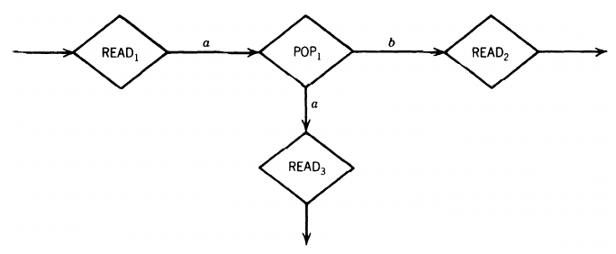
- the `deterministic branching at POPᵢ` has been replaced by `nondeterministic branching at RoHᵢ`→
  - 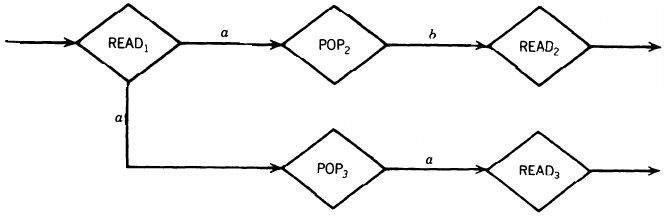

- ---
- `❺ case 2`: 
  - 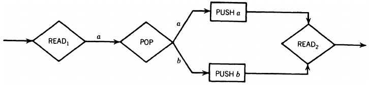
- the `deterministic branching at POPᵢ` has been replaced by `nondeterministic branching at RoHᵢ`→
  - 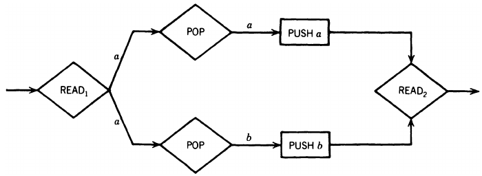

- Even before we get to START, a "bottom of STACK" symbol, `$`, is placed on the STACK 
  - If this symbol is ever popped in the processing, it must be replaced immedi­ately 
  - The STACK is never popped beneath this symbol
  - Right before entering ACCEPT, this symbol is popped out and left out
  - POP several Δ's off of an empty STACK can be satisfied with several POP\$ - PUSH\$ combinations
  - ❻ initialize the STACK to be

| STACK |
|:--:|
|\$|
|Δ|

- The PDA must begin with the sequence below
  - 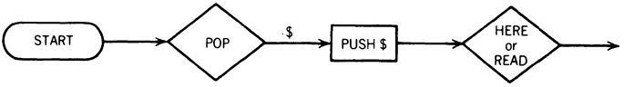
- The entire input string must be read before the machine can accept the word

🍎 Example 4
---
Convert the PDA below that accepts {a²ⁿbⁿ, n=1,2,3,⋯} 

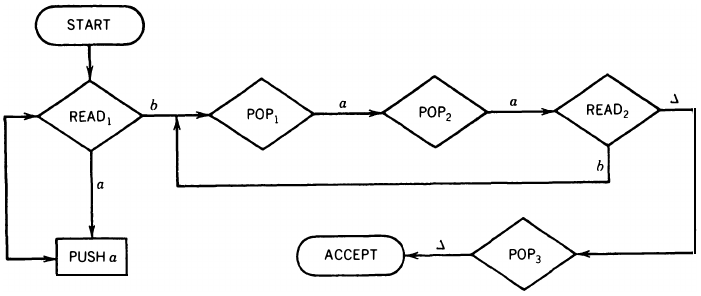

- into conversion form 🅰  →

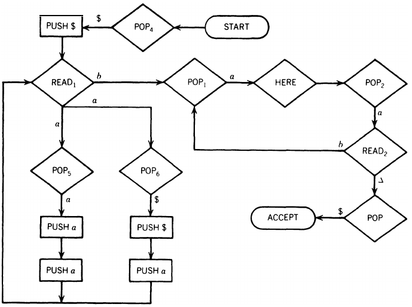

- the nondeterministic branch `POP6 - PUSH $ - PUSH a` will  
   - be taken the first time out of READ1 and only once
   - add an `a` to the STACK

Joints and path segments
---
- PDA conversion form is a collection of `path segments`, 
- 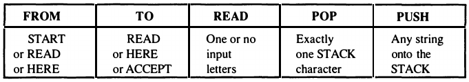
- each of the fol­lowing form

| From | To | READ | POP | PUSH |
|:--:|:--:|:--:|:--:|:--:|
|START or READ or HERE|READ or HERE or ACCEPT|{0,1} σ's|{1} γ|Γ⁺|

- The states `START, READ, HERE, and ACCEPT` are called the `joints` of the machine
  - Be­tween two consecutive joints on a path, exactly `one` character is popped and any arbitrary number can be pushed
  - the PDA 🅰 can be drawn as a set of joints with "arcs" (path segments) between them much like a TG
  - 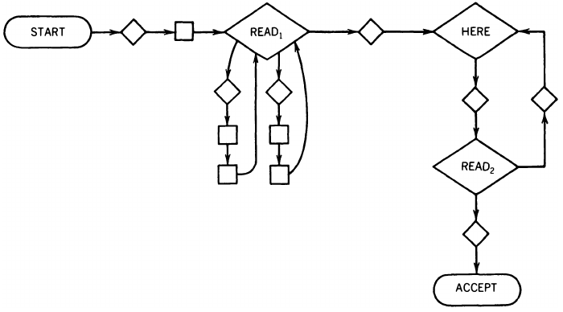
- a PDA is in conversion form can be described by its `summary table` 
  - the list of all the its `path segments`

The summary table of PDA 🅰
---
| Row# | From | To | READ | POP | PUSH |
|:--:|:--:|:--:|:--:|:--:|:--:|
| 1 | START | READ1 | ε | \$ | \$ |
| 2 | READ1 | READ1 | a | \$ | a\$ |
| 3 | READ1 | READ1 | a | a | aa |
| 4 | READ1 | HERE | b | a | - |
| 5 | HERE  | READ2 | ε | a | - |
| 6 | READ2 | HERE | b | a | - |
| 7 | READ2 | ACCEPT | Δ | \$ | - |

- `ε`, empty string, means READ `nothing` 
  - or perform a `null` READ when the read header is `not` on the TAPE
  - e.x. READ nothing in row 1, 5
- `-`, no such operation
  - e.x. no PUSH in row 4 to 7
- in row 2, `→ PUSH a$ →` is a short notation of `→ PUSH $ → PUSH a →`
  - the order is `from right to left`
- Every word accepted by the PDA corresponds to some `path` from START to ACCEPT
  - a sequence of these `path segments`, i.e. `rows` in the summary table
  - e.x. `aaaabb` can be accepted by the path 
    - `START-POP4-PUSH$-READ1-POP6-PUSH$-PUSHa-READ1-POP5-PUSHa- PUSHa-READ1-POP5-PUSHa-PUSHa-READ1-POP5-PUSHa-PUSHa-READ1-POP1 -HERE-POP2-READ2-POP1-HERE-POP2-READ2-POP3-ACCEPT`
    - or `row(1,2,3,3,3,4,5,6,5,7)`

The row language R(PDA) of a PDA
---
- the set of all `valid sequences` of rows of the PDA summary table with
  - `Σ = {Row₁, Row₂, ⋯, Rowᵢ, ⋯, Rowₙ}`
- A valid sequence of rows must be
  - `joint-consistent`: the rows meet up end to end
  - `STACK-consistent`: the character to be popped by a row must be right at the top of the STACK
  - and corresponds to an accepting path of an acceptable string
    - from START to ACCEPT
- e.x. `row(5,5,3,6)` ∉ R
- A `nonterminal in R` has the form of: `Net(Jᵢ, Jₖ, γ)`
  - `Jᵢ, Jₖ` can be any joint: START, READ, HERE, or ACCEPT
  - `γ` is  any char­acter from the STACK alphabet Γ currently at the top of the STACK
    - ⚠️ what is under `γ` is assumed to be `unknown`
  - it means there is some path going from joint `Jᵢ` to `Jₖ`
    - may pass through some other joints
  - it has the `net effect` on the STACK of removing `γ` without popping any characters below it
    - such as `POP γ → PUSH a → PUSH b → POP b → POP a` 
      - has net effect as `POP γ` 
    - but not `POP γ → POP b → PUSH b`
      - which try to pop `b` from what's unknown below `γ`
      - it will crash the PDA if what under `γ` is NOT `b`

Determine CFG(R)
---
Create productions of the CFG(R):
- Rule ❶ For all PDAs
  - `S → Net(START, ACCEPT, $)`
- Rule ❷ For every row of the summary table that has `no PUSH` entry, such as

| Row# | From | To | READ | POP | PUSH |
|:--:|:--:|:--:|:--:|:--:|:--:|
| i | X | Y | σ,ε or Δ | γ | - |

- `Net(X,Y,γ) → Rowᵢ`

- Rule ❸ For each row in the summary table that has `some PUSH` such as

| Row# | From | To | READ | POP | PUSH |
|:--:|:--:|:--:|:--:|:--:|:--:|
| i | X | Y | σ,ε or Δ | γ | γ₁γ₂⋯γₘ |

- create a family of productions for `all sets of m READ,HERE, or ACCEPT` states `S₁,S₂, ⋯, Sₘ`:
  - `Net(X,Sₘ, γ) → RowᵢNet(Y,S₁,γ₁)Net(S₁,S₂,γ₂)⋯Net(Sₘ₋₁,Sₘ,γₘ)`
  - this is an exhaustive family of productions, many of them may be `useless`

Determine CFG(PDA)
---
- Rule ❹ For every row in the summary table

| Row# | From | To | READ | POP | PUSH |
|:--:|:--:|:--:|:--:|:--:|:--:|
| i | X | Y | æ | γ | whatever |

- create production rule: `Rowᵢ → æ`

🍎 Example 5
---
Find the productions of the CFG(R) for the summary table 🅰:
- Rule ❶ produces
  - `P1: S → Net(START, ACCEPT, $)`
- Rule ❷ on rows 4,5,6,7 produces
  - `P2: Net(READ1 , HERE, a)  → Row4`
  - `P3: Net(HERE, READ2 , a)  → Row5`
  - `P4: Net(READ2 , HERE, a)  → Row6`
  - `P5: Net(READ2, ACCEPT, $) → Row7`
- Rule ❸ on rows 1,2,3
  - on row 1: `Net(START, X, $) → Row1Net(READ1 , X, $)`
    - `X` can take any of joints but START
      - READ1 , READ2 , HERE, or ACCEPT, ∴
    - `P6: Net(START, READ1 , $)  → Row1Net(READ1 , READ1 , $)`
    - `P7: Net(START, READ2 , $)  → Row1Net(READ1 , READ2 , $)`
    - `P8: Net(START, HERE , $)   → Row1Net(READ1 , HERE , $)`
    - `P9: Net(START, ACCEPT , $) → Row1Net(READ1 , ACCEPT , $)`
  - on row 2: `Net(READ1, X, $) → Row2Net(READ1, Y, a)Net(Y, X, $)`
    - `X` can be any joints but START
    - `Y` can be any joint state but START or ACCEPT
      - because we cannot return to START or leave ACCEPT
    - `P10: Net(READ1, READ1,  $) → Row2Net(READ1, READ1, a)Net(READ1, READ1, $)`
    - `P11: Net(READ1, READ1,  $) → Row2Net(READ1, READ2, a)Net(READ2, READ1, $)`
    - `P12: Net(READ1, READ1,  $) → Row2Net(READ1, HERE,  a)Net(HERE,  READ1, $)`
    - `P13: Net(READ1, READ2,  $) → Row2Net(READ1, READ1, a)Net(READ1, READ2, $)`
    - `P14: Net(READ1, READ2,  $) → Row2Net(READ1, READ2, a)Net(READ2, READ2, $)`
    - `P15: Net(READ1, READ2,  $) → Row2Net(READ1, HERE,  a)Net(HERE,  READ2, $)`
    - `P16: Net(READ1, HERE,   $) → Row2Net(READ1, READ1, a)Net(READ1, HERE, $)`
    - `P17: Net(READ1, HERE,   $) → Row2Net(READ1, READ2, a)Net(READ2, HERE, $)`
    - `P18: Net(READ1, HERE,   $) → Row2Net(READ1, HERE,  a)Net(HERE,  HERE, $)`
    - `P19: Net(READ1, ACCEPT, $) → Row2Net(READ1, READ1, a)Net(READ1, ACCEPT, $)`
    - `P20: Net(READ1, ACCEPT, $) → Row2Net(READ1, READ2, a)Net(READ2, ACCEPT, $)`
    - `P21: Net(READ1, ACCEPT, $) → Row2Net(READ1, HERE,  a)Net(HERE,  ACCEPT, $)`
  - on row 3: `Net(READ1, X, a) → Row3Net(READ1, Y, a)Net(Y, X, a)`
    - `X` can be READ1, READ2, HERE, or ACCEPT
    - `Y` can be READ1, READ2, or HERE
    - `P22: Net(READ1, READ1,  a) → Row3Net(READ1, READ1, a)Net(READ1, READ1,  a)`
    - `P23: Net(READ1, READ1,  a) → Row3Net(READ1, READ2, a)Net(READ2, READ1,  a)`
    - `P24: Net(READ1, READ1,  a) → Row3Net(READ1, HERE,  a)Net(HERE,  READ1,  a)`
    - `P25: Net(READ1, READ2,  a) → Row3Net(READ1, READ1, a)Net(READ1, READ2,  a)`
    - `P26: Net(READ1, READ2,  a) → Row3Net(READ1, READ2, a)Net(READ2, READ2,  a)`
    - `P27: Net(READ1, READ2,  a) → Row3Net(READ1, HERE,  a)Net(HERE,  READ2,  a)`
    - `P28: Net(READ1, HERE,   a) → Row3Net(READ1, READ1, a)Net(READ1, HERE,   a)`
    - `P29: Net(READ1, HERE,   a) → Row3Net(READ1, READ2, a)Net(READ2, HERE,   a)`
    - `P30: Net(READ1, HERE,   a) → Row3Net(READ1, HERE,  a)Net(HERE,  HERE,   a)`
    - `P31: Net(READ1, ACCEPT, a) → Row3Net(READ1, READ1, a)Net(READ1, ACCEPT, a)`
    - `P32: Net(READ1, ACCEPT, a) → Row3Net(READ1, READ2, a)Net(READ2, ACCEPT, a)`
    - `P33: Net(READ1, ACCEPT, a) → Row3Net(READ1, HERE,  a)Net(HERE,  ACCEPT, a)`
- This large CFG(R) has
  - 7 terminals: Row1, Row2, ⋯, Row7
  - 29 nonterminals:
    - S, 16 of the form Net(, , $)
    - 12 of the form Net(, , a)
  - 33 productions: P1, P2, ⋯, P33
- With leftmost derivations,
  - `Row(1,2,3,4,5,7)` can be derived by products `P(1, 9, 20, 27, 2, 3, 5)`

🍎 Example 6
---
Find the productions of the CFG(PDA) from the summary table 🅰:
- Rule ❹ produces
  - `P34: Row1 → ε`
  - `P35: Row2 → a`
  - `P36: Row3 → a`
  - `P37: Row4 → b`
  - `P38: Row5 → ε`
  - `P39: Row6 → b`
  - `P40: Row7 → Δ`
- `Row(1,2,3,4,5,7)` becomes `εaabεΔ`
  - then discard ε and Δ: `aab`

🍎 Example 7
---
The language `EVENA=(aa)⁺ = a²ⁿ = {aa,aaaa,aaaaaa,⋯}` has a simple CFG
- `S→SS|aa`
  - its leftmost total language tree
  - 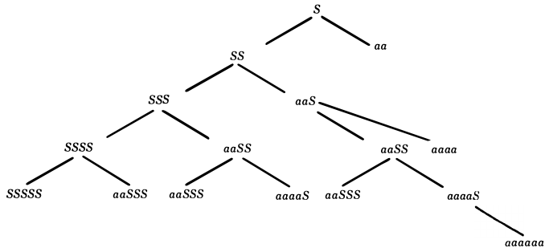
- convert it into CNF:
  - `S→SS|AA`
  - `A→a`
- find a PDA with Theorem 1.🅐 CFG→PDA
  - 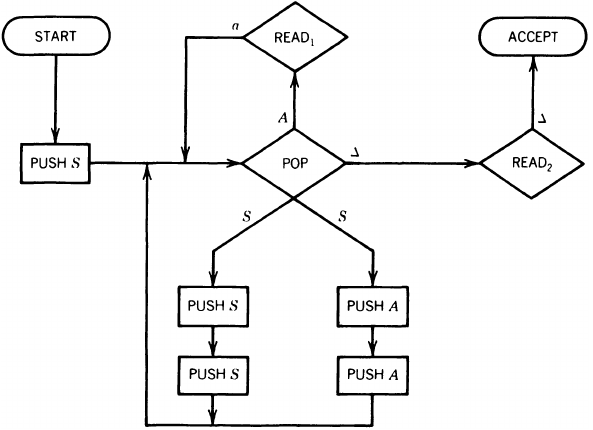
- turn the PDA into conversion form with Theorem 1.🅑 PDA→CFG
  - 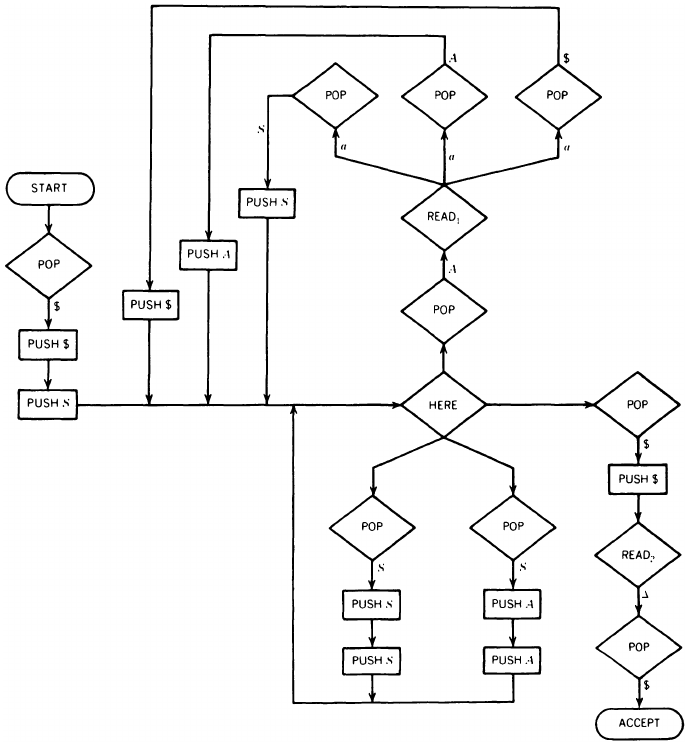
- summary table of the PDA

| Row# | From | To | READ | POP | PUSH |
|:--:|:--:|:--:|:--:|:--:|:--:|
| 1 | START | HERE  | ε | \$ | S\$ |
| 2 | HERE  | HERE  | ε | S  | SS |
| 3 | HERE  | HERE  | ε | S  | AA |
| 4 | HERE  | READ1 | ε | A  | - |
| 5 | READ1 | HERE  | a | S  | S |
| 6 | READ1 | HERE  | a | \$ | \$ |
| 7 | READ1 | HERE  | a | A  | A |
| 8 | HERE  | READ2 | ε | \$ | \$ |
| 9 | READ2 | ACCEPT| Δ | \$ | - |

- find CFG(R) and CFG(PDA)
- Rule ❶ produces
  - `S → Net(START, ACCEPT, $)`
- Rule ❷ on rows 4,9 produces
  - `Net(HERE, READ1, A)  → Row4`
  - `Net(READ2 , ACCEPT, $)  → Row9`
- Rule ❸ on rows 1,2,3,5,6,7,8
  - 12 productions on row 1: `Net(START, X, $) → Row1Net(HERE, Y, S)Net(Y,X,$)`
    - `X` ∈ {HERE, READ1, READ2, ACCEPT}
    - `Y` ∈ {HERE, READ1, READ2}
  - 8 productions on row 2: `Net(HERE, X, S) → Row2Net(HERE, Y, S)Net(Y, X, S)`
    - `X` ∈ {HERE, READ1, READ2, ACCEPT}
    - `Y` ∈ {HERE, READ1}
  - 8 productions on row 3: `Net(HERE, X, S) → Row3Net(HERE, Y, A)Net(Y, X, A)`
    - `X` ∈ {HERE, READ1, READ2, ACCEPT}
  - 4 productions on row 5: `Net(READ1, X, S) → Row5Net(HERE, X, S)`
    - `X` ∈ {HERE, READ1, READ2, ACCEPT}
  - 4 productions on row 6: `Net(READ1, X, $) → Row6Net(HERE, X, $)`
    - `X` ∈ {HERE, READ1, READ2, ACCEPT}
  - 4 productions on row 7: `Net(READ1, X, A) → Row7Net(HERE, X, A)`
    - `X` ∈ {HERE, READ1, READ2, ACCEPT}
  - 1 productions on row 8: `Net(HERE, ACCEPT, $) → Row8Net(READ2, ACCEPT, $)`
- Total: 44 productions
- Rule ❹ produces
  - `Row1 → ε`
  - `Row2 → ε`
  - `Row3 → ε`
  - `Row4 → ε`
  - `Row5 → a`
  - `Row6 → a`
  - `Row7 → a`
  - `Row8 → ε`
  - `Row9 → ε`