__Context-free Languages__

_ict chapter 17_

☯ Theorem 1 
---
🅰 CFLs are closed under `union, product, and Kleene closure`. 
- i.e. given two CFLs: L₁ and L₂, 
- `❶ L₁ + L₂, ❷L₁L₂, and ❸L₁*` are all `context-free`.

⚠️ 🅱 `NOT true` for the `complement` and `intersection` of CFLs since
- some are `non-context-free`
- some are `context-free`

Prove by construction 🅰:
- suppose L₁, L₂ can be generated by CFG1 and CFG2 respectively
  - rename their nonterminals to avoid name conflict
  - add new nonterminal S and new production rules to the `combination of CFG1 and CFG2` 
- for `❶ L₁ + L₂`, add
  - `S → S₁ | S₂` 
  - this is the CFG of L₁+L₂ since
    - all words in L₁ can be generated by S → S₁ and CFG1
    - all words in L₂ can be generated by S → S₂ and CFG2
  - this can also be done with PDAs
    - 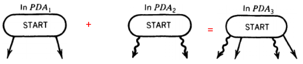
  - 🍎 Example

| PDA₁ |  | PDA₂ |  | PDA₃ |
|:--:|:--:|:--:|:--:|:--:|
| 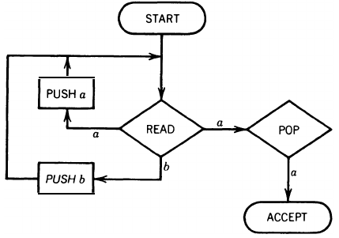 | `+` | 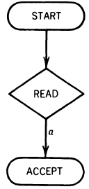 | `=` | 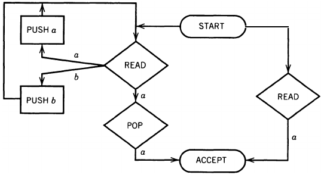 |

- for `❷L₁L₂`, add
  - `S → S₁S₂`
  - by PDAs
    - 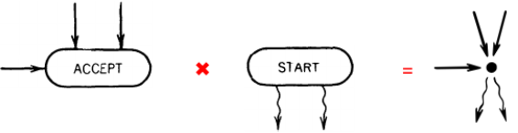

- 🍎 Example
    - try running `(baabbb)(aa)`

| PDA₁ |  | PDA₂ |  | PDA₃ |
|:--:|:--:|:--:|:--:|:--:|
| 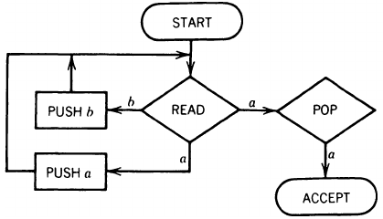 | `×` |  | `=` | 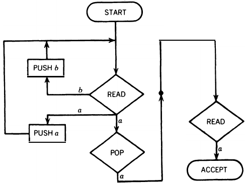 |

- 💡 How many ways does the operator have to run `(baabbb)(aa)`?
  - All ways will crash PDA₃. Why? 
    - PDA₂ works on `corrupted tape and nonempty stack` because we did NOT clean the tape and stack before leave from PDA₁
      - How about `(abbabaa)(abba)`?
    - This PDA₃ accepts words contain `aaa` only
  - Corrected version
    - modify PDA₁ to clean the tape and stack before leave
    - Do we need to clean PDA₂ as well?

| PDA₁ |  | PDA₂ |  | PDA₃ |
|:--:|:--:|:--:|:--:|:--:|
| 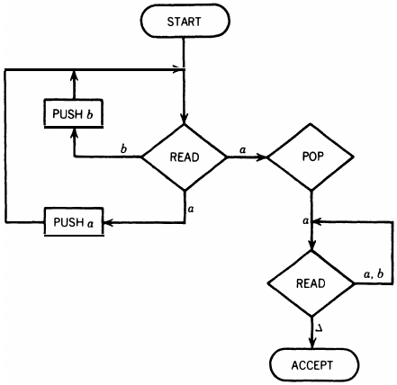 | `×` |  | `=` |  |

- for `❸L₁*`, add
  - `S → S₁S | ε`

---
Prove by counterexamples 🅱 `L₁ ∩ L₂`:
- `may` be context-free
  - ❶ All `regular languages` are context-free and the intersection of two regular lan­guages is regular
    - ∴ if L₁ and L₂ are regular and context-free, then `L₁ ∩ L₂` is both regular and context-free
  - ❷ If CFL₁ ⊂ CFL₂, then CFL₁ ∩ CFL₂ = CFL₁ is still CFL
    - ex. L₁={aⁿ|n=1,2,3,⋯}, L₂=PALINDROME
    - L₁ ⊂ L₂
  - ❸ L₁=PALINDROME, L₂=a⁺b⁺a⁺, then L₁ ∩ L₂ = {aⁿbᵐaⁿ|n,m=1,2,3,⋯; n,m are independent from each other}. This is a CFL which can be generated by the CFG below
    - S→aSa|B
    - B→bB|b
    - or by the PDA
      - 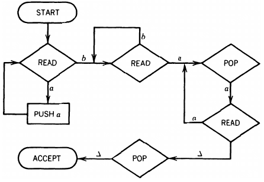
- `may NOT` be context-free
  - ❶ Given CFL L₁ = {aⁿbⁿaᵐ| n,m=1,2,3,⋯; n,m are independent from each other} = {aba, abaa, aabba, ⋯} which can be generated by CFG G₁
    - S→XA
    - X→aXb|ab
    - A→aA|a
    - L₁ is also the product of CFL {aⁿbⁿ} and RL a⁺
  - CFL L₂={aⁿbᵐaᵐ| n,m=1,2,3,⋯; n,m are independent from each other} = {aba, aaba, abbaa, ⋯}which can be generated by CFG G₂
    - S→XA
    - X→bXa|ba
    - A→aA|a
    - L₂ is also the product of RL a⁺ and CFL {aⁿbⁿ}
  - However, L₃ = L₁ ∩ L₂ = {aⁿbⁿaⁿ| n=1,2,3,⋯} is `non-context-free`
  - ❷ L₁ = EQUAL = {all words with the same number of a's and b's} is CFL which can be generated by the CFG below
    - S→bA | aB
    - A→bAA | aS | a
    - B→aBB | bS | b
  - L₂ = {aⁿbᵐaⁿ|n,m=1,2,3,⋯; n,m are independent from each other} is CFL
  - but L₃=L₁ ∩ L₂ = {aⁿb²ⁿaⁿ| n=1,2,3,⋯} = {abba, aabbbbaa, ⋯} is `non-context-free` which can be proved by the `pumping lemma for CFL`

🍎 Example 1
---
Given 
- L₁ the PALINDROME with CFG1: S→aSa | bSb | a | b | ε
- L₂ = {aⁿbⁿ} with CFG2: S→aSb | ε

`❶ L₁+L₂` can be generated with
- `S→S₁ | S₂`
- S₁→aS₁a | bS₁b | a | b | ε
- S₂→aS₂b | ε

`❷L₁L₂` can be generated with
- `S→S₁S₂`
- S₁→aS₁a | bS₁b | a | b | ε
- S₂→aS₂b | ε

`❸L₁*` can be generated with
- `S→S₁S | ε`
- S₁→aS₁a | bS₁b | a | b | ε

🍎 Example 2
---
Given 
- L₁ the PALINDROME with CFG1: S→aSa | bSb | a | b | ε over Σ₁ = {a,b}
- L₂ = {cⁿdⁿ} with CFG2: S→cSd | ε over Σ₂ = {c,d}

Then `L₁+L₂` can be generated with
- S→S₁ | S₂
- S₁→aS₁a | bS₁b | a | b | ε
- S₂→cS₂d | ε
- over Σ = Σ₁∪Σ₂ = {a,b,c,d}

🏃 Practice: find `L₁L₂, L₁*, and L₂*`

---

🏃 Exercise 1
---
Given 
- L₁ the EVENPALINDROME with CFG1: S→aSa | bSb | ε
- L₂ the ODDPALINDROME with CFG2: S→aSa | bSb | a | b

Then `L₁+L₂` can be generated with
- S→S₁ | S₂
- S₁→aS₁a | bS₁b | ε
- S₂→aS₂a | bS₂b | a | b

🏃 Practice: find `L₁L₂, L₁*, and L₂*`

🍎 Example 5
---
🅐 `L' may` be context-free
- ❶ If L is regular, then L' is also regular and both are context-free
- ❷ There are also some `nonregular but context-free` languages that have context-free complements such as PALINDROMEX on Σ={a,b,X}:
  - PALINDROMEX = {sX rev(s) | s is any string in (a+b)*}
  - ={X, aXa, bXb, aaXaa,abXba, baXab, bbXbb, ⋯}
  - can be accepted by a `dPDA`
    - 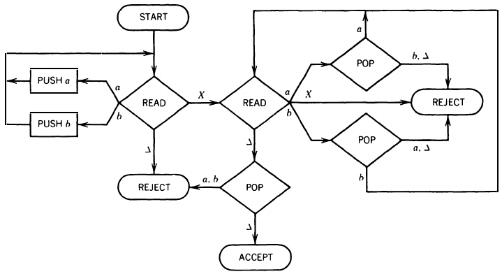
  - to construct a PDA that accepts exactly those input strings that this machine rejects, we need to reverse the status of the halt states from ACCEPT to REJECT and vice versa
    - 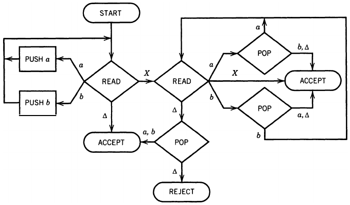
  - ⚠️ this trick can't be used on `nPDA` due to its `nondeterminism`

---
🅑`L' may NOT` be context-free
- ❶ by an indirect argument: suppose the complement of every CFL were context-free.
  - Let L₁ and L₂ be any two such languages, then L₁' + L₂' are context-free,
  - so (L₁' + L₂')' is also context-free, i.e. (L₁' + L₂')' = L₁ ∩ L₂ is also context-free, this is a `contradiction` to theorem 1 🅱.
- ❷ (optional) the complement of the `non-context-free language {aⁿbⁿaⁿ}` is the context-free language L below:
  - ${ L = M_{pq} + M_{qr} + M_{pr} + M_{rp} + M_{qr} + M_{rq} + M }$ is context-free since
    - ${ M_{pq}=\{a^p b^q a^r | p,q,r=1,2,3,⋯ \text{ and } p>q\} }$ is CFL can be generated by CFG₁:
      - S→AXA
      - X→aXb|ab (⊨aⁿbⁿ)
      - A→aA|a (⊨aa*)
      - it generates (aa*)(aⁿbⁿ)(aa*) = ${ a^p b^q a^r }$ = (a⁺)(aⁿbⁿ)(a⁺)
      - meanwhile, the product of two context-free languages is context-free, so is the product of three context-free languages
    - ${ M_{qp}=\{a^p b^q a^r | p,q,r=1,2,3,⋯ \text{ and } q>p\} }$ is CFL can be generated by CFG₂:
      - S→XBA
      - X→aXb|ab (⊨aⁿbⁿ)
      - B→bB|b (⊨bb*)
      - A→aA|a (⊨aa*)
      - (aⁿbⁿ)(b⁺)(a⁺) = ${ a^p b^q a^r }$
    - ${ M_{pr}=\{a^p b^q a^r | p,q,r=1,2,3,⋯ \text{ and } p>r\} }$ is CFL can be generated by CFG₃:
      - S→AX
      - X→aXa|aBa (⊨aⁿbb*aⁿ)
      - B→bB|b (⊨bb*)
      - A→aA|a (⊨aa*)
      - (aa*)(aⁿbb*aⁿ) = ${ a^p b^q a^r }$
    - ${ M_{rp}=\{a^p b^q a^r | p,q,r=1,2,3,⋯ \text{ and } r>p\} }$ is CFL can be generated by CFG₄:
      - S→XA
      - X→aXa|aBa (⊨aⁿbb*aⁿ)
      - B→bB|b (⊨bb*)
      - A→aA|a (⊨aa*)
      - (aⁿbb*aⁿ)(aa*) = ${ a^p b^q a^r }$
    - ${ M_{qr}=\{a^p b^q a^r | p,q,r=1,2,3,⋯ \text{ and } q>r\} }$ is CFL can be generated by CFG₅:
      - S→ABX
      - X→bXa|ba (⊨bⁿaⁿ)
      - B→bB|b (⊨bb*)
      - A→aA|a (⊨aa*)
      - (a⁺)(b⁺)(bⁿaⁿ) = ${ a^p b^q a^r }$
    - ${ M_{rq}=\{a^p b^q a^r | p,q,r=1,2,3,⋯ \text{ and } r>q\} }$ is CFL can be generated by CFG₆:
      - S→AXA
      - X→bXa|ba (⊨bⁿaⁿ)
      - A→aA|a (⊨aa*)
      - (a⁺)(bⁿaⁿ)(a⁺) = ${ a^p b^q a^r }$
    - M = {the complement of the language defined by a⁺b⁺a⁺}
      - = {all words not of the form ${ a^p b^q a^r }$ }
      - M is regular since it is the complement of a regular language 
  - ∴ `L={aⁿbⁿaⁿ}' is a CFL`, i.e. `L'={aⁿbⁿaⁿ} is non-context-free`
    - The reason that the complement of a CFL can be non-context-free is that not all CFLs can be accepted by dPDAs.
    - Idea of the proof: $`¬ ((p=q) ʌ (q=r)) ↔ (p≠q) ∨ (q≠r)`$
      - $`M_{pq}+M_{qp}`$ is for $`p≠q`$, $`M_{qr}+M_{rq}`$ is for $`q≠r`$
      - $`p≠r`$ is redundant, so $`M_{pr}+M_{rp}`$ is unnecessary, included here for symmetry.

☯ Theorem 2
---
- ❶ The `union` of a `context-free` language and a `regular` language must be `context-free`
  - because a RL is also a CFL
- but `may be regular or non-regular`
  - ex 0. if L₁⊂L₂, then L₁ ∪ L₂ = L₂, so its regularity depends on L₂
  - ex 1. PALINDROME is `nonregular context-free` and ${ \mathbf{(a+b)^*} }$ is regular
    - their union is regular since PALINDROME ⊂ ${ \mathbf{(a+b)^*} }$
  - ex 2. PALINDROME is `nonregular context-free` and ${ \mathbf{a^*} }$ is regular
    - their union is `nonregular context-free` since ${ \mathbf{a^*} }$ ⊂ PALINDROME
  - ex 3. {aⁿbⁿ} is `nonregular context-free` and $`{ \mathbf{b^*a^*} }`$ is regular
    - their union is `nonregular` (the argument is out of scope)
  - ex 4. PALINDROME is nonregular context-free and the complement of ${ \mathbf{a^*} }$ is regular
    - their union is `all strings` so is regular since ${ \mathbf{a^*} }$ ⊂ PALINDROME
- ❷ The `intersection` of a `context-free` language L₁ and a `regular` language L₂ is always `context-free`
- (optional) prove by constructing a new PDA from the PDA accepts L₁ and the FA accepts L₂
  - with the same idea as building the intersection machine for two FAs in Kleene's theorem

🍎 (optional) Example 6
---
➀ Show the intersection of 
- the language EQUAL of words with the same total number of a 's and b's
  - 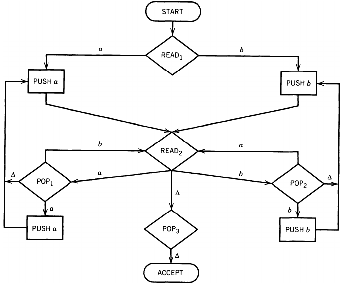
- and the FA that accepts all words ending in the letter a
  - 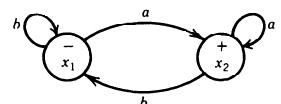

The result PDA:

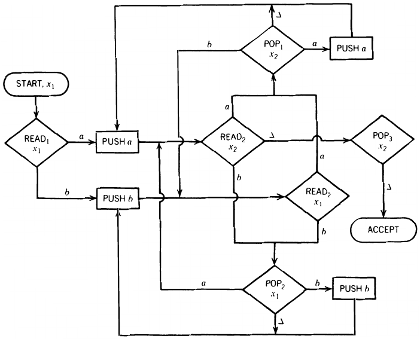

---
➁ show the language DOUBLEWORD is non-context-free.

Prove by contradiction:
- if DOUBLEWORD were a CFL, then when we inter­sect it with any regular language, we must get a context-free language.
- $`DOUBLEWORD ∩ a^+b^+a^+b^+ = a^nb^ma^nb^m`$, however, $`a^nb^ma^nb^m`$ is non-context-free.