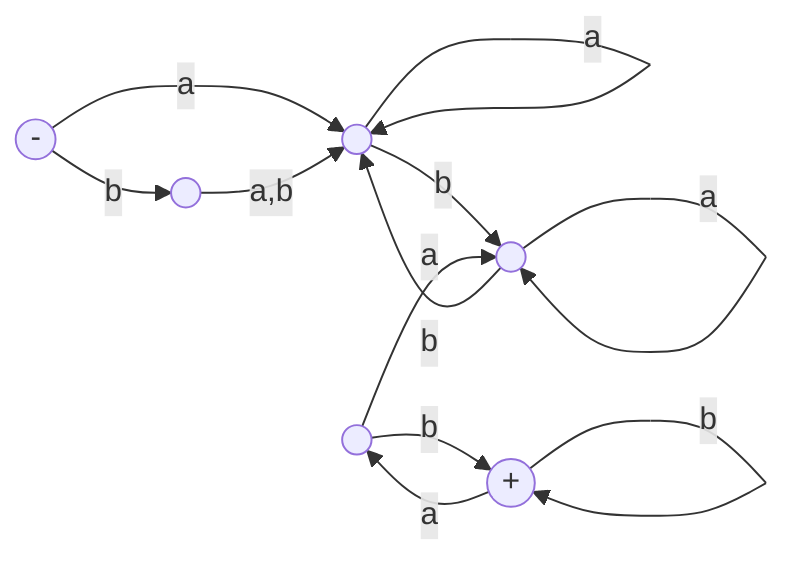
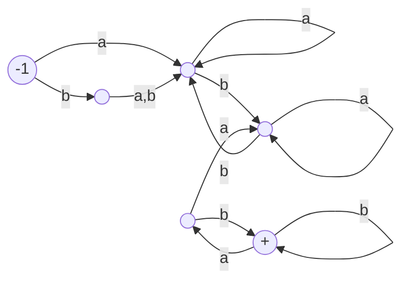
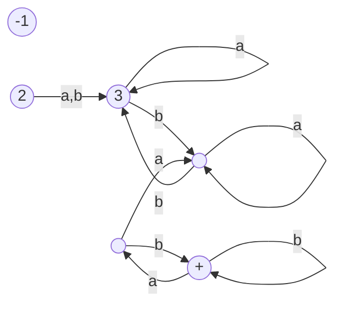
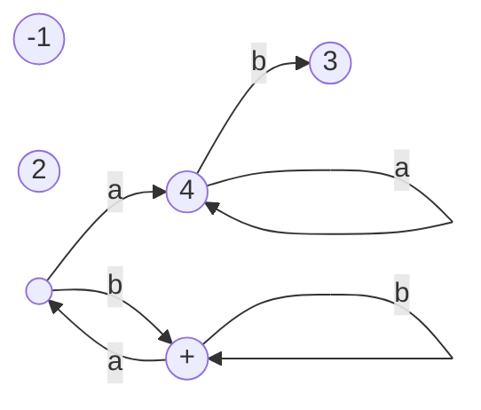
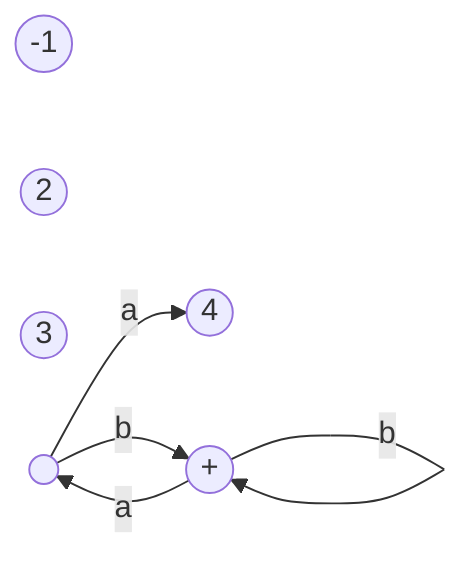
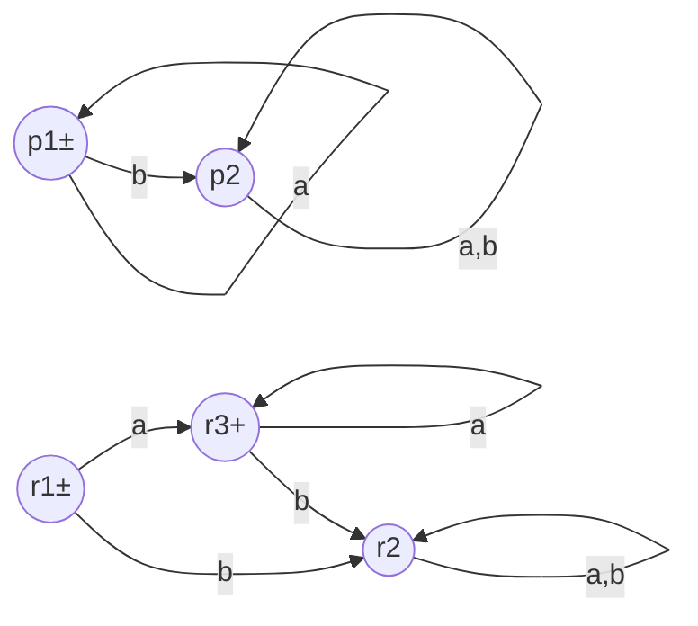
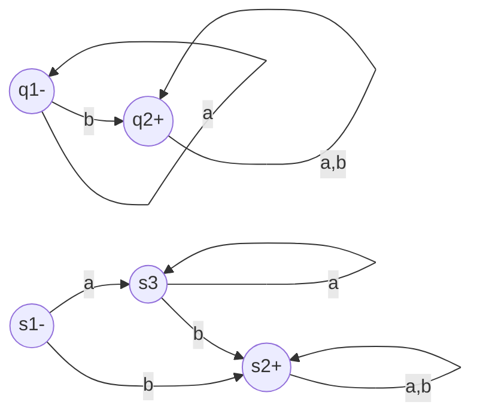
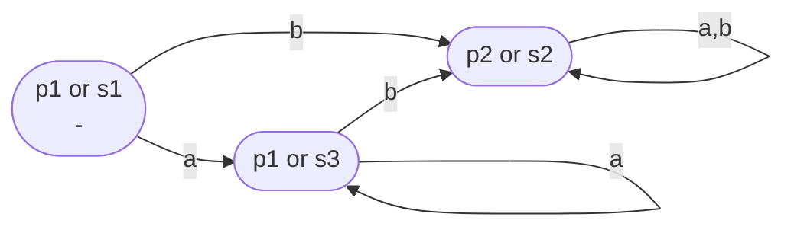

__Decidability__

_ict chapter 11_

Decidability problems and decision proce­dures
---
- Decidability problems
  - ① Do two regular expressions define the same language?
  - ② Do two FAs accept the same language?
  - ③ Is the number of words of a language defined by an FA finite?
- An `effective solution` to a problem that has a `yes or no answer` is called a `decision proce­dure`
  - A problem that has a decision procedure is called `decidable`

🍎 Example
---
Are two REs equivalent?
- $\mathbf{a(a + b)^*}$  and  $\mathbf{(b + \boldsymbol{ε})(baa + ba^*)^*}$
  - No
- $\mathbf{(aa + ab + ba + bb)^*}$ and $\mathbf{((ba + ab)^*(aa + bb)^*)^*}$
  - Both define the language of all strings with an even number of letters
- $\mathbf{((b^*a)^*ab^*)^*}$ and $\mathbf{ϵ + a(a + b)^* + (a + b)^*aa(a + b)^*}$
  - Both define the language of all words that either start with an a or else have a double a in them somewhere or else are null

Answer question ① and ②
---
- ① and ② are equivalent based on Kleene's theorem
  - RE ↔ FA
- L1 = L2 ↔ (L1 ∩ L2') + (L1' ∩ L2) = Φ
  - L1 ∩ L2' are all words in L1 but not in L2
  - L1' ∩ L2 are all words in L2 not not in L1
  - ∴ L1 = L2 if and only if (L1 ∩ L2') + (L1' ∩ L2) is empty
- so we only need to decide whether (L1 ∩ L2') + (L1' ∩ L2) is empty
  - this can be decided by the FA accepts (L1 ∩ L2') + (L1' ∩ L2)

Determine whether an FA accepts any words Method 1
---
- Convert the FA into a regular expression with Kleene's theorem
  - Every regular expression other than $\boldsymbol{Φ}$ defines some words
  - An FA results in $\boldsymbol{Φ}$ in three cases:
    - The FA has no final states
    - the final state is disconnected from the start state
    - the final state is unreachable from the start state

🍎 Example
---
Determine an RE defines some words:

$(a + ϵ)(ab^* + ba^*)^*(ϵ + b^*)^*$

- delete all stars
  - $(a + ϵ)(ab + ba)(ϵ + b)$
- keep the left part of each +
  - $(a)(ab)(ϵ)$
- eliminate ()
  - a ab ϵ
- which is the word `aab`

Determine whether an FA accepts any words Method 2
---
- Examine the FA to see whether or not there is any path from - to + by the procedure
  - ❶ mark the start state
  - ❷ from every marked state, 
    - follow its outgoing edges and mark the destination states
    - delete all these edges
  - ❸ repeat step ❷ until `no new` state is marked then stop
  - ❹ if any of the final states are marked 
    - then the machine accepts some words and 
    - if not, it does not

🍎 Example
---

- mark the start state

- mark the start state's neighbors and delete all its outgoing edges

- repeat →

- repeat →

- no new states markable, stop
  - no final state is marked
  - so the FA accepts no words

☯ Short words accepted by an FA
---
- If F is an FA with N states and accepts any words at all, 
- then it accepts some word with N or fewer letters.

**Proof**
- The shortest path `p` from - to +  cannot contain a circuit
- `p` can visit each state at most one time
- ∴ `p` can have at most N edges and the corresponding word can have at most N letters

Determine whether an FA accepts any words Method 3
---
- Test all words with no longer than N letters by running them on the FA
  - the number of such words is $|Σ|^N$
-  If the FA accepts none of them, then it accepts no words at all

🍎 Example
---
Decide the equivalence of the two REs
- $\mathbf{r_1=a^*}$ and $\mathbf{r_2=ϵ + aa^*}$

- Build the FAs that accepts the REs

- Find FA1' and FA2' by flipping states

- Build FA for (L1'+L2)'+(L1+L2')' instead of (L1∩L2')+(L1'∩L2)
- (FA1'+FA2)'
  - no final states, accept no words

- (FA1+FA2')'
  - no final states, accept no words

- (L1'+L2)'+(L1+L2')'= Φ
  - i.e. (L1∩L2')+(L1'∩L2) = Φ
- ∴ $\mathbf{r1 ≡ r2}$

☯ The equivalence of two regular language is decidable
---
There is an effective procedure to decide whether:
1. A given FA accepts any words.
2. Two FAs are equivalent.
3. Two regular expressions are equivalent.

☯ The finiteness of a regular language L defined by an RE
---
- L is infinite if and only if 
- the RE contains a Kleene closure on a nonempty component

☯ The finiteness of a regular language L defined by an FA with N states
---
- ❶ L is infinite if and only if
- ❷ F accepts an input string w such that N ≤ length(w) < 2N
-  prove ❶ → ❷ as proving the pumping lemma
-  prove ❷ → ❶ by the strong pumping lemma

☯ The finiteness of an FA is decidable
---
- There is an `effective procedure` to decide whether a given FA accepts a finite or an infinite language

**Proof**:
- If the machine has `N` states and the alphabet has `m=|Σ`| letters, then in total there are
  - $\displaystyle \sum_{i=N}^{2N-1}m^i$ 
- different input strings in the range
  - N ≤ length of the string < 2N
- test them all by running them on the machine. 
  - If any are accepted, the language is infinite 
  - If none are accepted, the language is finite