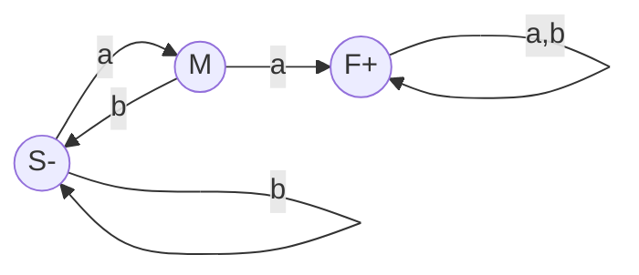
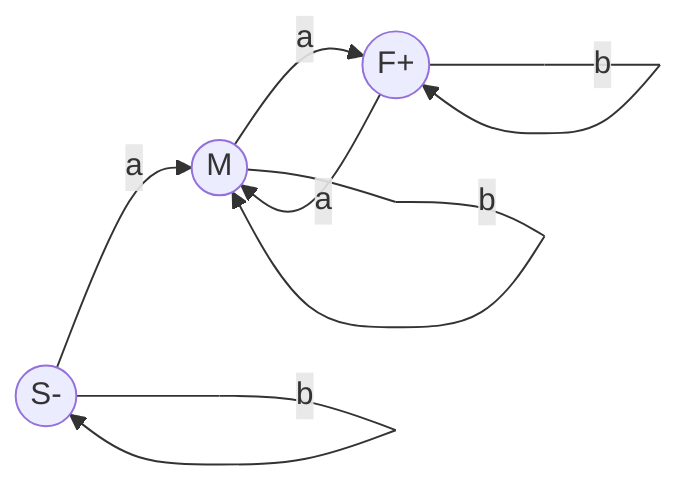
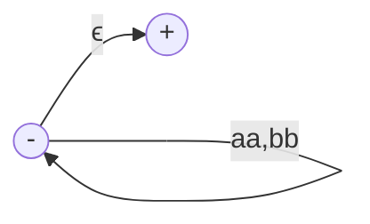
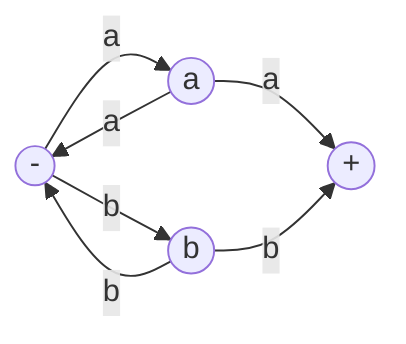
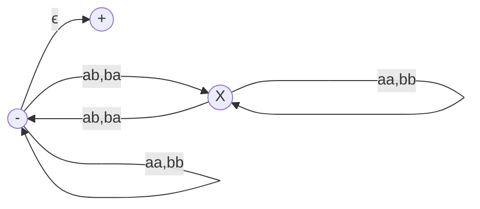

__Grammatical format__

_ict chapter 13_

Capability of CFGs
---
CFGs can generate
- all regular languages, and
- some nonregular languages but not all possible languages

☯ Theorem: All regular languages are context-free languages
---
Given any FA, there is a CFG that generates exactly the language accepted by the FA.

Prove by constructing a CFG for any given FA:
- Create a nonterminal for each state of the FA
  - the start state is the `S (start here)` nonterminal
- Create a production for every edge (s1, σ, s2), e.x.
  - X → aX for (x,a,y)
  - X → bX for (x,b,x)
  - F → ϵ for every final state f

Then show that
- ❶ every word w=σ₁σ₂⋯σₙ⋯σₑ accepted by the FA can be generated from the CFG
  - there is a `semiword` for every `semipath`
    - `semiword` = (terminal)⁺(nonterminal)
    - `semipath` = (σ)⁺(s)

🍎 Example
---

- The CFG created by the theorem:
  - S → aM | bS
  - M → aF | bS
  - F → aF | bF | ϵ
- When `baab` is running on the FA, 
  - a sequence of (semipath:semiword) is generated
    - S:S
    - S(b)S:bS
    - S(b)S(a)M:baM
    - S(b)S(a)M(a)F:baaF
    - S(b)S(a)M(a)F(b)F:baabF

- ❷ every word generated by th e CFG is accepted by the FA
  - any word `w` generated by the CFG is a semiword mapping to a semipath on the FA, and only when the nonterminal of the semiword is F, a word can be generated by applying `F→ϵ`. i.e. Its corresponding semipath stops at a final state of the FA, i.e. `w` is accepted by the FA. 

🍎 Example
---
- An FA defines the language of all words with an even number of a's

- has the CFG below generated by the theorem
  - S → bS|aM
  - M → bM|aF
  - F → bF|aM|ϵ

☯ Theorem: CFGs that generate RLs
---
If all the productions in a given CFG has only the two forms:
- ❶ nonterminal → semiword=(word)⁺nonterminal
  - e.x. Nᵤ → wᵢNᵥ
- ❷ nonterminal → word
  - e.x. Nₖ → wⱼ

then the language generated by this CFG is regular.
- such a CFG is called a `regular grammar (RG)`
  - all RGs generate RLs
  - all RLs can be generated by RGs
  - ⚠️ some non-RG CFGs can generate RLs as well

Prove by constructing a TG accepts the language generated by this CFG:
- create a state for each nonterminal
  - the start state is for the S nonterminal
  - a final state for each word in form ❷
- create an edge for each production
  - Nᵤ → wᵢNᵥ: an edge from Nᵤ to Nᵥ labeled with wᵢ
  - Nₖ → wⱼ: an edge from Nₖ to Fⱼ labeled with wⱼ

🍎 Example
---
① Given a RG1 
- S → aaS|bbS|ϵ, 
- a TG1 can be constructed following the previous theorem:

- which corresponds to RE1: $\mathbf{(aa+bb)^*}$

- ---

② Given a RG2 
- S → aA|bB
- A → aS | a
- B → bS | b
- a TG2 can be constructed following the previous theorem:

- which corresponds to RE2: $\mathbf{(aa+bb)^+}$

- ---

③ Given a RG3 
- S → aaS|bbS|abX|baX|ϵ
- X → aaX|bbX|abS|baS
- a TG3 can be constructed following the previous theorem:

- which is EVEN-EVEN RE3: $\mathbf{(aa+bb + (ab+ba)(aa+bb)^*(ab+ba))^*}$

