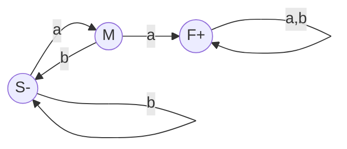
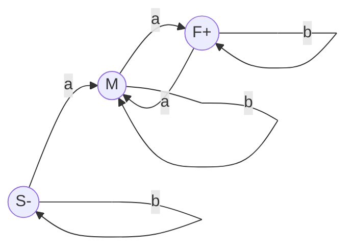
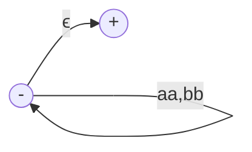
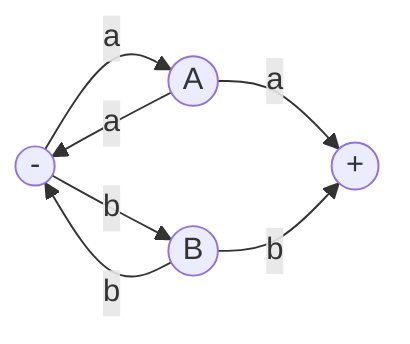
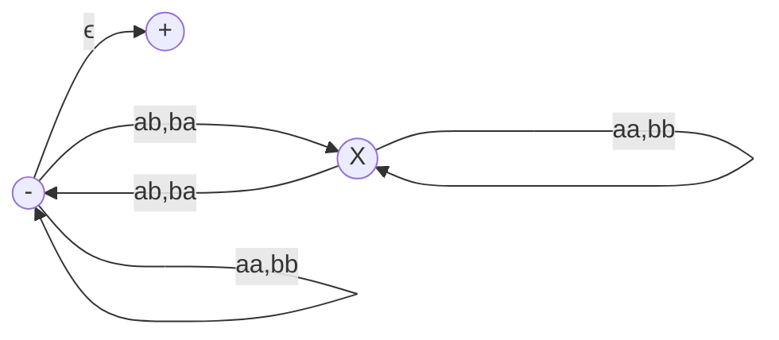

__Grammatical format__

_ict chapter 13_

Capability of CFGs
---
CFGs can generate
- all regular languages, and
- some nonregular languages but not all possible languages

☯ Theorem: All regular languages are context-free languages
---
Given any FA, there is a CFG that generates exactly the language accepted by the FA.
- `(sᵢ, σ, sⱼ)` denotes the edge from state `sᵢ` to `sⱼ` with letter `σ` on it

Prove by constructing a CFG for any given FA:
- ① Create a nonterminal for each state of the FA
  - the start state is the `S (start here)` nonterminal
- ② Create a production `Sᵢ→σSⱼ` for every edge `(sᵢ, σ, sⱼ)`, e.x.
  - X → aY for (x,a,y)
  - X → bX for (x,b,x)
- ③ F → ϵ for every final state f

Then show that
- ❶ every word w=σ₁σ₂⋯σₙ⋯σₑ accepted by the FA can be generated from the CFG
  - (p1) there is a `semiword` for every `semipath`
    - `semiword` = (terminal)*(nonterminal)
    - `semipath` = (σ)*(s)

🍎 Example 1
---

- The CFG created by the theorem:
  - S → aM | bS
  - M → aF | bS
  - F → aF | bF | ϵ
- When `baab` is running on the FA, 
  - a sequence of (semipath:semiword) is generated
    - S:S
    - S(b)S:bS
    - S(b)S(a)M:baM
    - S(b)S(a)M(a)F:baaF
    - S(b)S(a)M(a)F(b)F:baabF
- (p2) shows the sequence of semipaths accepts word `babbaaba` by this FA

- ❷ every word generated by th e CFG is accepted by the FA
  - any word `w` generated by the CFG is a semiword mapping to a semipath on the FA, and only when the nonterminal of the semiword is F, a word can be generated by applying `F→ϵ`. i.e. Its corresponding semipath stops at a final state of the FA, i.e. `w` is accepted by the FA. 

🍎 Example 2
---
- An FA defines the language of all words with an even number of a's

- has the CFG below generated by the theorem
  - S → bS|aM
  - M → bM|aF
  - F → bF|aM|ϵ

☯ Theorem: CFGs that generate RLs
---
If all the productions in a given CFG has only the two forms:
- ❶ nonterminal → semiword=(terminal)*nonterminal
  - e.x. Nᵤ → wᵢNᵥ
- ❷ nonterminal → word
  - e.x. Nₖ → wⱼ

then the language generated by this CFG is `regular`.
- such a CFG is called a `regular grammar (RG)`
  - all RGs generate RLs
  - all RLs can be generated by RGs
  - ⚠️ some non-RG CFGs can also generate RLs as well

Prove by constructing a TG accepts the language generated by this CFG:
- create a state for each nonterminal
  - the start state is for the S nonterminal
  - a final state for each word in form ❷
- create an edge for each production
  - Nᵤ → wᵢNᵥ: an edge from Nᵤ to Nᵥ labeled with wᵢ
  - Nₖ → wⱼ: an edge from Nₖ to Fⱼ labeled with wⱼ
- Any path in this TG from - to + 
  - corresponds to a word in the language of the TG (by concatenating labels)
  - also corre­sponds to a sequence of productions in the CFG generating the same word
- Conversely, every production of a word in this CFG
  - S⇒w₁N₁⇒w₁w₂N₂⇒⋯ ⇒ w₁w₂⋯wₙ corresponds to a path in this TG from - to +
- ∴ this TG ≡ this CFG

🍎 Example 3
---
① Given a RG1 
- S → aaS|bbS|ϵ, 
- a TG1 can be constructed following the previous theorem:

- which corresponds to RE1: $\mathbf{(aa+bb)^*}$

- ---

② Given a RG2 
- S → aA|bB
- A → aS | a
- B → bS | b
- a TG2 can be constructed following the previous theorem:

- which corresponds to RE2: $\mathbf{(aa+bb)^+}$

- ---

③ Given a RG3 
- S → aaS|bbS|abX|baX|ϵ
- X → aaX|bbX|abS|baS
- a TG3 can be constructed following the previous theorem:

- which is EVEN-EVEN RE3: $\mathbf{(aa+bb + (ab+ba)(aa+bb)^*(ab+ba))^*}$

Eliminating ϵ-productions
---
- An `ϵ-production` has the form
  - N → ϵ
  - N is a nonterminal
- a nonterminal N is `nullable` if
  - there is a production N → ϵ, or
  - there is a derivation starts at N and leads to ϵ:
    - N ⇒ ⋯ ⇒ ϵ

☯ Theorem: ϵ-production is removable
---
- If a CFL is generated by a CFG1 with ϵ-productions,
- then there is a different CFG2 without ϵ-productions generate 
  - the same CFL if it does not contain the empty word ϵ
  - or the language of words in the CFL except ϵ
- Let's say CFG2 is no-ϵ-equivalent to CFG1

Prove by construction
- given a CFG1 with N → ϵ, a no-ϵ-equivalent CFG2 can be constructed by 
- deleting all ϵ-productions
- for each production P in CFG1 that contains `nullable nonterminals`, 
  - remove all `possible subsets` of these nullable nonterminals from P one subset a time
  - add a P' = P without `nullable nonterminals` for each removal

🍎 Example 4
---
- the following CFG generates a single a
  - S → aX
  - `X → ϵ`
- which can be generated by
  - S → a
  - in which there is no ϵ-production
- ---

🍎 Example 5
---
- the no-ϵ-equivalent CFG1 to EVENPALINDROME: S → aSa|bSb|ϵ:
  - S → aSa | bSb | `aa | bb`
  - CFG1 generates all the words in EVENPALINDROME except ϵ

🍎 Example 6
---
- In the following CFG
  - S → a | Xb | aYa
  - X → Y | ϵ
  - Y → b | X
- both X and Y are nullable, so the no-ϵ-equivalent CFG can be constructed as
  - S → a | Xb | aYa | `b | aa`
  - X → Y
  - Y → b | X

🍎 Example 7
---
- find the nullable nonterminals of complex CFGs by propagating marks such as
  - S → Xay | YY | aX |ZYZ ❷
  - X → Za | bZ | ZZ | Yb ❸ 
  - Y → Ya | XY | ϵ ❶
  - Z → aX | YYY  ❷ 
- the marking sequence ❶ ❷ ❸ shows that all the nonterminals are nullable, 
- so the no-ϵ-equivalent CFG can be constructed
  - S → XaY | YY | aX |ZYZ | aY | `a | Y | Z | Xa | YZ | ZY | ZZ`
  - X → Za | bZ | ZZ | Yb | `a | b | Z`
  - Y → Ya | XY | `a | X | Y`
  - Z → aX | YYY | `a | Y | YY`

🍎 Example 8
---
- S → Xa
- X → aX | bX | ϵ

is no-ϵ-equivalent to
- S → Xa | `a`
- X → aX | bX | `a | b`

🍎 Example 9
---
An inefficient CFG generating the language defined by $\mathbf{(a+b)^*bb(a+b)^*}$, i.e. all words contains the substring `bb`:
- S → XY
- X → Zb
- Y → bW
- Z → AB
- W → Z
- A → aA | bA | ϵ
- B → Ba | Bb | ϵ

is no-ϵ-equivalent to
- S → XY
- X → Zb | `b`
- Y → bW | `b`
- Z → AB | `A | B`
- W → Z ❶ (unit production)
- A → aA | bA | `a | b`
- B → Ba | Bb | `a | b`

☯ Theorem: unit production is removable
---
- `one nonterminal → another nonterminal` is called a `unit production`
- `a chain of unit productions` has the form of
  - A ⇒X₁⇒X₂⇒⋯⇒B
- If a CFL is generated by a CFG1 without ϵ-productions,
- then there is a no-ϵ-equivalent CFG2 without ϵ-productions and unit productions

Prove by construction
- if `A→B` and  the nonunit productions from B are
  - B→s₁|s₂|⋯
  - sᵢ is a string with nonterminals and terminals
- then the production `A→B` can be replaced by
  - A→s₁|s₂|⋯

🍎 Example 10
---
Remove unit productions from the CFG below
- S→A | bb
- A→B | b
- B→S | a

❶ separate the units from the nonunits:

|unit production | nonunit production|
|:--:|:--:|
|S→A |S→bb|
|A→B |A→b|
|B→S| B→a |

❷ list all unit productions and `chains` of unit productions `without loops`
- create new pro­ductions by removing unit productions
- S→A gets S→b
- S→A→B gets S→a
- A→B gets A→a
- A→B→S gets A→bb
- B→S get  B→bb
- B→S→A gets B→b
  
∴ the new CFG is
- S→ bb | `a | b`
- A→ b | `a | bb`
- B→ a | `b | bb`

☯ Theorem: nonterminals and terminals are separable
---
- separates the terminals from the nonterminals in CFG productions
- For a given CFG1, there is another no-ϵ-equivalent CFG2 whose productions are in one of two basic forms:
  - Nonterminal → string of only nonterminals
  - Nontermial → one terminal

Prove by construction:
- foreach letter σᵢ in Σ, if its used any terminal wᵢ in the productions, 
  - add a new production: Nᵢ→σᵢ
- then replace each wᵢ in old productions with serials of Nᵢ's

🍎 Example 11
---
The CFG below
- S → X₁ | X₂aX₂ | aSb | b
- X₁ → X₂X₂ | b
- X₂ → aX₂ | aaX₁

add two new productions
- A→a
- B→b

get the CNF of the CFG
- S → X₁ | X₂AX₂ | ASB | B
- X₁ → X₂X₂ | B
- X₂ → AX₂ | AAX₁
- A→a
- B→b

⚠️ Above introduced 2 unit productions

🍎 Example 12
---
- S→Na
- N→a|b

become
- S→NA
- N→a|b
- A→a

⚠️ N→a can NOT be used to turn S→Na into S→NN since it generates bb where the old CFG does not. So, a new rule A→a is needed.

Chomsky Normal Form (CNF)
---
A CFG in `Chomsky Normal Form (CNF)` has productions of only two forms
- ❶ nonterminal → string of exactly two nonterminals
- ❷ nonterminal → one terminal

☯ Theorem: universality of CNF
---
The non-ϵ words of any CFL can be generated by a CFG in CNF.

prove by construction:
- find the non-ϵ-equivalent CFG1 without ϵ-productions and unit productions for the CFG, whose productions are in only two forms
  - ❶ Nonterminal → string of only nonterminals 
  - ❷ Nontermial → one terminal
- leave ❷ intact
- separate ❶ based on the length of the right string

🍎 Example 13
---
Convert the CFG below
- S→aSa|bSb|a|b|aa|bb
- the CFL is PALINDROME except for ϵ

into CNF:
- separate terminals and nonterminals `without introducing unit productions`
  - S→ASA|BSB|a|b|AA|BB
  - A→a
  - B→b
- S→ASA can be separated by
  - S→AR₁
  - R₁→SA
- S→BSB can be separated by
  - S→BR₂
  - R₂→SB
- add S→ϵ to the productions, we get PALINDROME which includes ϵ

🍎 Example 14
---
Convert the CFG below
- S→bA | aB
- A→bAA | aS | a
- B→aBB | bS | b
- the generated CFL is EQUAL

into CNF.

- separate terminals and nonterminals `without introducing unit productions`
  - S→YA | XB
  - A→YAA | XS | a
  - B→XBB | YS | b
  - `X→a`
  - `Y→b`
- A→YAA can be separated by
  - A→YR₁
  - R₁→AA
- B→XBB can be separated by
  - B→XR₂
  - R₂→BB

🍎 Example 15
---
Convert the CFG below
- S→aaaaS | aaaa
- the generated CFL is {a⁴ⁿ, n=1,2,...} = {a⁴, a⁸, a¹², ...}

into CNF.

- separate terminals and nonterminals `without introducing unit productions`
  - S→AAAAS | AAAA
  - `A→a`
- S→AAAA can be separated by
  - S→DD
  - D→AA 
  - or follow the algorithm
  - S→AX₁; X₁→AX₂; X₂→AA
- S→AAAAS i.e. S→DDS can be separated by
  - S→DR₁
  - R₁→DS
  - or follow the algorithm
  - S→AY₁; Y₁→AY₂; Y₂→AY₃; Y₃→AS

Leftmost derivations
---
- standardize the form of the derivations by
  - applying a rule of production  to the `leftmost nonterminal` in the working string
  - i.e. in the order from left to right
- e.x. the `leftmost nonterminal` in `abNbaXbYaZbN` is `N`

🍎 Example 15
---
A leftmost derivation on the CFG below
- S→aSX | b
- X→Xb | a

is
- S⇒aSX
- ⇒ aaSXX
- ⇒ aabXX
- ⇒ aabXbX
- ⇒ aababX
- ⇒ aababa

🍎 Example 15
---
(p3) The word `aaabb` can be generated in several different production sequences by the CFG below
- S→XY
- X→XX | a
- Y→YY | b

Derivation 1:
- S⇒XY
- S⇒(XX)(YY)
- S⇒((a)(XX)(bb))
- S⇒((a)(aa)(bb))

Derivation 2:
- S⇒XY
- S⇒(XX)(YY)
- S⇒((XX)(a)(bb))
- S⇒((aa)(a)(bb))

(p4) both derivations have a leftmost derivation respectively
- the leftmost derivation 1
  - S⇒XY
  - S⇒XXY
  - `S⇒aXY`
  - S⇒aXXY
  - S⇒aaXY
  - S⇒aaaY
  - S⇒aaaYY
  - S⇒aaabY
  - S⇒aaabb
- the leftmost derivation 2
  - S⇒XY
  - S⇒XXY
  - `S⇒XXXY`
  - S⇒aXXY
  - S⇒aaXY
  - S⇒aaaY
  - S⇒aaaYY
  - S⇒aaabY
  - S⇒aaabb

☯ Theorem: all CFL words can be generated by leftmost derivation 
---
Any word that can be generated by a given CFG by some derivation also has a leftmost de­rivation.

🍎 Example 15
---
Given the CFG
- S→S⊃S | ¬S | (S) | p | q

(p5) generate `(p⊃(¬p⊃q))` in leftmost derivation:
- S⇒(S)
- S⇒(S⊃S)
- S⇒(p⊃S)
- S⇒(p⊃(S))
- S⇒(p⊃(S⊃S))
- S⇒(p⊃(¬S⊃S))
- S⇒(p⊃(¬p⊃S))
- S⇒(p⊃(¬p⊃q))