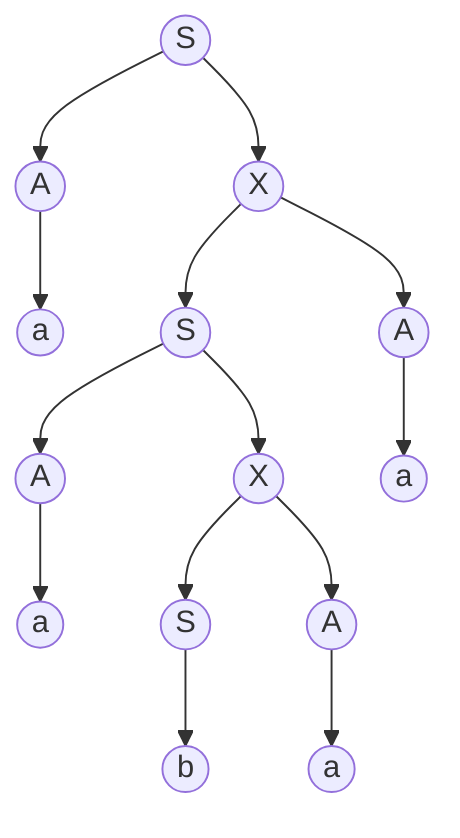

__Non-context-free Languages__

_ict chapter 16_

☯ Theorem 1 
---
Given a CFG G in CNF form, we name
- `Nonterminal → Nonterminal Nonterminal` as `live` production
- `Nonterminal → terminal` as `dead` production

then only `finitely` many words can be generated if the live productions can be applied `at most once each`.

Proof: 
- in the working string
  - applying a `live` production `increase` the `number of nonterminals` by `one`
  - applying a `dead` production `decrease` the `number of nonterminals` by `one`
- ∵ the net result of a derivation is to `start with one nonterminal S` and `end up with a word of solid terminals with zero nonterminals`
  - the net effect is to lose a nonterminal
- ∴ to get a string of only terminals, one more dead production than live pro­duction must be applied no matter in what order the productions are applied.
- Suppose G has exactly p live productions and q dead productions
  - ∵ any derivation not reuse a live production can have at most p live produc­tions, it must have at most (p + 1 ) dead productions
  - ∴  all words generated from G with­out repeating any live productions have at most ( p + 1 ) letters in them
    - i.e. there can be at most finitely many of them

💡 Demo 1
---
Given CFG: 
- S → AB
- A → XY
- X → b
- Y → SX

| working string | production applied | `# of live production` | `# of dead production` |
|:--:|:--:|:--:|:--:|
| ⇒S | start | 0 | 0 |
| S⇒AB | S → AB | 1 |  0 |
| S⇒XYB | A → XY | 1 |  0 |
| S⇒bYB | X → b | 0 |  1 |
| S⇒bSXB | Y → SX | 1 |  0 |

💡Demo 2
---
- A CNF production replaces every nonterminal with `one or two symbols`
- the derivation tree of each word has the property that
  - every mode has `one or two descendants`
- Such a tree is called a binary tree
- case 1 (p4): the second Z is a `descendant` of itself
- case 2 (p5): the second B is NOT a `descendant` of itself

💡Demo 3
---
- Given a derivation tree of an CFG in CNF (p6)
  - If the bottom row has more than 2ᵖ letters, 
  - the tree must have more than p  rows.
- Given p different live productions possible in the grammar, p=5 here
  - Y → a
  - X → BY
  - S → XY
  - B → SX
  - X → BY
  - S → XY
- (p7)
  - if more than p have been used in a path
  - then some live productions have been used more than once

☯ Theorem 2
---
Given a CFG G in CNF form with p live productions and q dead productions, 
- if w is a word generated by G of length > 2ᵖ letters, 
- then `somewhere` in `every derivation tree for w` there is an example of some nonterminal Z being used twice where the second Z is `descended` from the first Z
- such Z is said to be `self-embedded`
- Generally, in any CFG all sufficiently long words have leftmost de­rivations that include a self-embedded nonterminal

Proof:
- length(w)>2ᵖ ensures that the production tree for w has more than p rows, i.e p productions, so some live productions have been used more than once
- the nonterminal on the left side of this repeated live production has the property that it occurs twice (or more) on the descent line from S to a terminal in w.

🍎 Example 1
---
Consider the CFG for NONULLPALINDROME in CNF:
- S→AX|BY|AA|BB|a|b
- X→SA
- Y→SB
- A→a
- B→b

there are 6 live productions and 4 dead productions. According to Theorem 2, it would require a word of more than 2⁶ = 64 letters to `guarantee` that each derivation has a self-embedded nonterminal in it.

NONULLPALINDROME has words shorter than 6 letters with self-embedding nonterminal such as `aabaa` (p8):
- `X→SA` is used twice in this tree segment

- This tree has six levels, so it cannot quite guarantee a self-embedded nonterminal, but it has one anyway such as X and S
- the second X can begin a subtree exactly like the first X, and this procedure can be repeated infinitely (p1-3)
- S₁→S₂→S₃→⋯→Sₙ can be short-noted as `S₁⊨Sₙ` or ${S_1 \stackrel{*}{⇒} S_n}$
  - `S₁ can eventually produce Sₙ`
  - ex1. N is nullable if N ⊨ ε
  - ex2. N is self-embedded in the derivation of word w when there are strings of terminals v and y not both null, such that N ⊨ vNy

🍎 Example 2
---
Given CFL1 generated by CFG1:
- S → AB
- A → BC
- C → AB
- A → a
- B → b

and one of its possible derivation tree (p9①)
- A is `self-embedded`
- the subtree rooted at A can be repeated any number of times (p9②)
  - all the new and longer words generated this way ∈ CFL1

☯ Theorem 3: The pumping lemma for CFLs
---
If G is any CFG in CNF with p live productions and w is any word generated by G with length greater than 2ᵖ, then we can break up w into five substrings:
- `w = uvxyz`

such that 
- x ≠ ε
- v and y are not both ε
- `uvⁿxyⁿz` (n=1,2,3,⋯) can also be generated by G.

Proof 🅰:
- if length(w)>2ᵖ, then there are always `self-embedded nonterminals` in `any derivation tree for w`.
- given such as derivation tree and one self-embedded nonterminals P whose first production is P→QR (p10①)
- the triangle in (p10)  encloses the whole part of the tree generated from the `first P` down to where the `second P` is produced, divide w into these five parts (p10②)
  - `u` = the substring of all the letters of w generated `to the left of the triangle` above, it could be ε
  - `v` = the substring of all the letters of w descended from the first P but `to the left of the letters generated by the second P`, it could be ε
  - `x` = the substring of w descended from the second P
    - this can not be ε because this nonterminal must turn into some terminals
  - `y` = the substring of w of all letters generated by the first P but `to the right of the letters descending from the second P`
    - it could be ε `but not if v=ε`
  - `z` = the substring of all the letters of w generated `to the right of the triangle`
  - such as (p10③, p11, p12)
- reiterating the productions inside the triangle n times generates `uvⁿxyⁿz` (p13)

Proof 🅱:
- If P is a self-embedded nonterminal in the derivation of w, then there are substrings u,v,x≠ε,y,z, and v,y are not both ε, such that
  - S ⊨ uPz
  - P ⊨ vPy
  - P ⊨ x

- ∴ 
  - S ⊨ uPz ⊨ uvPyz ⊨ uvⁿPyⁿz ⊨ uvⁿxyⁿz

`Application`:
- mainly used to prove certain languages are not context-free, or
  - they are `non-context-free`

💡 Demo 4
---
Given a CFG G in CNF:
- S→PQ
- Q→QS | b
- P→a

word `abab` can be derived from G (p14①)
- there are 3 instances of self-embedded nonterminals
- such as self-embedded nonterminal Q (p14②)
  - (u,v,x,y,z)=(a,ε,b,ab,ε)
- repeat the self-embedding twice (p15)
  - (u,v²,x,y²,z)=(a,ε,b,(ab)²,ε)
- repeat the self-embedding three times (p16)
  - (u,v³,x,y³,z)=(a,ε,b,(ab)³,ε) 
- repeat the self-embedding n times (p17)
  - (u,vⁿ,x,yⁿ,z)=(a,ε,b,(ab)ⁿ,ε)

🏃 Application 1
---
Prove language L = {aⁿbⁿaⁿ, n=1,2,3,⋯} is non-context-free
- idea: given a word w∈L long enough to apply Theorem 1, 
  - `exhaust all partition schemes` of w = uvxyz
  - but uv²xy²z ∉ L which `breaks the general word structure`
- the structure characteristics in the general word aⁿbⁿaⁿ
  - ❶ there is exactly on substring `ab`, and `ba`
    - if either v or y contains `ab` or `ba`
    - uv²xy²z has one more such substring broken ❶ 
  - ❷ there are twice a's of b's with all b's in the middle and equal number of a's on each side of those b's
    - other partitions could only results in that v and y must be all a's, all b's or ε, but if v and y are blocks of one letter
    - then uv²xy²z breaks ❷
- ∴ L is non-context-free

🏃 Application 2
---
Prove language L = {aⁿbⁿcⁿ, n=1,2,3,⋯} is non-context-free
- same idea as above
- the structure characteristics in the general word aⁿbⁿcⁿ
  - ❶ there is only one substring `ab` and `bc`
  - ❷ no these substrings: `ac,ba,ca,cb`
  - ❸ there are equal number of a's, b's and c's
- if v or y is not a solid block of one letter (or ε), then uv²xy²z would have more of some of the two-letter substrings `ab, ac, ba, be, ca, cb`
- otherwise if v and y are solid blocks of one letter (or ε), then uv²xy²z would break ❸
- ∴ L is non-context-free

☯ Theorem 4: The pumping lemma for RLs
---
- If w is a word in a `regular language L` and w is `long enough`
- then w can be decomposed into `three` parts: 
  - `w = xyz` and `y≠ε`, such that all the words `xyⁿz` must also be in L
- `idea`: w is longer than the number of states of an FA that accepts this RL such that w contains an `infinitely repeatable circuit`

☯ Theorem 5: The pumping lemma for CFLs
---
- If w is a word in a `context-free language L` and w is `long enough`
- then w can be decomposed into `five` parts: 
  - `w = uvxyz`, such that all the words `uvⁿxyⁿz` must also be in L
  - where `x≠ε, v and y are not both ε`
- `idea`:  the deriva­tion for w must be so long that it contains an `infinitely repeatable sequence of productions`

☯ Theorem 6: The pumping lemma for CFLs with length
---
Let L be a CFL in CNF with p live productions.
- Then any word w in L with length > 2ᵖ can be broken into five parts: 
  - `w = uvxyz`
- such that
  - length(vxy) ≤ 2ᵖ
  - length(x) > 0, i.e. x≠ ε
  - length(v) + length(y) > 0, i.e. v and y are not both ε
- and such that all the words `uvⁿxyⁿz ∈ L`

🏃 Application 3
---
Show language L = {aⁿbᵐaⁿbᵐ}, n and m are both positive integers, is `non-context-free`.
- This can't be shown by Theorem 1 since
  - w=(u,v,x,y,z) = (ε, aᵏ, bⁱ, aᵏ, bⁱ) can be pumped to
  - (u,vⁿ,x,yⁿ,z) = (ε, (aᵏ)ⁿ, bⁱ, (aᵏ)ⁿ, bⁱ) ∈ L
- Show by `the pumping lemma for CFLs`:
  - suppose L can be generated by a CFG with p live productions
  - take word ${ a^{2^p}b^{2^p}a^{2^p}b^{2^p} }$ which is long enough to apply the theorem,
    - length(vxy) < 2ᵖ
  - first v and y `cannot be solid blocks of one letter` separated by a clump of the other letter since the separator letter clump has length 2ᵖ > length(vxy)
  - next v and y can't contain substring `ab` or `ba` otherwise
    - uv²xy²z breaks the word structure
  -  v and y must be `one solid letter` from any of the four clumps, then uv²xy²z breaks the word structure again
- ∴ L is `non-context-free`

🏃 Application 4
---
Show the language DOUBLEWORD
- = {ss, s is  any string of a 's and b's}
- = {ε,aa, bb, aaaa, abba, baba, bbbb, ⋯} 

is `non-context-free`.

- Show by `Theorem 4`: again suppose L can be generated by a CFG with p live productions, then any word with length greater than 2ᵖ can be pumped:
  - let n>2ᵖ and w = uvxyz = aⁿbⁿaⁿbⁿ ∈ DOUBLEWORD
  - and length(vxy) < 2ᵖ < n
- If `vxy` is contained entirely in one solid letter clump
  - then uv²xy²z breaks the word pattern
- if `vxy` spans two clumps of letters (⚠️ not long enough to span three clumps), i.e. `vxy` contains `ab` or `ba`
  - again uv²xy²z breaks the word pattern based on the argument cases
  - ❶ the substring `ab` or `ba` is not completely inside any of the parts v, x, or y but lies between them
  - ❷ the substring `ab` or `ba` is completely inside any of the parts v, x, or y
- ∴ L is `non-context-free`