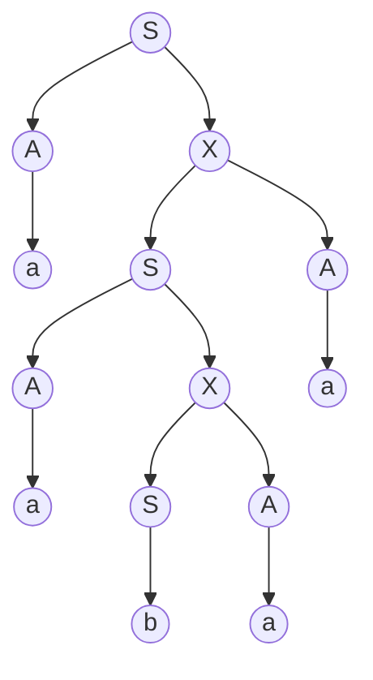

__Non-context-free Languages__

_ict chapter 16_

☯ Theorem 1 
---
Given a CFG G in CNF form, we name
- `Nontenninal → Nonterminal Nonterminal` as `live` production
- `Nontenninal → terminal` as `dead` production

then only `finitely` many words can be generated if the live productions can be applied `at most once each`.

Proof: 
- in the working string
  - applying a `live` production `increase` the number of nontenninals by `one`
  - applying a `dead` production `decrease` the number of nontenninals by `one`
- ∵ the net result of a derivation is to start with one nontenninal S and end up with a word of solid terminals with zero nonterminals
  - the net effect is to lose a nontenninal
- ∴ to get a string of only terminals, one more dead production than live pro­duction must be applied no matter in what order the productions are applied.
- Suppose G has exactly p live productions and q dead productions
  - ∵ any derivation not reuse a live production can have at most p live produc­tions, it must have at most (p + 1 ) dead productions
  - ∴  all words generated from G with­out repeating any live productions have at most ( p + l ) letters in them
    - i.e. there can be at most finitely many of them

☯ Theorem 2
---
Given a CFG G in CNF form with p live productions and q dead productions, 
- if w is a word generated by G of length > 2ᵖ letters, 
- then `somewhere` in `every derivation tree for w` there is an example of some nonterminal Z being used twice where the second Z is `descended` from the first Z
- such Z is said to be `self-embedded`
- Generally, in any CFG all sufficiently long words have leftmost de­rivations that include a self-embedded nonterminal

Proof:
- length(w)>2ᵖ ensures that the production tree for w has more than p rows, i.e p productions, so some live productions have been used more than once
- the nonterminal on the left side of this repeated live production has the property that it occurs twice (or more) on the descent line from S to a terminal in w.

🍎 Example 1
---
Consider the CFG for NONNULLPALINDROME in CNF:
- S→AX|BY|AA|BB|a|b
- X→SA
- Y→SB
- A→a
- B→b

there are 6 live productions and 4 dead productions. According to Theorem 2, it would require a word of more than 2⁶ = 64 letters to `guarantee` that each derivation has a self-embedded nontenninal in it.

NONNULLPALINDROME has words shorter than 6 letters with self-embedding nonterminal such as `aabaa`:

- This tree has six levels, so it cannot quite guarantee a self-embedded nonterminal, but it has one anyway such as X and S
- the second X can begin a subtree exactly like the first X, and this procedure can be repeated infinitely (p1-3)