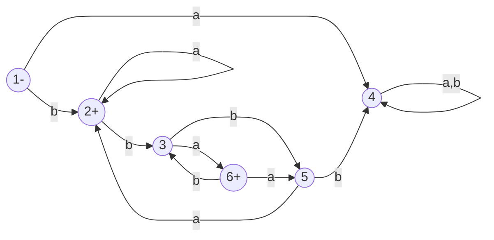

__Nonregular Languages__

_ict chapter 10_

Nonregular language
---
- can't be defined by a regular expression
- not be accepted by any FA or TG by Kleene's theorem
- must be `infinite`
- e.x.
  - PALINDROME
  - PRIME = {aᵖ}, p is a prime number
  - L = {aⁿbⁿ, n=0,1,2,3,...} = {ε, ab, aabb, aaabbb, ...}
    - = {aⁿbⁿ}, simplified notation

☯ The pumping lemma
---
- If L is a `regular language` with infinite words, then there exist three strings x, y, and z (y≠ε) such that all the strings of the form
  - xyⁿz, (n=1,2,3,...) ∈ L 

Proof
---
- L is is a `regular language` 
  - then there is an FA with `finite` number states accepts L
- L has `infinite` words
  - then L has words with length more than the FA's states
- to recognize these long words, then there must exist a `circuit` on the FA on which these words loop at least once
  - let x=the string from the FA's start state to the first-touched state A on the circuit,
  - z=the string from the FA's final state backtracing to the first-touched state B on the circuit
  - y=the string loops n times on the circuit starting from A and ending at B, n=1,2,3,...

🍎 Example
---

- (b)(aⁿ)(bba)
- (bb)(ab)ⁿ(a)
- (baᵐ)(bba)ⁿba
- (baᵐ)(bbaa)ⁿba

🍎 Example
---
Show L = {aⁿbⁿ, n=0,1,2,3,...} is not a regular language.
- prove by contradiction with pumping lemma. suppose L is regular, let's construct xyz = aᵐbᵐ
  - if y is all a's, then x must be all a's, pump xyz to xyyz, we will get more a's than b, we get a contradiction
  - if y is all b's, we can get a contradiction similarly
  - the only option left is that y has some a's and some b's, then it contains the substring ab, then xyyz has two copies of ab which contradicts that each word in L has at most one substring ab

🍎 Example
---
Show language EQUAL =  all words with the same total number of a's and b's is nonregular.
- EQUAL={ε,ab, ba, aabb, abab, ...}
- prove by contradiction
  - ∵ {aⁿbⁿ} = $\mathbf{a^*b^*}$ ∩ EQUAL
  - if EQUAL is regular, then {aⁿbⁿ} is regular.
  - but {aⁿbⁿ} is nonregular, ∴ EQUAL must be nonregular.

🍎 Example
---
Show language L= aⁿbaⁿ={b, ab, aabaa, ...} is nonregular.
- if L is regular, then there exist string x,y,z such that xyz and xyyz ∈ L:
  - if y contains b, then xyyz has two b's so it is not in L
  - if y is all a's, then b is in either x or z, xyyz will increase the number of a's either before b or after b so it is not in L
- ∴ L can't be pumped so it is nonregular

📝 Practice
---
Prove language L= aⁿbⁿabⁿ⁺¹ for n=1,2,3, ..., is nonregular by showing that  if xyz is in L for any three strings x, y, and z, but xyyz is not in L

☯ The strong pumping lemma
---
L is an infinite language accepted by an FA with N states, then for all words w in L that have more than N letters, 
- there are strings x, y≠ε, and z, and length(x) + length(y) does not exceed N such all strings of the form `xyⁿz` (n=1,2,3,...) ∈ L.

🍎 Example
---
Use the strong pumping lemma to show the following languages are nonregular
- PALINDROME
- PRIME = {aᵖ, p is a prime number} = {aa,aaa,aaaaa, aaaaaaa, ...}

☯ The Myhill-Nerode theorem
---
Given a language L, two strings x and y are in the same class if for all
possible strings z either both xz and yz are in L or both are not. L's strings can be divided into separate (mutually exclusive) classes.
- L is regular ↔  the number of classes L creates is finite