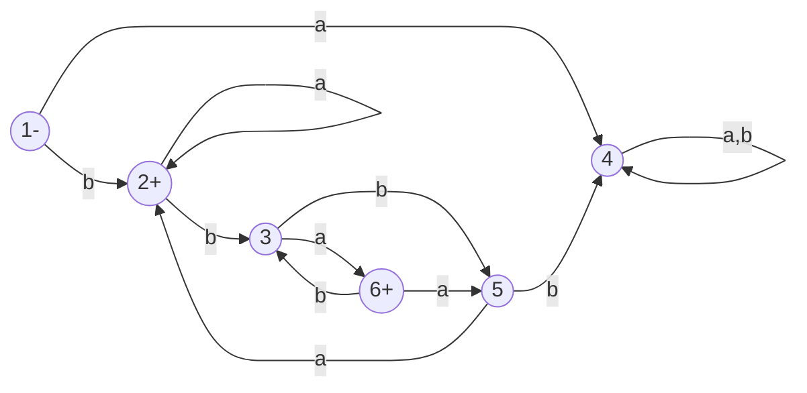
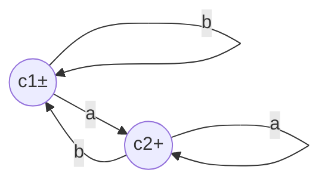

__Nonregular Languages__

_ict chapter 10_

Nonregular language
---
- can't be defined by a regular expression
- not be accepted by any FA or TG by Kleene's theorem
- must be `infinite`
- e.x.
  - PALINDROME
  - PRIME = {aᵖ}, p is a prime number
  - L = {aⁿbⁿ, n=0,1,2,3,...} = {ε, ab, aabb, aaabbb, ...}
    - = {aⁿbⁿ}, simplified notation

☯ The pumping lemma
---
- If L is a `regular language` with infinite words, 
- then there exist three strings x, y, and z (y≠ε) such that all the strings of the form xyⁿz, (n=1,2,3,...) are in L.

Proof
---
- L is is a `regular language` 
  - then there is an FA with `finite` number states accepts L
- L has `infinite` words
  - then L has words with length more than the FA's states
- to recognize these long words, then there must exist a `circuit` on the FA on which these words loop at least once
  - let x=the string from the FA's start state to the first-touched state A on the circuit,
  - z=the string from the FA's final state backtracing to the first-touched state B on the circuit
  - y=the string loops n times on the circuit starting from A and ending at B, n=1,2,3,...
- ⚠️ A loop is a special circuit contains only one state

Using the pumping lemma to show L is nonregular
---
Show by contradiction
- assume L is regular to get xyz ∈ L
- then based on the word structure of L to show xyⁿz ∉ L

or by the lemma's contrapositive
- if xyz ∈ L for any x,y,z, then xyyz ∉ L

🍎 Example
---

- (b)(aⁿ)(bba)
- (bb)(ab)ⁿ(a)
- (baᵐ)(bba)ⁿba
- (baᵐ)(bbaa)ⁿba

🍎 Example
---
Show L = {aⁿbⁿ, n=0,1,2,3,...} is not a regular language.
- prove by contradiction with pumping lemma. suppose L is regular, let's construct xyz = aᵐbᵐ
  - if y is all a's, then x must be all a's, pump xyz to xyyz, we will get more a's than b, we get a contradiction
  - if y is all b's, we can get a contradiction similarly
  - the only option left is that y has some a's and some b's, then it contains the substring ab, then xyyz has two copies of ab which contradicts that each word in L has at most one substring ab

🍎 Example
---
Show language EQUAL =  all words with the same total number of a's and b's is nonregular.
- EQUAL={ε,ab, ba, aabb, abab, ...}
- prove by contradiction
  - ∵ {aⁿbⁿ} = $`\mathbf{a^*b^*}`$ ∩ EQUAL
  - if EQUAL is regular, then {aⁿbⁿ} is regular.
  - but {aⁿbⁿ} is nonregular, ∴ EQUAL must be nonregular.

🍎 Example
---
Show language L= aⁿbaⁿ={b, ab, aabaa, ...} is nonregular.
- if L is regular, then there exist string x,y,z such that xyz and xyyz ∈ L:
  - if y contains b, then xyyz has two b's so it is not in L
  - if y is all a's, then b is in either x or z, xyyz will increase the number of a's either before b or after b so it is not in L
- ∴ L can't be pumped so it is nonregular

📝 Practice
---
Prove language L= aⁿbⁿabⁿ⁺¹ for n=1,2,3, ..., is nonregular by showing that if xyz is in L for any three strings x, y≠ε, and z, but xyyz is not in L
- the structure of aⁿbⁿabⁿ⁺¹
  - ➊ it has exactly two substring ab and one substring ba 
  - ➋ (the number of a's)*2 = (the number of b's) + 1
- if y contains either substring ab or ba then xyyz would have too many and violates ➊
- if y contains only a's or b's, then xyyz would have too many a's or b's and violates ➋

☯ The strong pumping lemma
---
- If L is an infinite language accepted by an FA with N states, 
- then for all words w in L that have more than N letters, 
  - there are strings x, y≠ε, and z, and length(x) + length(y) ≤ N such that 
  - xyz and all strings of the form `xyⁿz` (n=1,2,3,...) are in L.

🍎 Example
---
Use the strong pumping lemma to show PALINDROME is nonregular.
- it can't be shown by the pumping lemma, since we have 
  - aba ∈ PALINDROME and abⁿa ∈ PALINDROME

Show with the strong pumping lemma by contradiction
- suppose PALINDROME is accepted by an FA with 50 states, 
- give a⁶⁰ba⁶⁰ ∈ PALINDROME and suppose it can be factored into x,y≠ε,z where xyz ∈ PALINDROME and length(x)+length(y)≤50
  - length(x)+length(y)≤50 means x, and y are in the first a⁶⁰, then xyyz would add more a's to the front of b so xyyz ∉ L

🍎 Example
---
Use the strong pumping lemma to show PRIME is nonregular
- PRIME = {aᵖ, p is a prime number} = {aa,aaa,aaaaa, aaaaaaa, ...}

Suppose PRIME is accepted by an FA with 30 states,
- choose a prime number larger than 30 such as 31, a³¹ ∈ PRIME and suppose it can be factored into x,y≠ε,z i.e. a³¹ =xyz ∈ PRIME, then xyⁿz ∈ PRIME for any n=1,2,3,...
- take n=32, then xyⁿz = xy³²z = xyzy³¹ (the order does not matter since they are all a's)
- xyzy³¹ = a³¹y³¹, suppose y=aᵏ 
- = a³¹(aᵏ)³¹ = a³¹a³¹ᵏ = a³¹⁽ᵏ⁺¹⁾
- 31(k+1), (k≠0 since y≠ε) is not a prime, so we get a contradiction

---

**[optional topics]**

Distinguishing extension with respect to language L
---
- used to distinguish or classify all strings of Σ*
- Given two strings x and y from Σ*, their distinguish extension with respect to language L is a string z∈Σ* (z may be ε) which makes
  - exactly one of xz and yz belong to L
- A relation ˜L on strings is defined as x˜Ly if there is no distinguishing extension for x and y
  - ˜L is an equivalence relation on strings
  - it divides the set of all strings Σ* into equivalence classes [x]
    - x is a word in L

☯ [The Myhill-Nerode theorem](https://en.wikipedia.org/wiki/Myhill%E2%80%93Nerode_theorem)
---
L is regular if and only if ˜L has a finite number of equivalence classes.
- This number is equal to the number of states in the minimal deterministic finite automaton (DFA) accepting L
- Any minimal DFA acceptor for the language is isomorphic to the following one:
  - each equivalence class [x] correspond to a final state
    - the start state is [ε]
  - state transitions are `σ: [x]→[xσ]` for each letter σ∈Σ

🍎 Example
---
L is the language of all words that end in a, which divides all strings of Σ* into two classes:
- class 2 (c2): all strings that end in a
- class 1 (c1): all strings that do not
- x ∈ c1, y ∈ c2 can be distinguished by z=ε

