__Pushdown Automata__

_ict chapter 14_

Input tape
---
- (p1) a type of program storage: 
  - infinite, indexed, loaded with a string a time, blank cells are loaded with blanks noted as `Δ`
- the machine moves on the TAPE from left to right and never go back to a cell that was read before
- it reads one letter at a time and eliminates each as it is used 
- when ti reaches the first blank cell, it stops
- it is presumed that once the first blank is encountered
   - the rest of the TAPE is also blank

A `new pictorial` representation for FA
---
- (p2①) three landmark states: `START`, `ACCEPT` and `REJECT`
  - The START state is like a - state connected to another state in a TG by a ε-edge
    - has no arrows coming into it
    - read no input letter and proceed immediately to the next state
  - (p2②) An ACCEPT state is a dead-end final state
    - once entered, it cannot be left
  - A REJECT state is also a dead-end state that is NOT final
  - the new ACCEPT and REJECT states are called `halt states`
    - they `can't be traversed` even there are remaining letters from the input string
- every function a state performs is done by a separate box in the picture such as
  - (p2③) an FA state reads an input letter and branches to other states depending on what letter has been read
    - transformed to `READ` states
  - that `Δ` is read means out of input letters and the processing of the input string is done. The Δ-edge will leads to
    - ACCEPT is the stopped state is a `final` state
    - REJECT is the stopped state is `NOT` a final state
- this merely new pictorial representation for an FA has not altered the power of the FA

🍎 Example 1: another pictorial notation of FA
---
- ❶ (p3)

```mermaid
flowchart LR
  p1(("-"))
  p2(("+"))
  p1-->|b|p1
  p1-->|a|p2
  p2-->|b|p1
  p2-->|a|p2

  s(["START"])
  r1{"READ1"}
  r2{"READ2"}
  rj(["REJECT"])
  ac(["ACCEPT"])
  s-->r1
  r1-->|a|r2
  r1-->|b|r1
  r2-->|a|r2
  r2-->|b|r1
  r1-->|Δ|rj
  r2-->|Δ|ac
```

---
- ❷ (p4)

```mermaid
flowchart LR
  p1(("-"))
  p2((" "))
  p3(("+"))
  p1-->|b|p1
  p1-->|a|p2
  p2-->|b|p1
  p2-->|a|p3
  p3-->|"a,b"|p3

  s(["START"])
  r1{"READ1"}
  r2{"READ2"}
  r3{"READ3"}
  rj1(["REJECT1"])
  rj2(["REJECT2"])
  ac(["ACCEPT"])
  s-->r1
  r1-->|a|r2
  r1-->|b|r1
  r2-->|a|r3
  r2-->|b|r1
  r3-->|"a,b"|r3
  r1-->|Δ|rj1
  r2-->|Δ|rj2
  r3-->|Δ|ac
```

Adding a pushdown stack to a machine
---
- a pushdown stack is also called a pushdown store
  - is a place where input letters (or other information) can be stored and retrieved
  - is empty before the machine begins to process an input string
    - i.e. it contains blanks initially
  - supports two operations
    - (p5①) `PUSH` adds a new letter to its top
      - all the other letters are pushed down accordingly
    - `POP` remove the top letter of the STACK
      - all the other letters are moved up accordingly
  - called a `LIFO` file, which stands for `last in first out`
- add a `PUSHDOWN STACK` and the operations `PUSH and POP` to the new drawings of FAs
  - the ensemble is called a `pushdown automata (PDA)`
  - branching can occur at POP states but not at PUSH states
  - a PUSH state can be entered from any direction
    - but can only be left by one indicated route

🍎 Example 2: A PDA
---
- (p6)

```mermaid
flowchart LR
  s(["START"])
  j1(["REJECT1"])
  j2(["REJECT2"])
  j3(["REJECT3"])
  ac(["ACCEPT"])
  r1{"READ"}
  r2{"READ"}
  po1{"POP"}
  po2{"POP"}
  pu{"PUSH a"} 

  s-->r1
  r1-->|a|pu
  pu-->s
  r1-->|Δ|po2
  r1-->|b|po1
  po1-->|"b,Δ"|j1
  po1-->|a|r2
  r2-->|a|j2
  r2-->|b|po1
  r2-->|Δ|po2
  po2-->|Δ|ac
  po2-->|"a,b"|j3
```

| TAPE | STACK |
|:--:|:--:|
|a|Δ|
|a|Δ|
|a|Δ|
|b|Δ|
|b|Δ|
|b|Δ|
|Δ|Δ|

- (p7) the string `aaabbb` is recorded on the TAPE
  - run it on the PDA
  - show the growth and shrinkage of the STACK
- (p8) the language accepted by this PDA is {aⁿbⁿ, n=0,1,2,⋯}
- (p9) with a different stack alphabet Γ={X}, this PDA can be simplified to be

Pushdown automaton (PDA)
---
is a `connected directed graph` of eight things:

1. An alphabet Σ of input letters
2. An input TAPE 
   - infinite in one direction
   - Initially, the string of input letters is placed on the TAPE starting in cell 0. 
   - The rest of the TAPE is blank Δ.
3. An alphabet Γ of STACK characters
4. A pushdown STACK
   - infinite in one direction
   - Initially, the STACK is empty (contains all blanks Δ).
5. One START state that has only out-edges, no in-edges
6. Halt states of two kinds: 
   - some ACCEPT and some REJECT
   - They have in-edges and no out-edges
7. Finitely many nonbranching PUSH states that introduce characters onto the top of the STACK
8. Finitely many branching states of two kinds:
   1. States that read the next unused letter from the TAPE
      - which may have zero or more out-edges labeled with σ or Δ
      - no restrictions on duplication of out-edges
   2. States that read the top character of the STACK
      - which may have out-edges labeled with γ or Δ
      - again with no restrictions

Running a string on a PDA
---
- generates 
  - a unique path through `deterministic PDA (dPDA)`
  - several paths chosen by the operator through `nondeterministic PDA (nPDA)`
- ⚠️ `nondeterministic` DOES add extra capabilities to PDA
  - while, there is NO capability difference between FA, NFA, ε-NFA and TG
- An input string with a path that ends in `ACCEPT` is said to be `accepted`
- An input string that can follow a selection of paths is said to be accepted 
  - if `at least one` of these paths leads to ACCEPT
- The set of all input strings accepted by a PDA is called 
  - the language accepted by the PDA
  - or the language recognized by the PDA
- A rejected string `s` may 
  - `crash` the PDA if there is NO specified transition for a letter in `s`
  - or halt the PDA if `s` always ends at a `REJECT` state

A hierarchy of languages
---
- (p10)Languages accepted by nPDA ⊃ Languages accepted by dPDA ⊃ Languages accepted by FA or NFA or TG

🍎 Example 3
---
A PDA accepts the language PALINDROMEX of all words of the form
- s X reverse(s)
  - s is any string in $\mathbf{(a + b)^*}$. The words in this language are
  - {X, aXa, bXb, aaXaa, abXba, baXab, aaaXaaa, ⋯}

```mermaid
flowchart LR
  s(["START"])
  ac(["ACCEPT"])
  r1{"READ1"}
  r2{"READ2"}
  po1{"POP1"}
  po2{"POP2"}
  po3{"POP3"}
  pua{"PUSH a"}
  pub{"PUSH b"}

  s-->r1
  r1-->|a|pua
  pua-->s
  r1-->|b|pub
  pub-->s
  r1-->|X|r2
  r2-->|a|po2
  r2-->|b|po3
  r2-->|Δ|po1
  po1-->|Δ|ac
  po2-->|a|r2
  po3-->|b|r2
```

- (p11) run `abbXbba`

🍎 Example 4
---
A PDA accepts the language 
- ODDPALINDROME = {a,b,aaa,aba,bab,bbb, ⋯}
- These words are just like the words in PALINDROMEX except that the middle letter X has been changed into a or b
- (p12) so we can reuse the previous PDA by changing X into "a,b", 
  - now it becomes nondeterministic
  - For every word in ODDPALINDROME, if we make the right choices, the path does lead to acceptance

```mermaid
flowchart LR
  s(["START"])
  ac(["ACCEPT"])
  r1{"READ1"}
  r2{"READ2"}
  po1{"POP1"}
  po2{"POP2"}
  po3{"POP3"}
  pua{"PUSH a"}
  pub{"PUSH b"}

  s-->r1
  r1-->|a|pua
  pua-->s
  r1-->|b|pub
  pub-->s
  r1-->|"a,b"|r2
  r2-->|a|po2
  r2-->|b|po3
  r2-->|Δ|po1
  po1-->|Δ|ac
  po2-->|a|r2
  po3-->|b|r2
```

- (p13) find a path for `aba`

🍎 Example 5
---
A PDA accepts the language 
- (p14) EVENPALINDROME = {s reverse(s), where s is in $\mathbf{(a + b)^*}$}
  - = {ε, aa, bb, aaaa, abba, baab, bbbb, aaaaaa ⋯}
- again, a nondeterministic PDA
- given string `babbab`, find a path leads to
  - accept (p15)
  - reject
  - crash (p16)

- another crash by looping around the circuit READ1→PUSH 6 times
- the path accepts ε
  - START→READ1→POP3→ACCEPT

🍎 Example 6
---
A PDA accepts the language generated by the CFG (p17)
- S → S + S | S*S | 4
  - `+,*,4` are the terminals
- (p18-19) trace the acceptance of the string `4+4*4`

☯ Theorem 1 
---
For every regular language L, there is a PDA that accepts it.

Prove by constructing an equivalent PDA from a FA that accepts L.
- ⚠️ the lengths of the paths formed by a given input on the PDA may be different from the FA

🍎 Example 7
---
(p21①) A PDA accepts the language of all words beginning with an a
- no matter how long the input string, the path is only 
  - one edge long for rejected strings
  - or two edges long for accepted strings

🍎 Example 8
---
(p21②) A PDA accepts the language of only the word b
- but it must follow a six-­edge path to acceptance.
- ∵ The PDA can continue to process the blanks on the TAPE even after all input letters have been read, 
  - so there could exist arbitrarily long or even infinite paths caused by very short input words

```mermaid
flowchart LR
  s(["START"])
  ac(["ACCEPT"])
  r1{"READ1"}
  r2{"READ2"}
  r3{"READ3"}
  r4{"READ4"}
  r5{"READ5"}
  s-->r1
  r1-->|b|r2
  r2-->|Δ|r3
  r3-->|Δ|r4
  r4-->|Δ|r5
  r5-->|Δ|ac
```

🍎 Example 9
---
(p21③) A PDA accepts all words that 
- start with an a in a path of two edges and 
- loops forever on any input starting with b

☯ Theorem 2
---
Given any PDA, there is another PDA that accepts exactly the same language with the addi­tional property that 
- whenever a path leads to ACCEPT, the STACK and the TAPE contain only blanks

Prove by construction (p21):
- replace

- with 

```mermaid
flowchart LR
  s(" ")
  ac(["ACCEPT"])
  r{"READ"}
  p{"POP"}
  s-->r
  r-->|Δ|p
  r-->|"any σ in Σ"|r
  p-->|Δ|ac
  p-->|"any γ in Γ"|p
```

- The new PDA formed accepts exactly the same language and finishes all successful runs with empty TAPE and empty STACK.
