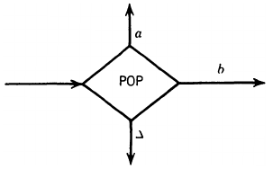

__Pushdown Automata__

_ict chapter 14_

Input tape
---
- An input tape is a type of program storage: 
- 
  - infinite, indexed, loaded with a string a time, blank cells are loaded with blanks noted as `Δ`
- the machine moves on the TAPE from left to right and never go back to a cell that was read before
- it reads one letter at a time and eliminates each as it is used 
- when it reaches the first blank cell, it stops
  - it is presumed that once the first blank is encountered, the rest of the TAPE is also blank

A `new pictorial` representation for FA
---
- Three landmark states: `START`, `ACCEPT` and `REJECT`
  - 
  - The START state is like a - state connected to another state in a TG by a ε-edge
    - has no arrows coming into it
    - read no input letter and proceed immediately to the next state
  - An `ACCEPT` state is a `dead-end` final state
    - 
    - once entered, it cannot be left
  - A `REJECT` state is also a dead-end state that is NOT final
    - 
  - the new ACCEPT and REJECT states are called `halt states`
    - they `can't be traversed` even there are remaining letters from the input string
- every function a state performs is done by a separate box in the picture such as
  - An FA state reads an input letter and branches to other states depending on what letter has been read
    - transformed to `READ` states
    - 
  - that `Δ` is read means out of input letters and the processing of the input string is done. The Δ-edge will leads to
    - ACCEPT is the stopped state is a `final` state
    - REJECT is the stopped state is `NOT` a final state
- this merely new pictorial representation for an FA has not altered the power of the FA

🍎 Example 1: another pictorial notation of FA
---
- ❶ 

| FA | PDA |
|:---:|:---:|
|  |  |

| Style 1 | ≡ | Style 2|
|:---:|:---:|:---:|
|  | ≡ |  |

---

- ❷ 

| Machine Type | Machine Graph |
|:---:|:---:|
| FA |  |
| PDA |  |

---

Adding a pushdown stack to a machine
---
- a pushdown stack is also called a pushdown store
  - is a place where input letters (or other information) can be stored and retrieved
  - is empty before the machine begins to process an input string
    - i.e. it contains blanks initially
  - supports two operations
    - `PUSH` adds a new letter to its top
      - all the other letters are pushed down accordingly
    - `POP` remove the top letter of the STACK
      - all the other letters are moved up accordingly
  - called a `LIFO` file, which stands for `last in first out`

| Operations | Stack |
|:---:|:---:|
| PUSH a  PUSH b  PUSH c  PUSH c  PUSH d  PUSH b |  |

- add a `PUSHDOWN STACK` and the operations `PUSH and POP` to the new drawings of FAs
  - the ensemble is called a `pushdown automata (PDA)`
  - branching can occur at POP states but not at PUSH states
  - a `PUSH` state can be `entered from any` direction
    - but can only be `left by one` indicated route

| POP | PUSH |
|:---:|:---:|
|  |  |

---

🍎 Example 2: A PDA
---
- 

| TAPE | STACK |
|:--:|:--:|
|  |  |

- The string `aaabbb` is recorded on the TAPE
  - run it on the PDA
  - show the growth and shrinkage of the STACK

| TAPE | STACK |
|:--:|:--:|
|  |  |
|  |  |
|  |  |
|  |  |
|  |  |

- the language accepted by this PDA is {aⁿbⁿ, n=0,1,2,⋯}
- the `a` pushed is `unrelated` to the `a` read
  - with a different stack alphabet Γ={X}, the a's now can be counted by X's
    - the read states must provide branches for a, b, or Δ
    - the POP states must provide branches for X or Δ
- push n a's onto the stack
  - 
- match a's to b's
  - 
- check the STACK is empty
  - 
- this PDA can be simplified to be
  - 

Pushdown automaton (PDA)
---
is a `connected directed graph` of eight things:

1. An alphabet Σ of input letters
2. An input TAPE 
   - infinite in one direction
   - Initially, the string of input letters is placed on the TAPE starting from cell 0. 
   - The rest of the TAPE is blank Δ.
   - it can not be written nor reread
3. An alphabet Γ of STACK characters
4. A pushdown STACK
   - infinite in one direction
   - Initially, the STACK is empty (contains all blanks Δ).
5. `finitely many states`
   1. One `START` state that has `only out-edges, no in-edges`
      
   2. `Halt` states of two kinds: 
      - some `ACCEPT` and some `REJECT`
        
      - They `have in-edges and no out-edges`
   3. Finitely many `nonbranching PUSH` states that introduce characters onto the top of the STACK
      
   4. Finitely many `branching` states of two kinds:
      1. States that `READ` the next unused letter from the `TAPE`
         - 
         - which may have one or `more` out-edges labeled with σ or Δ
         - no restrictions on `duplication` of out-edges
           - this introduces `nondeterminism`
      2. States that `POP` the top character of the `STACK`
         - 
         - which may have out-edges labeled with γ or Δ
         - again with no restrictions on duplication

Running a string on a PDA
---
- generates 
  - a unique path through `deterministic PDA (dPDA)`
    - with `exactly one edge` for each letter σ and Δ can leave either branching state READ or POP
  - several paths chosen by the operator through `nondeterministic PDA (nPDA)`
    - with `more than one edge with the same label` can leave either branching state READ or POP
    - by default a PDA is nondeterministic
- ⚠️ `nondeterministic` DOES add extra capabilities to PDA
  - while, there is NO capability difference between FA, NFA, ε-NFA and TG
- An input string with a path that ends in `ACCEPT` is said to be `accepted`
  - there may be unread letters left on the TAPE
- An input string that can follow a selection of paths is said to be accepted 
  - if `at least one` of these paths leads to ACCEPT
- The set of all input strings accepted by a PDA is called 
  - the language accepted by the PDA
  - or the language recognized by the PDA
- A rejected string `s` may 
  - `crash` the PDA if there is NO specified transition for a letter in `s`
  - or halt the PDA if `s` always ends at a `REJECT` state

---

A hierarchy of languages
---
- Languages accepted by nPDA ⊃ Languages accepted by dPDA ⊃ Languages accepted by FA or NFA or TG
- 

---

🍎 Example 3
---
A PDA accepts the language PALINDROMEX of all words of the form
- s X reverse(s)
  - s is any string in $`\mathbf{(a + b)^*}`$. The words in this language are
  - {X, aXa, bXb, aaXaa, abXba, baXab, aaaXaaa, ⋯}
- the input alphabet here Σ = {a,b,X}
- the STACK alphabet is Γ = {a,b}
- a deterministic PDA for PALINDROMEX

| s | rev(s) |
|:---:|:---:|
|  |  |

- a deterministic PDA for PALINDROMEX without `REJECT` states
  - 
  - 📝 run `abbXbba`

🍎 Example 4
---
A PDA accepts the language 
- ODDPALINDROME = {a,b,aaa,aba,bab,bbb, ⋯}
- These words are just like the words in PALINDROMEX except that the middle letter X has been changed into a or b
- so we can reuse the previous PDA by changing X into "a,b", 
  - 
  - now it becomes `nondeterministic` because the left READ state has two choices for exit edges labeled a and two choices for b
  - For every word in ODDPALINDROME, if we make the right choices, the path does lead to acceptance

- 📝 find a path for `aba`
- 

🍎 Example 5
---
A PDA accepts the language 
- EVENPALINDROME = {s reverse(s), where s is in $`\mathbf{(a + b)^*}`$}
  - = {ε, aa, bb, aaaa, abba, baab, bbbb, aaaaaa ⋯}
- again, a nondeterministic PDA
  - 
- given string `babbab`, find a path leads to
  - accept 
    - 
  - reject?
  - crash
    - 

- another crash by looping around the circuit READ1→PUSH 6 times
- the path accepts ε
  - START→READ1→POP3→ACCEPT

---

🍎 Example 6
---
A PDA accepts the language generated by the CFG
- 
- S → S + S | S*S | 4
  - `+,*,4` are the terminals
- 📝 trace the acceptance of the string `4+4*4`
  - 
  - 

---

☯ Theorem 1 
---
For every regular language L, there is a PDA that accepts it.

Prove by constructing an equivalent PDA from a FA that accepts L.
- ⚠️ the lengths of the paths formed by a given input on the PDA may be different (longer or shorter) from the FA

---

🍎 Example 7
---
A PDA accepts the language of all words beginning with an a
- 
- ⚠️ no matter how long the input string, the path is only 
  - one edge long for rejected strings
    - ex. bbaaa, b, baaa
  - or two edges long for accepted strings
    - ex. aaaa, abbb, a
  - what about the remaining letters on the TAPE?
- ❓ Questions 
  - Extend this PDA to accept all strings with a specified prefix
  - Create a PDA accepts
    - all words

---

🍎 Example 8
---
A PDA accepts the language of only the word b
- 
- but it must follow a six-­edge path to acceptance.
- ∵ The PDA can continue to process the blanks on the TAPE even after all input letters have been read, 
  - so there could exist arbitrarily long or even infinite paths caused by very short input words
- ❓ Questions 
  - Change this PDA to accept only the word b with different lengths:
    - what is the minimum length?
    - maximum length?
  - Extend this PDA to accept a finite language {w₁, w₂, ⋯, wₙ}
  - Create a PDA that accepts
    - {ε}, i.e. the language with only the empty string
    - nothing, i.e. the empty language Φ

---

🍎 Example 9
---
A PDA  
- accepts all word that start with an a in a path of two edges 
- and loops forever on any input starting with b
  - 
- ❓ Question
  - is this PDA useful?
  - revise this PDA to accepts all words

---

☯ Theorem 2
---
Given any PDA, there is another PDA that accepts exactly the same language with the addi­tional property that 
- whenever a path leads to ACCEPT, the STACK and the TAPE contain only blanks

Prove by construction:
- replace each
  - 
- with 
  - 
- The new PDA formed accepts exactly the same language and finishes all successful runs with empty TAPE and empty STACK.
