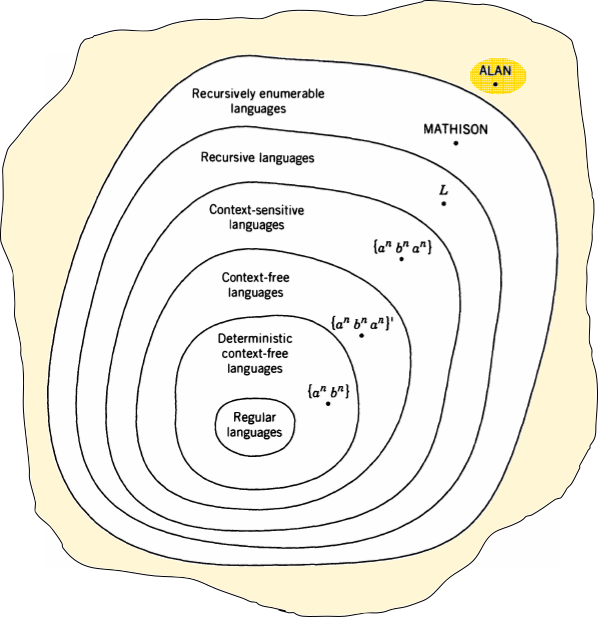

__The Chomsky  hierarchy__

_ict chapter 24_

Phrase-structure grammar (PSG)
---
a 3-element tuple (Σ, N, P)
- Σ, a finite set of letters called `terminals`
- N, a finite set of symbols called `nonterminals`
  - including the `start symbol S`
- P,  a finite list of productions of the form: stringₗ → stringᵣ
  - `stringₗ`, any `string of terminals and nonterminals` that contains `at least one nonterminal`
  - `stringᵣ`, any `string of terminals and nonterminals whatsoever`

A `derivation` in a phrase-structure grammar
--- 
- a series of `working strings` beginning with the start symbol S
- by making `substitutions` according to the productions
- arrives at a string of `all terminals` 
  - at which point generation must stop
- The `language` generated by a phrase-structure grammar is the set of all strings of terminals that can be derived starting at S

phrase-structure languages (PSL)
---
- languages generated by phrase-structure gram­mars
- a larger class of languages than the CFLs

🍎 Example
---
Given a phrase-structure grammar over Σ={a,b} with nonterminals X and S:
- ⓿ S → ε
- ❶ S → XS
- ❷ X → aX | a
- ❸ aaaX → ba

Derivations:
- ⓿❶ ⊢ S⊨X⁺
- ❷ ⊢ X⊨a⁺
- ❸ is a working-string-length decreasing production besides ε-production
  - Terminals that used to be in a working string can disappear
  - Leftmost derivations do not always exist
  - CYK algorithm does not apply
  - It is no longer possible just to read the list of nonterminals off of the left sides of productions
  - A working string may contain nonterminals and yet no production can be applied to it
    - Such a working string is not a word in the language of the grammar
    - it is a dead end
- where ❶ ❷ are working-string-length non-decreasing production

☯ Theorem 1
---
At least one language that cannot be generated by a CFG can be generated by a phrase-struc­ture grammar.

🍎 Example
---
The PSG over Σ={a,b} below generates the non-context-free language {aⁿbⁿaⁿ | n ∈ Z⁺}
- S → aSBA
- S → abA
- AB → BA
- bB → bb
- bA → ba
- aA → aa

Type 0
---
A phrase-structure grammar is called `type 0` if each production is of the form
- nonempty string of nonterminals - any string of terminals and nonterminals

☯ Theorem 2
---
Given PSL L generated by PSG P₁ over Σ, then there is another PSG P₂ over Σ generates L in which each production is of the form
- string of nonterminmals → string of terminals and nonterminals

i.e. all phrase-structure grammars are equivalent to type 0 grammars.
- other names used: 
  - nonterminal-rewriting grammars
  - context-sensitive-with-erasing grammars
  - unrestricted grammars
  - semi-Thue grammars

🍎 Example
---
The PSG over Σ={a,b} below generates the non-context-free language {aⁿbⁿaⁿ | n ∈ Z⁺}
- S → aSBA
- S → abA
- AB → BA
- bB → bb
- bA → ba
- aA → aa

can be turned into
- S → XSBA
- S → XYA
- AB → BA
- YB → YY
- YA → YX
- XA → XX
- X → a
- Y → b

The Chomsky Hierarchy of Grammars
---
| Type | Name of the language generated | Production restrictions  L → R | Acceptor |
|:--:|:--:|:--:|:--:|
| 0 | phrase-structure =recursively enumerable | L = any string with nonterminals  R = any string | TM |
| 1 | context-sensitive | L = any string with nonterminals  R = any string as long as or longer than L | TMs with bounded (not infinite) TAPE, called li near-bounded automata LBAs* |
| 2 | context-free | L = one nonterminal  R = any string | PDA |
| 3 | regular | L = one nonterminal  R = tN or R = t | FA |

- in which `N` is nonterminal and `t` is terminal

Deterministic context-free languages
---
- The set of all languages that can be ac­cepted by deterministic PDAs
- closed under complementation
- generated by `LR(k) grammars`
  - generat­ing words that can be parsed by being read from left to right
  - taking k symbols at a time

The six classes of languages
---
- Regular languages ⊂ Deterministic context-free languages {aⁿbⁿ} ⊂ Context-free languages {aⁿbⁿaⁿ}' ⊂ Context-sensitive languages {aⁿbⁿaⁿ} ⊂ Recursive languages L ⊂ Recursively enumerable languages MATHISON ⊂ ALAN
- 
  - {aⁿbⁿ} is deterministic context-free but not regular
  - {aⁿbⁿaⁿ}' is a CFL, but it cannot be accepted by a DPDA
  - {aⁿbⁿaⁿ} is context-sensitive but not context-free
  - L stands for a language that is recursive but not context-sensitive
  - MATHISON is recursively enumerable but not recursive

☯ Theorem 3
---
r.e. ≡ type 0
- If L is generated by a type 0 grammar G, then there is a TM that accepts L
- If a language is r.e., it can be generated by a type 0 grammar

☯ Theorem 4
---
- The recursively enumer­able languages are closed under product
  - i.e. If L₁ and L₂ are recursively enumerable languages, then so is L₁L₂
- The r.e. languages are closed under Keene star
  - i.e. If L is recursively enumerable, then L* is also

Context-sensitive grammars
---
- also called type 1 grammar
- a generative grammar in which the left side of each production is not longer than the right side
- presumed to be the model fo r all human languages

☯ Theorem 5
---
context-sensitive languages are recursive
- For every context-sensitive grammar G, there is some special TM that 
  - accepts all the words generated by G 
  - crashes for all other inputs
- There is at least one language L that is recursive but not context-sensitive
  - L = { all the code words for context-sensitive grammars that cannot be generated by the very grammars they encode }

☯ Theorem 6
---
Given G, a context-sensitive grammar, and w, an input string, 
- it is decidable by a TM whether G generates w