__Computers__

_ict chapter 25_

Input & output
---
- FAs are only language-acceptors
- Transducers, such as  Mealy and Moore machines, have output capabilities
- PDAs are not only language-acceptors
  - but also transducers by considering what is put into, popped from, or left in the STACK as output
- TMs always have as a natural output whatever is left on its TAP
  - when the processing of the TM terminates

Encoding numbers
---
- TMs can work as calculators by first encoding numbers as words in Σ*
- ex. a natural number `n` can be encoded as a `string of n a's` 
  - e(0) = ε, e(1) = a, e(3) = aaa, etc.
  - this is called `unary encoding` because it uses one symbol
- If Σ={a,b}, then every word in Σ* can be interpreted as a sequence of numbers (strings of a's) separated internally by b's
  - ex. babbaaa = (0 a)b(1 a)b(0 a)b(3 a's) represents 0,1,0,3
  - we assume that there is a group of a's at the beginning of the string and at the end even though these may be groups of `0 a` or no a's
- in this way, a TM can work as a calculator
  - `input numbers` represented by a string in Σ*
  - `calculation` represented by a TM program
  - `output numbers` represented by another string in Σ* left on the TAPE when the TM program terminates

🍎 Example
---
- an ADDER accepts input aⁿbaᵐ representing n+m
- 
  - inputs other than aⁿbaᵐ crashes the TM
  - n, m ∈ ℕ
- the result is aⁿ⁺ᵐ representing n+m

🍎 Example
---
Build a TM that 
- adds two numbers presented in binary notation
- leaves the answer on the TAPE in binary notation

through
- an incrementer that accepts $(0+1)* representing n
- 
  - leaves n+1 in $(0+1)* notation
- a decrementer that accepts $(0+1)* representing n
- 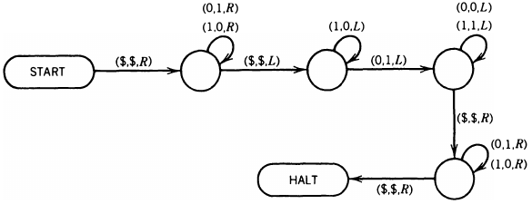
  - leaves n-1 in $(0+1)* notation
- the binary ADDER that accepts $(0+1)*$(0+1)* representing n+m
- 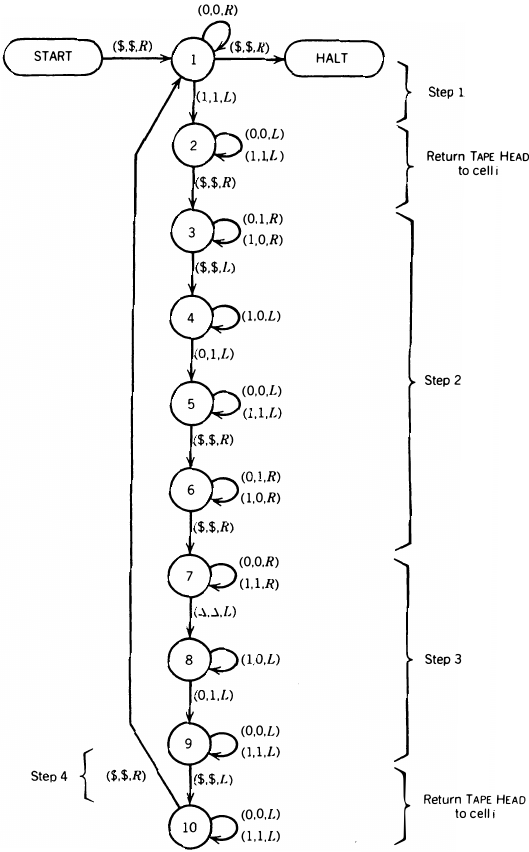
  - leaves n+m in $0*$(n+m) in binary
  - 🏃 trace `$10$0110` which leaves `$00$1000` on the tape
-

Computer
---
a TM has the property that for every word it accepts, at the time it halts, it leaves one solid string of Σ* on its TAPE starting in cell 0 
- The input string is called the `input` (a sequence of `nonnegative integers`)
- The string left on the TAPE is called the `output` (a sequence of nonnegative integers)

Computable functions
---
A computer has acted like a mathematical `function`
- if it takes `a sequence of numbers as input` and leaves only `one number as output`

Any operation that is defined on `all sequences of K numbers` (K≥1) and that can be performed by a TM is called `Turing-computable` or just `computable`

☯ Theorem 1
---
The following operations are computable
- addition: x+y
- simple subtraction: x ∸ y = x-y if x≥ y else 0
  - 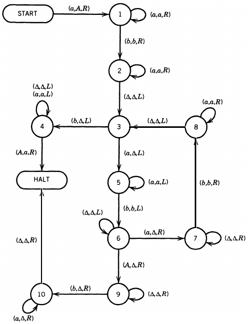
- MAX(x,y) = x if x>y else y
  - 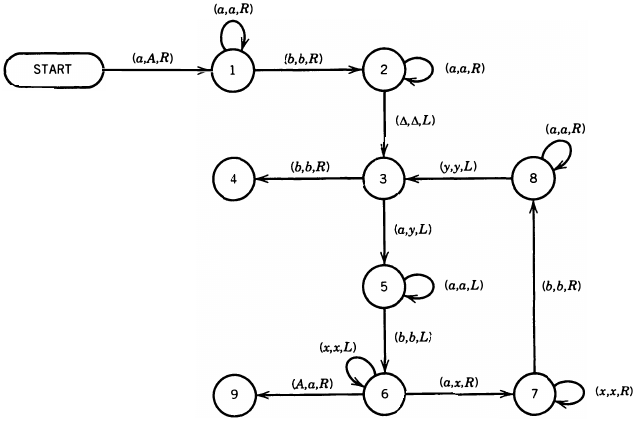
  - state 4 indicates x>y
    - 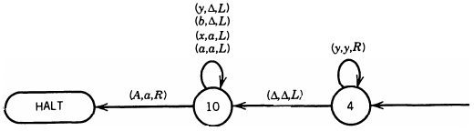
  - trace `aaabaa`, i.e. MAX(3,2) = 3
    - 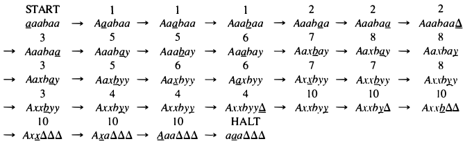
  - state 9 indicates x≤y
    - 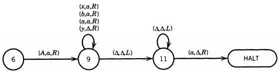
  - trace `aabaaa`, i.e. MAX(2,3) = 3
    - 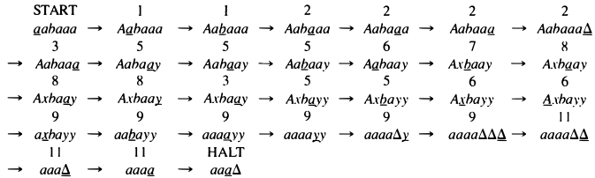
- IDENTITY(n) = n, ∀ n ≥ 0
  - 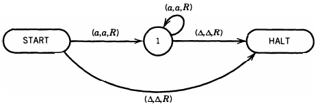
- SUCCESSOR(n)=n+1, ∀ n ≥ 0
  - 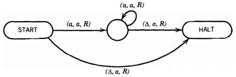
- select-the-iᵗʰ-out-of-n-numbers function: SELECT/i/n(a₁,a₂,⋯,aᵢ,⋯,aₙ), i≤n
  - ex. SELECT/2/4(8,7,1,5) = 7
  - SELECT/4/9(2,0,4,1,3,7,5,5,6) = 1
  - on the TM below, ex. let's encode SELECT/3/5(r,s,t,u,v) as $`a^rba^sba^tba^uba^v`$
  - 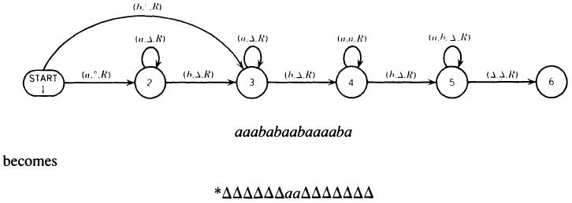
    - 📝 trace `aaababaabaaaaba`, get `*ΔΔΔΔΔΔaaΔΔΔΔΔΔΔ`
- multiplication: n×m=nm, n>0, m>0
  - $`a^mba^n→a^{mn}`$
  - idea: ex. 3×2, 
    - `aaabaa→baaabaa#→bΔaabaa#aa→bΔΔabaa#aaaa→bΔΔΔbaa#aaaaaa→bΔΔΔΔΔΔΔaaaaaa`
  - construct the TM MPY:
    - ❶ check the input, place the initial b and the # 
    - 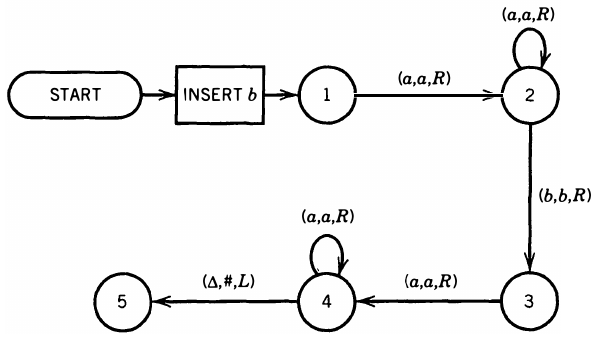
    - ❷ go back find the first a in aᵐ and convert it into a Δ
    - 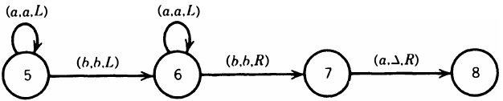
    - ❸ find the first letter of aⁿ
    - 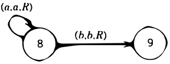
    - ❹ turn each a in aⁿ into A and copy it to the other side of the #
    - 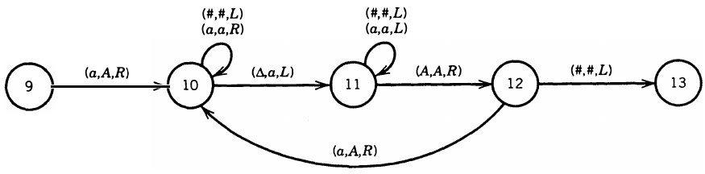
    - ❺ change those A's back to a's then look for the next a in aᵐ
    - 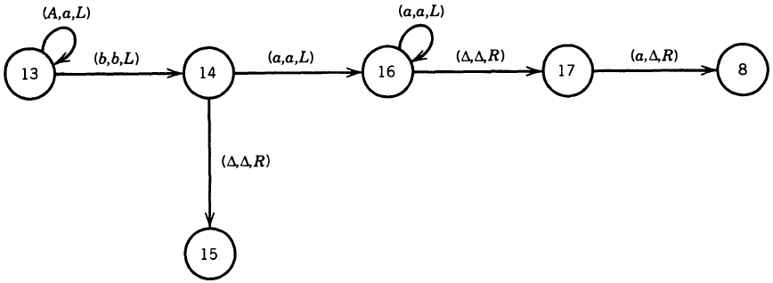
    - ❻ erase aⁿ
    - 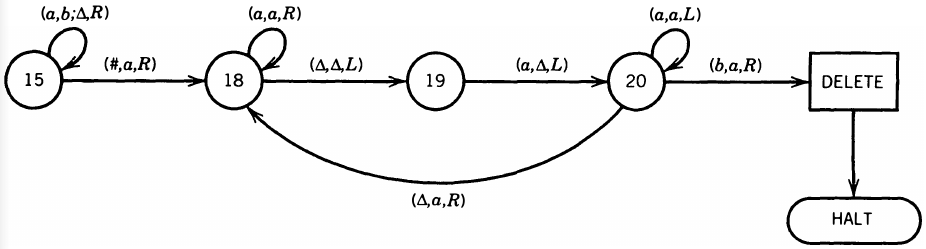
- SQRT calculates the square root of n: n ↦ ⌊√n⌋ for simplicity
  - 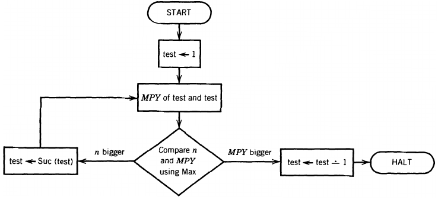

📝 Trace 2×2 on MPY
---
- 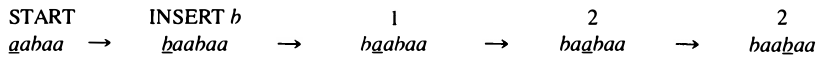
- 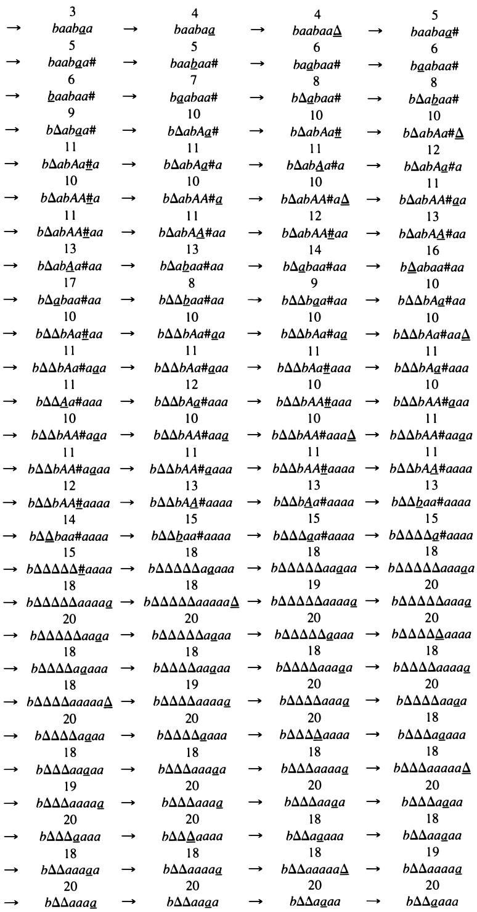
- 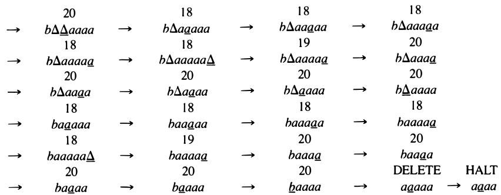

---

Church's thesis
---
- The TM is believed to be the ultimate calculating mechanism
- It is believed that there are no functions that can be defined by humans, whose calculation can be described by any well-defined mathematical algorithm that people can be taught to perform, that cannot be computed by TMs

TM roles
---
- a computer as a transducer
- a decision procedure as an acceptor
- a language L generator as printing all word from L delimited by #'s on a blank TAPE after some calculation
  - the order in which these words occur does not matter and any word may be repeated in­definitely
  - also called language enumerator

☯ Theorem 2
---
- any language that can be generated by a TM can be ac­cepted by some TM
- any language that can be accepted by a TM can be generated by some TM
- This is why the languages accepted by TMs were called `recursively enumerable`

☯ Theorem 3
---
The words in a language L can be generated by a TM in `size order` if and only if L is recursive.

- the TM enumerates all words of L in a sequence where shorter words appear before longer ones
- and words of equal length are ordered lexicographically

☠️ Uncomputable Functions
---

| `Function` | `Definition`  | `Reason for Uncomputability`  | `Applications`  |
|---|----|---|---|
| `Halting Problem`   | $`f_{\text{halt}}(M, w) = 1`$ if $M$ halts on $w$; else $0$.    | Self-reference paradox (a decider cannot exist).| - Basis for proving undecidability.   - Used in compiler optimization (limitations). |
| `Kolmogorov Complexity`  | $`K(x) =`$ shortest program outputting $x$.  | Leads to compression paradoxes.   | - Foundation of algorithmic information theory.   - Used in defining randomness. |
| `Busy Beaver ($`Σ(n)`$)` | $`Σ(n) =`$ max 1s written by a halting $n$-state TM. | Grows faster than any computable function. | - Benchmark for computability bounds.   - Studies in hypercomputation. |
| `Totality Function` | $`f_{\text{total}}(M) = 1`$ if $M$ halts on all inputs; else $0$.   | Reduces to halting problem.   | - Formal verification (showing certain properties are undecidable). |
| `Rice’s Theorem Examples` | Checks non-trivial semantic properties (e.g., "Does $M$ accept $`\epsilon`$?"). | All non-trivial semantic properties are undecidable.    | - General tool to prove undecidability.   - Limits of static code analysis. |
| `Word Problem for Groups` | Given a group and word $w$, does $`w = e`$? | Some group presentations are inherently undecidable (Novikov-Boone). | - Algebraic topology.   - Cryptography (in group-based systems). |