__Minsky's theorem__

_ict chapter 21_

2PDA
---
- A dPDA with two pushdown stacks
- it is almost the same as a dPDA except
  - its PUSH an POP operations must specify the stack they work on
  - ex. by subscripts: `PUSH₁ x, PUSH₂ y`

🍎 Example 1
---
A 2PDA that accepts {aⁿbⁿaⁿ | n=1,2,3,⋯}
- 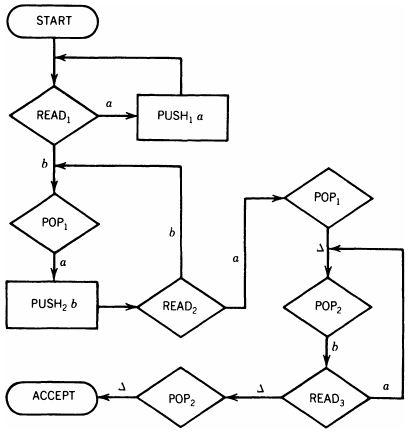
- trace `aabbaa`
- 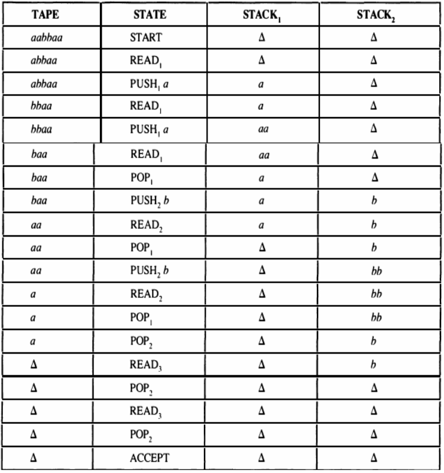

☯ Theorem 1
---
Minsky 's theorem: 2PDA ≡ TM

Proof by showing that the operations of 2PDA can be done by TM (2PDA ⇉ TM), and vice versa.

1️⃣ 2PDA ⇉ TM
---
- Idea
  - TM combines input + two stacks into one tape.  
  - Simulates `POP`/`PUSH` with tape operations.  
  - Always resets head to `#` after each step. 
- Representation of 2PDA Data:  
   - The 2PDA has three storage components:  
     - Input Tape (read-only)  
     - Stack 1  
     - Stack 2  
   - The TM combines all three into a single tape with separators (`#`, `$`).  

| 2PDA | TM |
|---|---|
| 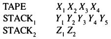 | 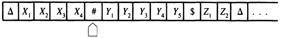 |

- Input Handling: Scan right for next symbol → branch → mark consumed → reset to #. 
   - TM scans right from # to find the first non-Δ symbol (unread input).
     - If # is encountered first → input is exhausted (halt/reject or follow 2PDA’s rule).
   - Read and Mark Consumed Symbol:
     - TM marks consumed input symbols with `Δ` mirrors the 2PDA’s advancing input head.
     - 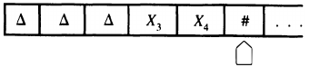
     - Move left (to avoid overshooting #).
   - Branch Based on Symbol:
     - Transition to different TM states based on the symbol read (matching 2PDA’s behavior).
   - Reset Head to #:
     - Move right until # is found (ensures consistent tape positioning).

| 2PDA | TM |
|---|---|
| 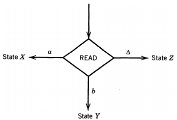 | 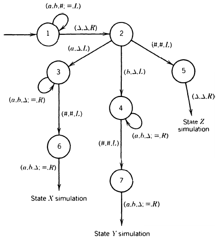 |

- Stack Simulation:  
   - Stack 1 is placed right after `#`.  
   - Stack 2 is placed after a `$` separator.  
- Operations: 
   - POP1/POP2: TM moves to the respective stack, reads the top symbol, branches accordingly, and deletes it.  
   - PUSH1/PUSH2: TM inserts a new symbol at the top of the respective stack.  
   - After each operation, the TM’s head returns to `#`.  

| 2PDA | TM |
|---|---|
| 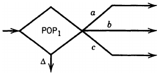 | 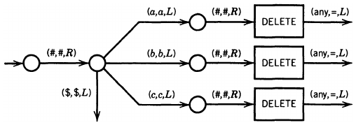 |
| 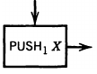 | 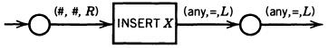 |
|  | 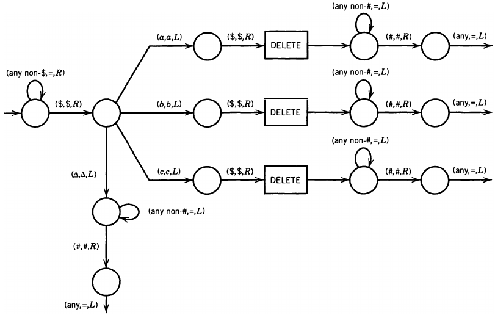 |
| 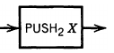 | 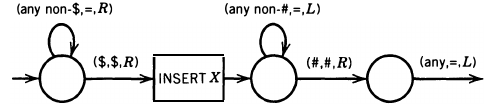 |

- Acceptance: When the 2PDA accepts, the TM halts and accepts. 

2️⃣ TM ⇉ 2PDA
---
- Idea (via PM)
  - Input copied to Stack 1 via Stack 2.  
  - `READ` = `POP1`.  
  - `ADD X` = Reverse stack, push `X`, reverse back.  
- Initialization:  
   - Transfer the input from the 2PDA’s tape to Stack 1 (via Stack 2 to maintain order).
   - 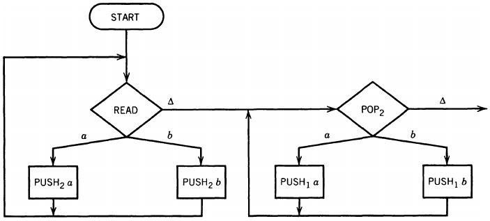
- Simulating PM Operations:  
   - READ: Equivalent to `POP1` (removes top symbol, branches accordingly).  
   - ADD X: Simulated by:  
     - Moving all of Stack 1 to Stack 2 (reversing order).  
     - Pushing `X` onto Stack 1.  
     - Moving contents back from Stack 2 to Stack 1 (restoring order with `X` at the bottom)
     - 
   - 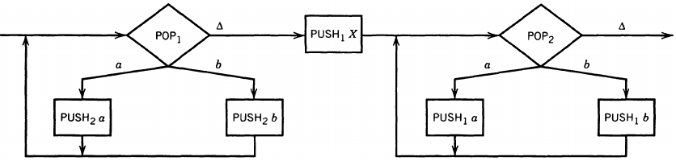
- Accept/Reject: Directly mapped to 2PDA’s accept/reject states. 

☯ Theorem 2
---
2⁺PDA ≡ TM
- 2⁺PDA has 2 and more stacks
- computing power of the models
  - `FA = TG = NFA = 0PDA < dPDA < nPDA = 1nPDA < 2dPDA = 2⁺dPDA = 2⁺nPDA = PM = nPM = TM = nTM`