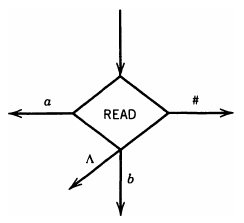
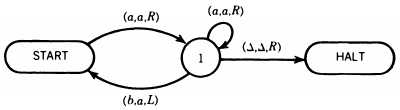

__Post machines__

_ict chapter 20_

Universal Algorithm Machine
---
- An algorithm is a `detailed, finite procedure`, 
  - but its definition is vague due to the unclear term "procedure."
- Algorithms can use `basic operations or vague actions`, 
  - prompting questions about valid steps.
- Early 20th-century goal: 
  - a `"universal algorithm machine"` with minimal operations to run any algorithm.
- Emil Post's 1936 `Post machine` aimed to recognize all human-defined languages, exceeding simpler models.
- `Post and Turing's machines` tested if all math problems could be solved algorithmically, possibly self-programming.

Post machine (PM)
---
a 5-element tuple (Σ, QUEUE, START, READ, ADD):
- `Σ`: the alphabet of input letters and a `special symbol #`
- `QUEUE or STORE`: 
  - a FIFO linear storage, 
    - letters go into it from its `tail` and out from its `head` one letter a time
      - by default, head on the left and tail on the right
    - initially contains the input string 
  - the `queue or store` alphabet `Γ` contains all characters can be used in the QUEUE
- `READ` states remove the `QUEUE head character` and branch accordingly
  - 
  - PMs are deterministic, so no two edges from the READ have the same label
    - nondeterministic PMs (nPMs) can be defined if two or more edges from the READ have the same label
      - it is proved that nPM ≡ PM
  - There may be a branch for every character in Σ or Γ
  - the `ε or Λ` branch means an empty QUEUE was read
- `ADD` states concatenate a character to the string in the QUEUE through its tail
  - 
  - No branching can take place at an ADD state
    - There may be an ADD state for every character in Σ or Γ
  - e.g. the following PM operation sequence converts an `empty` STORE to `abb`
    - 
- `An unenterable START` state and `0 or more halt states` called `ACCEPT` and `REJECT`
  - 
  - a read character in a READ state without outgoing edges crashes the PM
  - this is equivalent to taking a labeled edge into a REJECT state
  - ∴ PMs can be drawn with or without REJECT states

---

🍎 Example 1
---
❶ A PM that accepts {aⁿbⁿ | n=0,1,2,3,⋯}
- 
- trace `aaabbb`
- 

---

❷ A PM that accepts {aⁿbⁿaⁿ | n=0,1,2,3,⋯}
- 
- 📝 trace `aaabbb`

---

☯ Theorem 1
---
Any language that can be accepted by a PM can be accepted by some TM.

Proof by simulating a PM on a TM.
- keep track of the PM QUEUE by the TM TAPE

| PM QUEUE | TM TAPE |
|:---:|:---:|
| x₁x₂x₃x₄x₅ |  |
| READ→ADD a→READ→ADD a→ADD b→READ |  |

- by duplicating PM ADD and READ on the TM TAPE

| PM Operation | TM Tape change | TM program |
|:---:|:---:|:---:|
| ADD y |  |   |
|  | |  |
|  | |  |

---

🍎 Example 2
---
- Simulate PM P by a TM T 
  - the PM accepts {aⁿbⁿ | n=0,1,2,3,⋯}

| PM P | TM T |
|:---:|:---:|
| |  |

- their corresponding states
- 
- trace `aabb` on T 
- 
- a short notation is applied
  - (a,b,c,d,e;=,D) stands for the instructions
    - (a,a,D)(b,b,D)(c,c,D)(d,d,D)(e,e,D)
    - D is direction L or R

☯ Theorem 2
---
There are subprograms that enable a PM to 
- 1️⃣ add a character to the head of the string in the QUEUE
  - `ADD FRONT b`:
  - 
  - ex. `ADD FRONT b` to  `pqr`
    - 
- 2️⃣ read the character off of the tail of the string
  - `SHIFT-RIGHT CYCLICALLY`:
  - 
  - 

---

☯ Theorem 3
---
Any language that can be accepted by a TM can be accepted by some PM.

Proof by constructing a PM equivalent to a given TM:
- track the TM TAPE
  - 
  - by
  - 
  - with
  - 
  -  a correspondence between `#` and the position of the `TAPE HEAD`
- the TM converts `cat` into `dog`
  - 
- simulate a left move

| TM Operation | TM TAPE | PM QUEUE | PM Operation | 
|:---:|:---:|:---:|:---:|
| (X₄,Y,L) |  | `X₃YX₅X₆X₇X₈#X₁X₂` |   |

- Corner situation:
  - Crash of (X₁,Y,L) on 
  - which can be simulated by adding a test to see whether the first symbol in the QUEUE has become `#` in every PM simulation of a leftward TM move:
  - 
 
- A rightward TM move can be simulated symmetrically
- simulate initial state

| TM TAPE | PM QUEUE | PM initial sequence |
|:---:|:---:|:---:|
|  |  |  |

🍎 Example 3
---
- Given a TM T:
  - 
  - that accepts all strings starting with a
- build a PM equivalent to T
  - 

☯ Theorem 4
---
PM ≡ TM