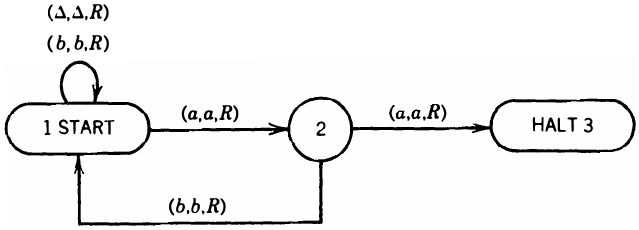
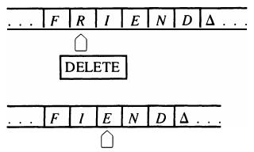

__Turing machines__

_ict chapter 19_

Languages and machines
---
| Grammar | Machine | Nondeterminism =Determinism | Language closed under | What can be decided | Application  |
|:--:|:--:|:--:|:--:|:--:|:--:|
| Regular expression | FA, TG | Yes | Union, intersection, complement, product, Kleene star | Equivalence, emptiness, finiteness, membership | Text editors, sequential circuits |
| CFG | PDA | No | Union, product, Kleene star | emptiness, finiteness, membership | programming languages, compilers |
| Type 0 grammar | TM, PM, 2⁺sPDA | Yes | Union, intersection, product, Kleene star | Not much | Computers |

Turing machines (TMs)
---
- mathematical models for the entire family of modem-day computers
  - process inputs and produce outputs
- used to study theoretical limi­tations of computability
- show certain operations can be done by computer

---

Definition of TM
---
A TM is a 6-element tuple `(Σ, TAPE, TAPE HEAD, Γ, S, P)`:
- `Σ`: an alphabet of `input` letters for building input words
- `TAPE`: a sequence of cells indexed by natural numbers
  - The `input word` is presented to the machine `one letter per cell` beginning in cell 0
  - The rest of the TAPE is initially filled with `blanks Δ's`
  - 
- `TAPE HEAD`: at every step
  - `reads` the content of the `current cell ⇧` on the TAPE
  - `replaces` it with some other character
    - replacing with Δ is called `erasing`
  - `moves` one cell left or right
  - `locates` at `cell 0` initially
  - `crashes` the TM if it was instructed to move to the left of cell 0
- `Γ`: an alphabet of `output` characters
  - it may include Σ
  - the blank Δ is neither in Γ nor in Σ
- `S`: a finite set of `states` with
  - exactly `1 START` state from which the execution begins
    - it can be reentered
  - `0 or more HALT` states that stop the execution when they are entered
  - `0 or more other states` have no functions, typically named as `q₁, q₂, ⋯, qₙ`
    - or simply labeled with positive numbers
- `P`: a `program` depicted as a `directed graph` consists of states and directed edges with labels in the form of `3-element tuples (σ, γ, direction)`
  - 
  - `input letter σ read`: the character the TAPE HEAD reads from the current cell
  - `output letter γ written`: what the TAPE HEAD prints in the cell before it leaves
  - `direction moved`:
    - `L`: move one cell left
    - `R`: move one cell right
- all Turing machines are `deterministic`
  - there are no two or more edges leaving a state labeled with the same read letter
    - not allowed: 
      - 
  - no constraints on the number of outgoing edges from a state
    - a read letter without outgoing edges crashes the TM
    - an input string led to a HALT state stops the TM successfully
      - and this string is `accepted` by the TM

---

🍎 Example 1
---
➊ Run `aba` on the TM with program P:
- 
- 
- the whole execution can be depicted by an `execution chain`
  - also called a `process chain` or `trace of execution`, or simply a `trace`
  - 
- the language accepted by this TM: ${\mathbf{(a+b)b(a+b)^*}}$
- ---

➋ TM₂ accepts {aⁿbⁿ | n=1,2,3,⋯}
- Tricks in programming TMs
  - 
  - determine where the TAPE HEAD is by `bouncing off of landmarks`
- Trace `aabb`
  - 
- then `aaabbb`
  -  
- ---

➌ TM₃ accepts PALINDROME
- 
- Trace `ababa`:
- 

---

☯ Theorem 1
---
- Every regular language has a TM that accepts it.

Proof by construction a TM from an FA accepts the RL:
- Change the edge labels a and b to (a, a, R) and (b, b, R) respectively
- Change the `-` state to the word `START`
- Erase the `+` sign in each final state F
  - then add to F an outgoing edge labeled (Δ, Δ, R) to a `HALT` state

🍎 Example 2
---
➊ build a TM to accept the language EVEN-EVEN
- the collection of all strings with an even number of a's and an even number of b's

| FA | TM |
|:--:|:--:|
|  |  |

- ---

➋ A problematic TM that accepts the language of all strings that have a double a in them somewhere
- 
- show that all the strings in `(a + b)*` can be divided into three sets on this TM:
  - Those with a double a. They are `accepted` by the TM
  - Those without aa that end in a. They `crash`.
  - Those without aa that end in b. They `loop forever`.
- These three possibilities exist for every TM
  - because the input string is just the first part of an `infinite TAPE`
  - there are always `infi­nitely many Δ's` to read after the meaningful input has been exhausted

---

Input string classification by a TM
---
Every Turing machine `T` over the alphabet Σ divides the set of input strings into `3 classes`:
- `ACCEPT(T)` is the set of all strings leading to a `HALT` state. 
  - This is also called the lan­guage accepted by T.
- `REJECT(T)` is the set of all strings that crash during execution 
  - by moving left from cell 0 
  - or by being in a state that has `no exit edge` for the read character
- `LOOP(T)` is the set of all strings that `loop forever` while running on T

---

🍎 Example 3
---
A TM T that accepts the non-context-free language {aⁿbⁿaⁿ | n=0,1,2,3,⋯}
- 
- trace `aaabbbaaa`
- 
- when T halts
  - the TAPE will hold as many *'s as there were b's in the input
  - the TAPE HEAD will be in cell (n + 1, indexed from 0) when the machine halts

---

Two subprograms
---
- `INSET` inserts a letter at current cell C
- 
  - C and all those cells to the right of C will be shifted one cell to the right
  - implemented as a TM program
  - 
- `DELETE` removes the current cell C
- 
  - all those cells to the right of C will be shifted one cell to the left
  - implemented as a TM program
  - 

---

🍎 Example 4
---
➊  A TM that accepts the language EQUAL of all strings with the same number of a's and b's
- 
- EQUAL is context-free but nonregular
- trace `baab`
- 
- idea:
  - Landmark cell 0 by INSERT # into it
  - repeat the following two procedures from cell 1
    - find the first a,  change it into an X and return the TAPE HEAD to cell 1
    - find the first b,  change it into an X and return the TAPE HEAD to cell 1
  - until when we look for an a but Δ if found
    - then scan left the TAPE to be sure that all the cells contain X's and there are no un­matched b's left 
    - When we encounter # on this pass, we accept the input

- ---

➋ Create a TM program to accept EQUAL with `DELETE`
- Landmark cell 0 by INSERT # into it
- repeat the following two procedures
  - find the first a, delete it then return the TAPE HEAD to cell 0
  - find the first b, delete it then return the TAPE HEAD to cell 0
- until it finds a Δ
  - move one cell left if what is read is # then the string is accepted
    - if what is read is b then there are excessive b's
  - if there are excessive a's, the program would crash in the hunt for the matching b