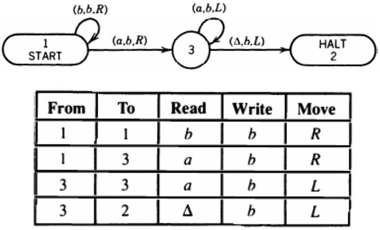

__Turing languages__

_ict chapter 23_

Recursively enumerable language
---
A language L over the alphabet Σ is called `recursively enumerable (r.e.)` if there is a TM T that 
- accepts every word in L  
  - `ACCEPT(T)=L`
- either rejects (crashes) or loops forever for every word in the complement of L
  - `REJECT(T) + LOOP(T) = L'`

Recursive language
---
A language L over the alphabet Σ is called `recursive` if there is a TM T that 
- accepts every word in L
  - `ACCEPT(T)=L`
- and rejects every word in L'
  - `REJECT(T) = L'` and `LOOP(T)=Φ`

☯ Theorem 1
---
Given a TM T = a PM P = a 2PDA A, then
- `ACCEPT(T)=ACCEPT(P)=ACCEPT(A)`
- `REJECT(T)=REJECT(P)=REJECT(A)`
- `LOOP(T)=LOOP(P)=LOOP(A)`

☯ Theorem 2
---
- ① L is recursive ↔ L' is recursive
- ② If L is r.e. and L' is also r.e., then L is recursive.

☯ Theorem 3
---
The `union and intersection` of two recursively enumerable languages is recursively enu­merable
- the set of recursively enumerable languages is `closed under union and intersection`
- Given two TMs T₁ and T₂, then there exist a TM T₃ such that
  - union: `ACCEPT(T₃)=ACCEPT(T₁) + ACCEPT(T₂)`
  - intersection: `ACCEPT(T₃)=ACCEPT(T₁) ∩ ACCEPT(T₂)`

The encoding of TMs
---
- A TM can be completely described by a `summary table`
  - Each state is encoded as a positive number
    - with START as 1 and HALT as 2
- 
  - each row is a 5-element tuple `(from, to, read, write, move)`
  - `from` and `to` are state numbers
  - `read` and `write` are characters, # or Δ
  - `move` is a direction, either L or R
- then this table can be `encoded as words of a regular language`

- For a general row 

| from | to | read | write | move |
|:--:|:--:|:--:|:--:|:--:|
| x₁ | x₂ | x₃ | x₄ | x₅ |

- `(from, to)`can be encoded as
  - $`a^{x_1} b a^{x_2}b`$, b is used as separator here
  - $`a^{x_i}`$ means a string of `xᵢ a's`
- `(read, write)` can be encoded as

| x₃, x₄ | Code |
|:--:|:--:|
| a | aa |
| b | ab |
| Δ | ba |
| # | bb |

- `move` can be encoded as

| x₅ | Code |
|:--:|:--:|
| L | a |
| R | b |

- then this row can be encoded as a word of $`{\mathbf{a^+ba^+b(a+b)^5}}`$
  - every word defined by this regular expression can be interpreted as a row of a TM summary table 
    - with one exception: We cannot leave a HALT state
    - ∴ `e(HALT)e(states other than HALT)e(read)e(write)e(move)` defines a `forbidden sublanguage`
      - e(x) means the encode of x
- any row of a TM summary table can be encoded into a string
- the whole summary table can also be encoded into one long string by concatenating the strings that represent the rows
- code word language (CWL) = the language defined by $`{\mathbf{(a^+ba^+b(a+b)^5)^*}}`$
  - every TM corresponds to a word in CWL
  - but the contrary is NOT true, such as the forbidden sublanguage
- ❓ What could happen when we feed each TM its own code word as input data?
  - Sometimes it will crash, sometimes loop, sometimes accept.

The language `ALAN`
---
- has all the words in CWL 
   -  that are `not accepted by the TMs they represent` 
   -  or that do `not represent any TM`
- is `not recursively enumerable`
- 🍎
  - TM accepts "aa" → Code has "aa" → Accepts itself → Code ∉ ALAN.  
  - TM accepts palindromes → Code isn't palindrome → Rejects itself → Code ∈ ALAN.

☯ Theorem 4
---
- Not all languages are recursively enumerable

universal TM (UTM)
---
- a TM that can be fed as input a string composed of two parts:
  - ❶ the encoded `program` of any TM T followed by a marker
  - ❷ a string that will be called `data`
- operates on the data as if it were T

☯ Theorem 5
---
- UTMs exist

☯ Theorem 6
---
MATHISON is recursively enumerable.
- MATHISON is the language of all CWL words that do represent TMs and are accepted by the very machines they represent

☯ Theorem 7
---
The complement of a recursively enumerable language might not be recursively enumerable.

☯ Theorem 8
---
There are recursively enumerable languages that are not recursive

The halting problem for TMs
---
Given an input string w and a TM T. Can we tell whether or not T halts on w?

☯ Theorem 9
---
There is no TM that can accept `any string w and any coded TM T` and always decide correctly whether T halts on w. 
- In other words, the halting problem cannot be decided by a TM

☯ Theorem 10
---
There is no TM that can decide, for every TM T fed into it in encoded form, whether or not T accepts the word ϵ.
- This is sometimes called the `blank tape problem`

☯ Theorem 11
---
There is no TM that, when fed the code word for an arbitrary TM, can always decide
whether the encoded TM accepts any words. 
- In other words, the `emptiness question for r.e. languages` cannot be decided by TM

☯ Theorem 12
---
There does not exist a TM that can decide, for any encoded TM T fed into it, whether or not the language of T is finite or infinite.