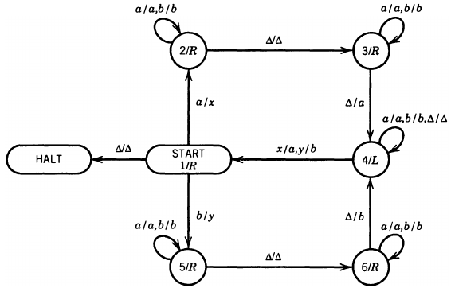
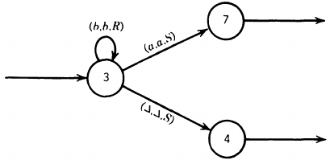
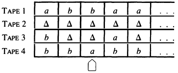
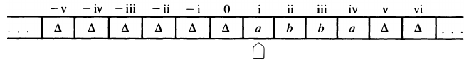
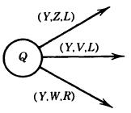

__Variations on the TM__

_ict chapter 22_

TM Variants
---
| Variant | Description | Transition Differences| Extra Features|
|---|---|---|---|
| **TM with one-way tape**| ▶️ Tape is infinite only to the right (has left end marker).   ▶️ **Book**  model | $`δ: Q × Γ → Q × Γ × \{L, R\}`$  (with left boundary)  | Can detect tape start| 
| **TM with two-way tape**| ▶️ Infinite tape extending infinitely both left and right   ▶️ **standard** model  | $`δ: Q × Γ → Q × Γ × \{L, R\}`$  (no boundary)| No left end marker|
| **Move-in-state TM**  | ▶️ Movement direction (L/R) is part of the state, not the transition   ▶️ Just a different pictorial description | $`δ: Q × Γ → Q × Γ`$  (state determines movement)| Simplified movement control  | 
| **Stay-option TM** | Head can `stay in place (S)` instead of just moving left/right.  | $`δ: Q × Γ → Q × Γ × \{L, R, S\}`$| More flexible head movement| 
| **k-track TM**  | Uses `multiple "tracks"` (layers) on a single tape (`k parallel symbols`).| $`δ: Q × Γᵏ → Q × Γᵏ × \{L, R\}`$ | Simulates multi-tape TMs| 
| **Single-tape, multi-head TM**  | One tape, but `multiple independent read-write heads`.| $`δ: Q × Γᵏ → Q × Γᵏ × \{L, R, S\}ᵏ`$  (k = #heads) | Parallel processing on one tape | 
| **Multi-tape TM**  | `Multiple tapes`, each with an independent head. | $`δ: Q × Γᵏ → Q × Γᵏ × \{L, R, S\}ᵏ`$  (k = #tapes)| Simulates real-world computers better| 
| **2D-tape TM**  | Tape extends infinitely in `two dimensions (a grid)`. | $`δ: Q × Γ → Q × Γ × \{L, R, U, D\}`$  (4-way moves)  | Spatial computation  | 
| **2D-tape multi-head TM** | 2D tape with `multiple independent heads` moving in 4 directions.| $`δ: Q × Γᵏ → Q × Γᵏ × \{L, R, U, D\}ᵏ`$  (k = #heads)| Parallel 2D computation | 
| **Nondeterministic variants**| Any of the above (multi-head, multi-tape, 2D, etc.) with `nondeterminism`. | δ returns a set of possible transitions | Branching in complex setups| 

- **☯ Theorem 0**: All TM variants are `EQUALLY capable`.

☯ Theorem 1
---
Move-in-state ≡ TM

- 🍎 A move-in-state TM
- 

☯ Theorem 2
---
Stay-option machine ≡ TM

- 🍎 A stay option besides left/right movement
- 

☯ Theorem 3
---
kTM ≡ TM
- a kTM (k-track TM) has 
  - k normal TM TAPES 
  - and one TAPE HEAD that reads correspond­ing cells on all TAPES simultaneously and can write on all TAPES at once.
- 💡 k-track

| k-track | one read/write/movement |
|---|---|
|  |  |

☯ Theorem 4
---
TMs with two-way TAPES ≡ TMs with one-way TAPES

- 💡 A two-way tape
- 

☯ Theorem 5
---
nTM ≡ dTM
- A nondeterministic TM (nTM) is defined like a TM
  - but allows more than one edge leaving any state with the same `read letter` in the label
- 

☯ Theorem 6
---
Every CFL can be accepted by some TM.

☯ Theorem 7
---
A `read-only TM`, also known as a `two-way FA`, accepts exclusively `regular languages`.