Midterm review
---
- Covers chapter 1-9

Q1
---
Summarize FA, TG, NFA, NFA-ε, Me and Mo

Comparison of Automata
---
| Attrib\Machine | FA | TG | NFA | NFA-ϵ | MOORE |MEALY |
|:---:|:---:|:---:|:---:|:---:|:---:|:---:|
| Start states |  One |  One or more |  One |  One |  One |  One | 
| Final states |  Some or None |  Some or None |  Some or none |  Some or none |  none | none |
| Edge labels |  Letters from Σ |  Words from Σ* |  Letters from Σ |  Letters from Σ and ϵ | Letters from Σ | i/o: i from Σ, o from Γ |
| Number of edges from each state |  One for each  letter in Σ |  Arbitrary |  Arbitrary |  Arbitrary |  One for each letter in Σ |  One for each letter in Σ |
| Deterministic |  Yes |  No |  No |  No |  Yes |  Yes |
| Output |  No |  No |  No |  No |  Yes |  Yes |

Q2
---
- Given a language L, when will $`L^*=L^+`$?

Q3
---
- Recursively define
  - the set of odd numbers
  - the set of integers
  - the set of positive even numbers

Q4 RE laws
---
- Two REs are equivalent if their regular languages are equal
  - $`L(\mathbf{r_1})=L(\mathbf{r_2}) → \mathbf{r_1}=\mathbf{r_2}`$
- Denote $`L(\mathbf{r_1})⊆L(\mathbf{r_2})`$  with $`\mathbf{r_1≤r_2}`$

| law | equation |
|:--:|:--:|
| basic | $`\mathbf{r+Φ = r}`$ $`\mathbf{r+r=r}`$ $`\mathbf{ϵr=rϵ=r}`$ $`\mathbf{Φr=rΦ=Φ}`$ $`\mathbf{rr^*=r^*r=r^+}`$ $`\mathbf{ϵ+r^+=r^*}`$   $`\underbrace{\mathbf{rr⋯r}}_{n\mathbf{r}'s}=\mathbf{r^n}`$  $`\mathbf{r^0=ϵ}`$   $`\mathbf{(r^*)^*=r^*r^*=r^*}`$ |
| communication | $`\mathbf{r_1+r_2=r_2+r_1}`$ |
| association | $`\mathbf{r_1+(r_2+r_3)=(r_1+r_2)+r_3}`$ $`\mathbf{r_1(r_2r_3)=(r_1r_2)r_3}`$ |
| distribution | $`\mathbf{r_1(r_2+r_3)=r_1r_2+r_1r_3}`$ $`\mathbf{(r_1+r_2)r_3=r_1r_3+r_2r_3}`$ |
| subset | $`\mathbf{r_1≤r_2 → r_1+r_2=r_2}`$   $`\mathbf{r_2+r_1r_3≤r_3→r_1^*r_2≤r_3}`$ $`\mathbf{r_2+r_3r_1≤r_3→r_2r_1^*≤r_3}`$ |
| derived | $`\mathbf{(r_1r_2)^*r_1=r_1(r_2r_1)^*}`$ $`\mathbf{(r_1^*r_2)^*r_1^*=(r_1+r_2)^*}`$   $`\mathbf{r_1^*(r_2r_1^*)^*=(r_1+r_2)^*}`$ $`\mathbf{(r_1^*r_2^*)^*=(r_1+r_2)^*}`$ $`\mathbf{(ϵ+r)^*=r^*}`$ |

Q5 Kleene's theorem
---
Theorem: Equal capability of RE,FA and TG

Any language that can be defined by
- regular expression, or
- finite automaton, or
- transition graph

can be defined by all three methods.

Q6
---
Can Mealy or Moore machine be used to define languages?

Q7
---
Find regular expressions for the following languages over Σ={a,b}. For each language, list out the first 5 simplest words.
- All words with at least one b: 
  - $`\mathbf{(a+b)^*b(a+b)^*}`$
- All words with exactly one b:
  - $`\mathbf{a^*ba^*}`$
- All words with at least one a OR at least one b
  - $`\mathbf{(a+b)^*(a+b)(a+b)^*}`$
- All words without a AND without b
  - $`\boldsymbol{ε}`$
- All words with at least one a AND at least  one b
  - $`\mathbf{(a+b)^*a(a+b)^*b(a+b)^*+(a+b)^*b(a+b)^*a(a+b)^*}`$
- All words without a OR without b
  - $`\mathbf{a^* + b^*}`$

Q8
---
Given L1={aa,b}, L2={a,bb,ab}, find
- L1+L2
- L1L2
- L2L1

Q9
---
Given TG accepts all words that begin and end with different letters
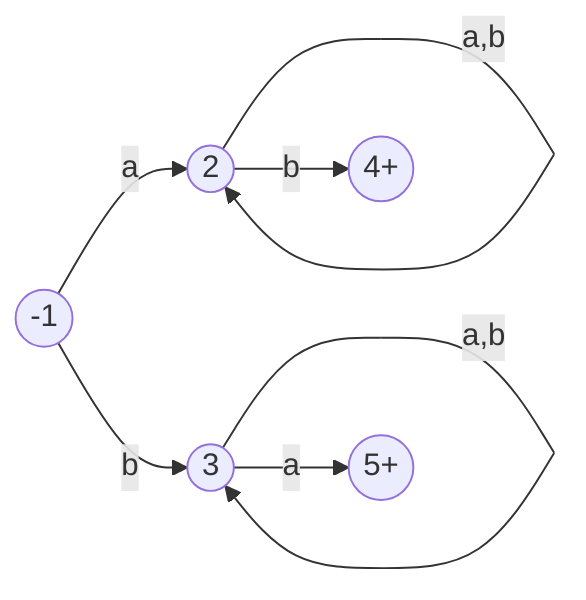
- List several words that `fail` the TG
  - words that end at non-final states
  - such as a, b, aa, bb, aaa, bbb, etc.
- List several words that `crash` the TG
  - words that end at a state without specified where to go next for the remain letters
  - such as bab, aba, etc.
- Note: `bab` can 
  - fail the TG by path: `1-3-3-3`
  - crash the TG by path: `1-3-5-`
  - we will be conservative and think it crashes the TG
- Note: when a string can fail and crash a TG by some paths but `it can also be accepted by the TG in other paths, it is defined as accepted by the TG`.
  - consider `abab`:
    - fail the TG by path: `1-2-2-2-2`
    - crash the TG by path: `1-2-3-`
    - accepted by the TG through path: `1-2-2-2-3`

Q10
---
Using Kleene's theorem, find the regular expressions and English description for the following TGs:
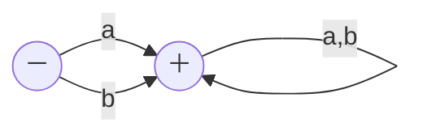
- $`\mathbf{(a+b)(a+b)^*}`$
- All words except ε
- ---
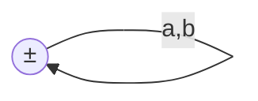
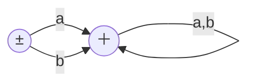
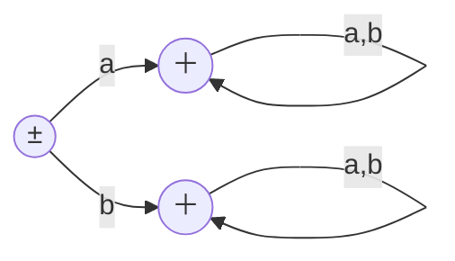

- all the three FAs accept all words
- ---
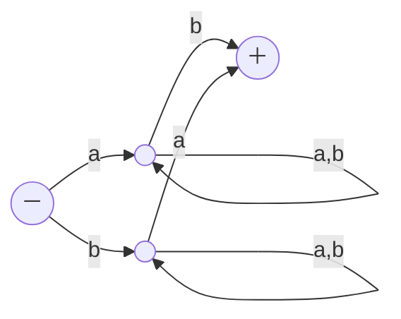
- $`\mathbf{a(a+b)^*b+b(a+b)^*a}`$
- All words have different first and last letters

- ---
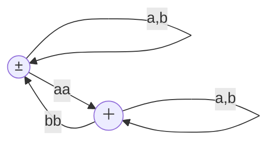
- →

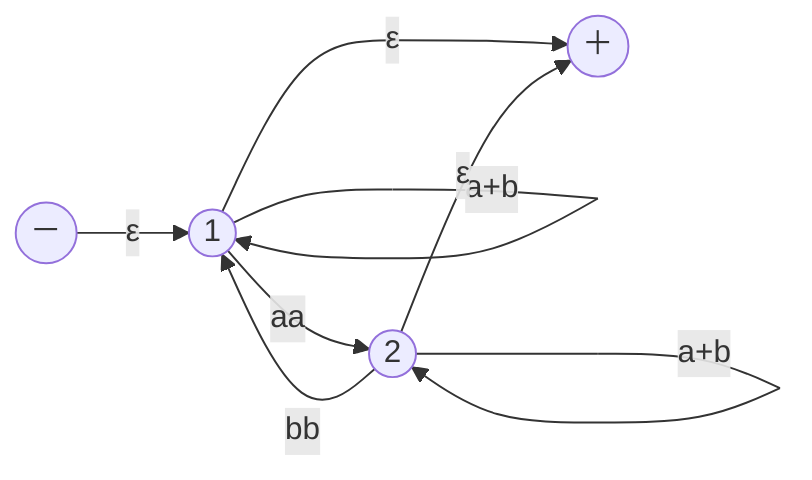
- remove or bypass state 1 →
  - two in's s and 2, two out's 2 and f passing through 1
  - s-1-2: `ε(a+b)*aa=(a+b)*aa`
  - s-1-f: `ε(a+b)*ε=(a+b)*`
  - 2-1-2: `bb(a+b)*aa`
  - 2-1-f: `bb(a+b)*ε=bb(a+b)*`

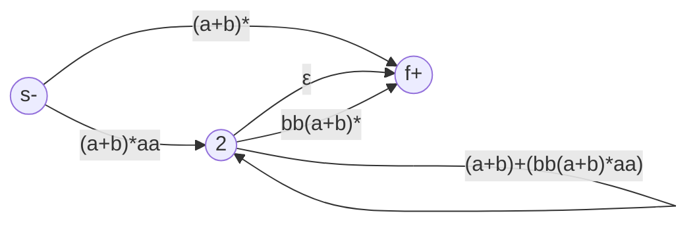
- remove or bypass state 2 →
  - 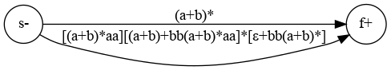

<!--
  - ⚠️ mermaid DOES NOT render correctly, check source code
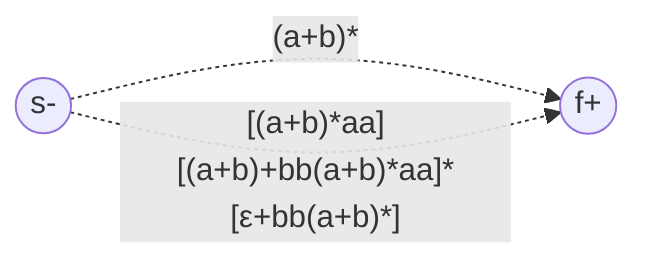

-  → ⚠️ mermaid DOES NOT render correctly, check source code
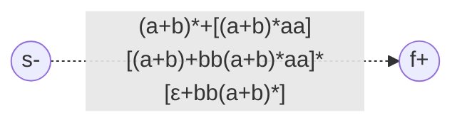
-->

- Can we describe it in plain English?

Q11
---
Given two FAs below, using Kleene's theorem, find:
- FA1+FA2
- FA1FA2
- FA2FA2
- FA1*
- FA2*

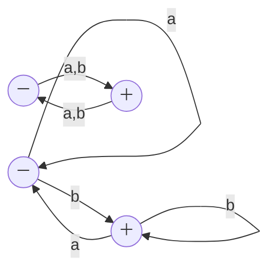
- ---
- FA1+FA2
- label the states
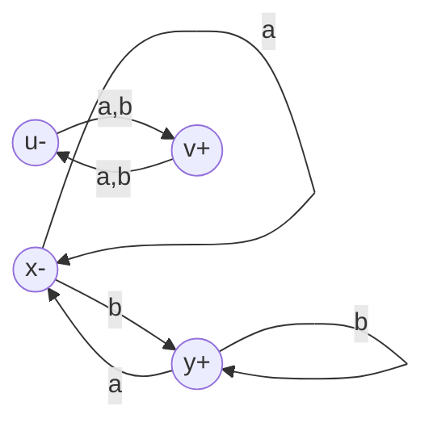
- build the transition table

| z | a | b |
|:--:|:--:|:--:|
| z1- = x- or u- | z2 = x or v | z3 = y or v |
| z2+ = x or v+ | x or u = z1 | z4 = y or u |
| z3+ = y+ or v+ | x or u = z1 | y or u = z4 |
| z4+ = y+ or u | x or v = z2 | y or v = z3 |

- ---
- FA1FA2
- build the transition table

| z | a | b |
|:--:|:--:|:--:|
| z1- = x- | x = z1 | y or u = z2 |
| z2 = y or u | x or v = z3 | y or u or v = z4 |
| z3+ = x or v+ | x or u = z5 | y or u = z2 |
| z4+ = y or u or v+ | x or u or v = z6 | y or u or v = z4 |
| z5 = x or u | x or v = z3 | y or u or v = z4 |
| z6+ = x or u or v+ | x or u or v = z6 | y or u or v = z4 |

- ---
- FA2FA2
- relabel the states
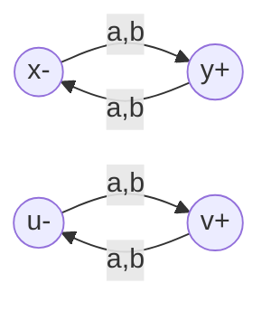
- build the transition table

| z | a | b |
|:--:|:--:|:--:|
| z1- = x- | y or u = z2 | y or u = z2 |
| z2 = y or u | x or v = z3 | x or v = z3 |
| z3+ = x or v+ | y or u = z2 | y or u = z2 |

- ---

Case 3: For an FA NOT accepting ϵ and its x1- has incoming edges, to build its FA*, two separate start states are needed,
- One of them will be x1 and a final state, let's denote it as x1ₑ
- whereas the other will be x1 and a nonfinal state, let's denote it as x1

- FA1*
- label the states
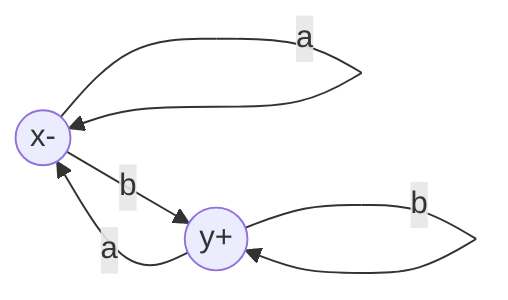
- build the transition table

| z | a | b |
|:--:|:--:|:--:|
| z1± = xₑ | x = z2 | y or x = z3 |
| z2 = x | x = z2 | y or x = z3 |
| z3+ = y+ or x | x = z2 | y or x = z3 |

- ---
- FA2*
- label the states
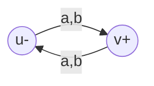
- build the transition table

| z | a | b |
|:--:|:--:|:--:|
| z1± = uₑ | v or u = z3  | v or u = z3  |
| z2 = u | v or u = z3  | v or u = z3  |
| z3+ = v+ or u | v or u = z3 | v or u = z3  |
- z2 is a dead state which can be removed

Q12
---
Given a Me below, covert the Me to a Mo, 
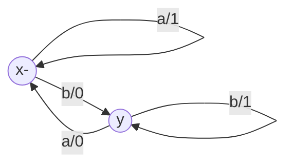
- each state has two different types of prints
- turn state x to x/1 and x/0
  - no matter x/1 as new start or x/0 

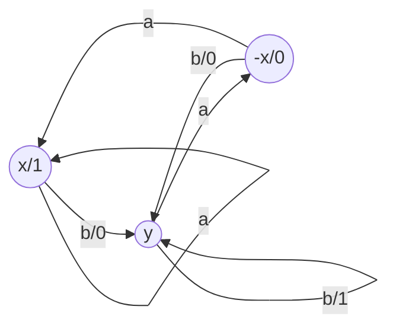
- turn state y to two

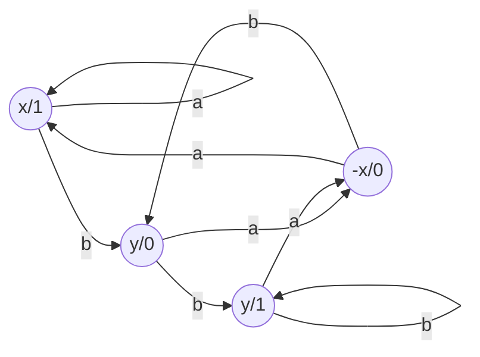