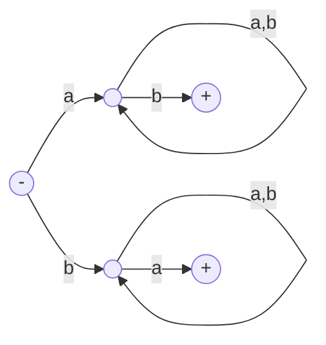
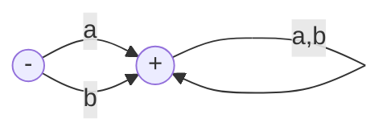
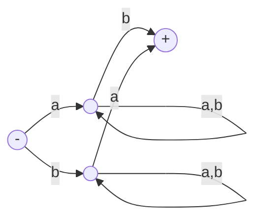

Midterm review
---
- Covers chapter 1-9

Q1
---
Summarize FA, TG, NFA, NFA-ε, Me and Mo

Comparison of Automata
---
| Attrib\Machine | FA | TG | NFA | NFA-ϵ | MOORE |MEALY |
|:---:|:---:|:---:|:---:|:---:|:---:|:---:|
| Start states |  One |  One or more |  One |  One |  One |  One | 
| Final states |  Some or None |  Some or None |  Some or none |  Some or none |  none | none |
| Edge labels |  Letters from Σ |  Words from Σ* |  Letters from Σ |  Letters from Σ and ϵ | Letters from Σ | i/o: i from Σ, o from Γ |
| Number of edges from each state |  One for each  letter in Σ |  Arbitrary |  Arbitrary |  Arbitrary |  One for each letter in Σ |  One for each letter in Σ |
| Deterministic |  Yes |  No |  No |  No |  Yes |  Yes |
| Output |  No |  No |  No |  No |  Yes |  Yes |

Q2
---
- Given a language L, when will $L^*=L^+$?

Q3
---
- Recursively define
  - the set of odd numbers
  - the set of integers
  - the set of positive even numbers

Q4 RE laws
---
- Two REs are equivalent if their regular languages are equal
  - $L(\mathbf{r_1})=L(\mathbf{r_2}) → \mathbf{r_1}=\mathbf{r_2}$
- Denote $L(\mathbf{r_1})⊆L(\mathbf{r_2})$  with $\mathbf{r_1≤r_2}$

| law | equation |
|:--:|:--:|
| basic | $\mathbf{r+Φ = r}$ $\mathbf{r+r=r}$ $\mathbf{ϵr=rϵ=r}$ $\mathbf{Φr=rΦ=Φ}$ $\mathbf{rr^*=r^*r=r^+}$ $\mathbf{ϵ+r^+=r^*}$   $\underbrace{\mathbf{rr⋯r}}_{n\mathbf{r}'s}=\mathbf{r^n}$  $\mathbf{r^0=ϵ}$   $\mathbf{(r^*)^*=r^*r^*=r^*}$ |
| communication | $\mathbf{r_1+r_2=r_2+r_1}$ |
| association | $\mathbf{r_1+(r_2+r_3)=(r_1+r_2)+r_3}$ $\mathbf{r_1(r_2r_3)=(r_1r_2)r_3}$ |
| distribution | $\mathbf{r_1(r_2+r_3)=r_1r_2+r_1r_3}$ $\mathbf{(r_1+r_2)r_3=r_1r_3+r_2r_3}$ |
| subset | $\mathbf{r_1≤r_2 → r_1+r_2=r_2}$   $\mathbf{r_2+r_1r_3≤r_3→r_1^*r_2≤r_3}$ $\mathbf{r_2+r_3r_1≤r_3→r_2r_1^*≤r_3}$ |
| derived | $\mathbf{(r_1r_2)^*r_1=r_1(r_2r_1)^*}$ $\mathbf{(r_1^*r_2)^*r_1^*=(r_1+r_2)^*}$   $\mathbf{r_1^*(r_2r_1^*)^*=(r_1+r_2)^*}$ $\mathbf{(r_1^*r_2^*)^*=(r_1+r_2)^*}$ $\mathbf{(ϵ+r)^*=r^*}$ |

Q5 Kleene's theorem
---
Theorem: Equal capability of RE,FA and TG

Any language that can be defined by
- regular expression, or
- finite automaton, or
- transition graph

can be defined by all three methods.

Q6
---
Can Mealy or Moore machine be used to define languages?

Q7
---
Find regular expressions for the following languages over Σ={a,b}. For each language, list out the first 5 simplest words.
- All words with at least one b: 
  - $\mathbf{(a+b)^*b(a+b)^*}$
- All words with exactly one b:
  - $\mathbf{a^*ba^*}$
- All words with at least one a OR at least one b
  - $\mathbf{(a+b)^*(a+b)(a+b)^*}$
- All words without a AND without b
  - $\boldsymbol{ε}$
- All words with at least one a AND at least  one b
  - $\mathbf{(a+b)^*a(a+b)^*b(a+b)^*+(a+b)^*b(a+b)^*a(a+b)^*}$
- All words without a OR without b
  - $\mathbf{a^* + b^*}$

Q8
---
Given L1={aa,b}, L2={a,bb,ab}, find
- L1+L2
- L1L2
- L2L1

Q9
---
Given TG accepts all words that begin and end with different letters

- List several words that `fail` the TG
  - words that end at non-final states
  - such as aa,aaa, bbb, etc.
- List several words that `crash` the TG
  - words that end at a state without specified where to go next for the remain letters
  - such as bab, aba, etc.

Q10
---
Find the regular expressions and English description for the following TGs:

- $\mathbf{(a+b)(a+b)^*}$
- All words except ε

- $\mathbf{a(a+b)^*b+b(a+b)^*a}$
- All words have different first and last letters