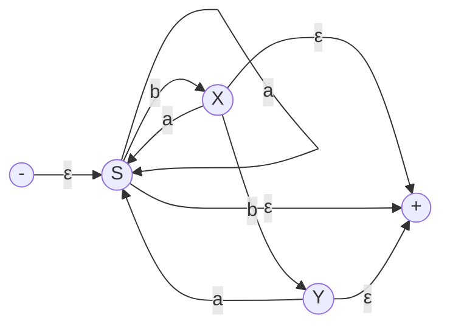
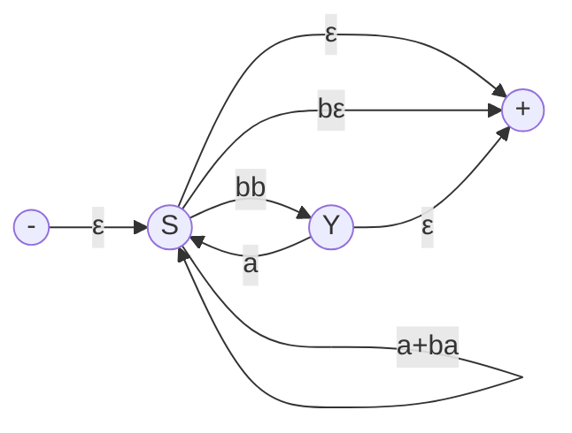
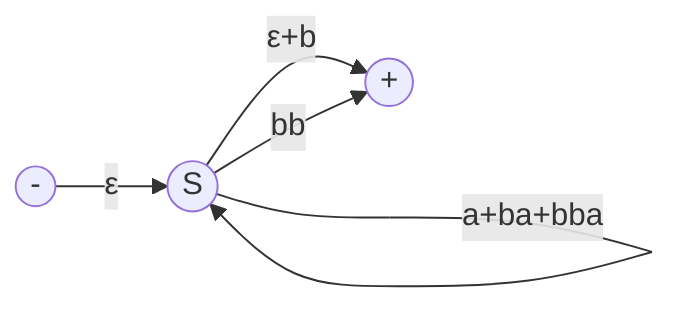
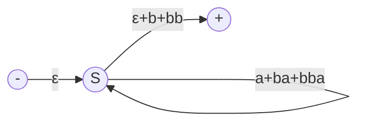
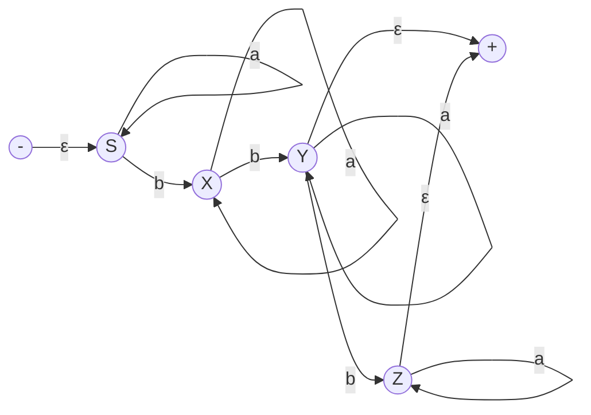
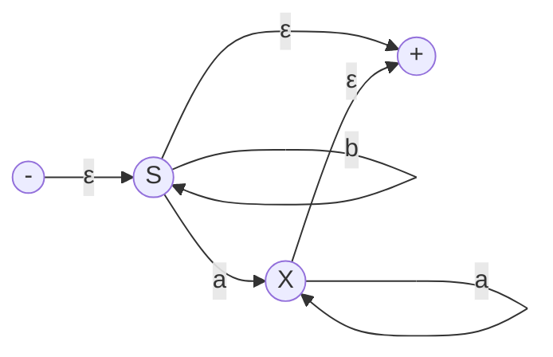

Q4
---

```mermaid
flowchart LR
  q0(("-"))
  qs(("S"))
  qx(("X"))
  qy(("Y"))
  qf(("+"))

  q0-->|ε|qs
  qs-->|"a"|qs
  qs-->|"b"|qx
  qx-->|"ε"|qf
  qx-->|"a"|qs
  qx-->|"b"|qy
  qy-->|"a"|qs
  qs-->|"ε"|qf
  qy-->|"ε"|qf
```
- →

```mermaid
flowchart LR
  q0(("-"))
  qs(("S"))
  qy(("Y"))
  qf(("+"))

  q0-->|ε|qs
  qy-->|"a"|qs
  qs-->|"ε"|qf
  qs-->|"bε"|qf
  qs-->|"a+ba"|qs
  qs-->|"bb"|qy
  qy-->|"ε"|qf
```
- →

```mermaid
flowchart LR
  q0(("-"))
  qs(("S"))
  qf(("+"))

  q0-->|ε|qs
  qs-->|"ε+b"|qf
  qs-->|"a+ba+bba"|qs
  qs-->|"bb"|qf
```
- →

```mermaid
flowchart LR
  q0(("-"))
  qs(("S"))
  qf(("+"))

  q0-->|ε|qs
  qs-->|"ε+b+bb"|qf
  qs-->|"a+ba+bba"|qs
```
- ---

```mermaid
flowchart LR
  q0(("-"))
  qs(("S"))
  qx(("X"))
  qy(("Y"))
  qz(("Z"))
  qf(("+"))

  q0-->|ε|qs
  qs-->|"a"|qs
  qs-->|"b"|qx
  qy-->|"ε"|qf
  qy-->|"a"|qy
  qy-->|"b"|qz
  qx-->|"a"|qx
  qx-->|"b"|qy
  qz-->|"a"|qz
  qz-->|"ε"|qf
```

- ---

```mermaid
flowchart LR
  q0(("-"))
  qs(("S"))
  qx(("X"))
  qf(("+"))

  q0-->|ε|qs
  qs-->|"b"|qs
  qs-->|"a"|qx
  qs-->|"ε"|qf
  qx-->|"ε"|qf
  qx-->|"a"|qx
```

