六.

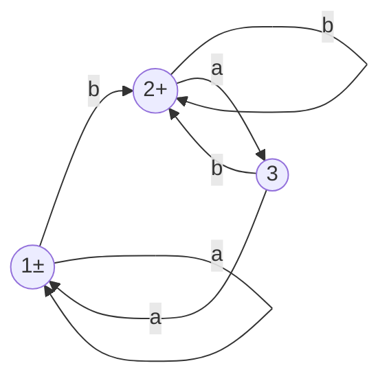
```mermaid
flowchart LR
  q1(("1±"))
  q2(("2+"))
  q3(("3"))
  q1-->|b|q2
  q1-->|a|q1
  q2-->|b|q2
  q3-->|a|q1
  q3-->|b|q2
  q2-->|a|q3
```

二.

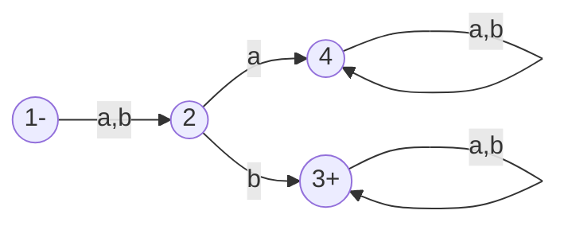
```mermaid
flowchart LR
  q1(("1-"))
  q2(("2"))
  q3(("3+"))
  q4((4))
  q1-->|"a,b"|q2
  q2-->|a|q4
  q2-->|b|q3
  q3-->|"a,b"|q3
  q4-->|"a,b"|q4
```

五.一

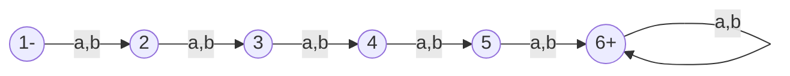
```mermaid
flowchart LR
  q1(("1-"))
  q2(("2"))
  q3(("3"))
  q4((4))
  q5((5))
  q6(("6+"))
  q1-->|"a,b"|q2
  q2-->|"a,b"|q3
  q3-->|"a,b"|q4
  q4-->|"a,b"|q5
  q5-->|"a,b"|q6
  q6-->|"a,b"|q6
```

五.二 

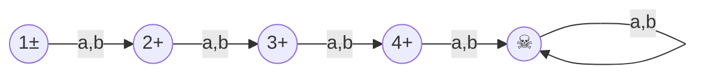
```mermaid
flowchart LR
  q1(("1±"))
  q2(("2+"))
  q3(("3+"))
  q4((4+))
  q5(("☠"))
  q1-->|"a,b"|q2
  q2-->|"a,b"|q3
  q3-->|"a,b"|q4
  q4-->|"a,b"|q5
  q5-->|"a,b"|q5
```

五.三

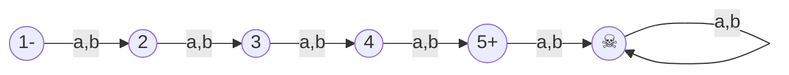
```mermaid
flowchart LR
  q1(("1-"))
  q2(("2"))
  q3(("3"))
  q4((4))
  q5(("5+"))
  q6((☠))
  q1-->|"a,b"|q2
  q2-->|"a,b"|q3
  q3-->|"a,b"|q4
  q4-->|"a,b"|q5
  q5-->|"a,b"|q6
  q6-->|"a,b"|q6
```

七.

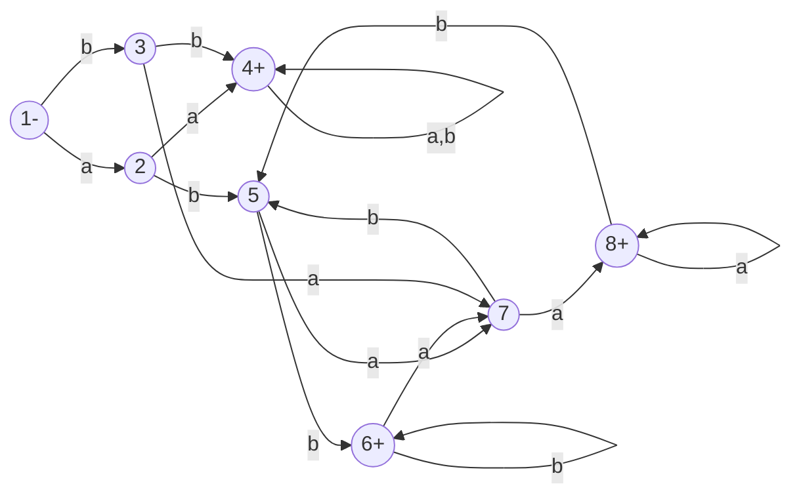
```mermaid
flowchart LR
  q1(("4+"))
  q2(("2"))
  q3(("5"))
  q4(("1-"))
  q5(("8+"))
  q6(("6+"))
  q7((3))
  q8((7))
  q1-->|"a,b"|q1
  q2-->|a|q1
  q2-->|b|q3
  q3-->|a|q8
  q3-->|b|q6  
  q4-->|a|q2
  q4-->|b|q7  
  q5-->|a|q5
  q5-->|b|q3  
  q6-->|a|q8
  q6-->|b|q6
  q7-->|a|q8
  q7-->|b|q1
  q8-->|a|q5
  q8-->|b|q3  
```

一七.一

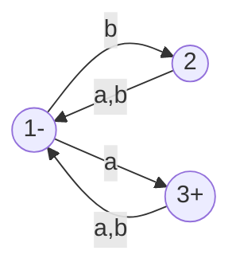
```mermaid
flowchart LR
  q1(("1-"))
  q2(("2"))
  q3(("3+"))
  q1-->|b|q2
  q1-->|a|q3
  q2-->|"a,b"|q1
  q3-->|"a,b"|q1
```

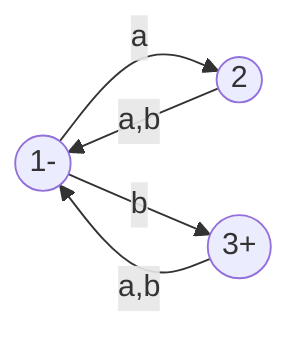
```mermaid
flowchart LR
  q1(("1-"))
  q2(("2"))
  q3(("3+"))
  q1-->|a|q2
  q1-->|b|q3
  q2-->|"a,b"|q1
  q3-->|"a,b"|q1
```

一七.二

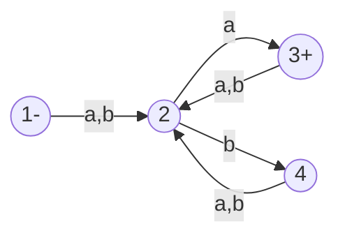
```mermaid
flowchart LR
  q1(("1-"))
  q2(("2"))
  q3(("3+"))
  q4((4))
  q1-->|"a,b"|q2
  q2-->|a|q3
  q2-->|b|q4
  q3-->|"a,b"|q2
  q4-->|"a,b"|q2
```

一七.三

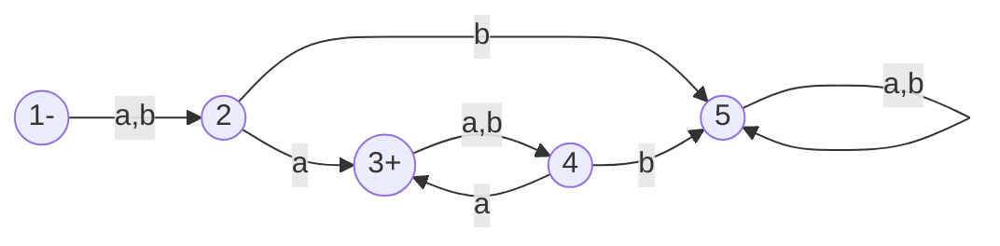
```mermaid
flowchart LR
  q1(("1-"))
  q2(("2"))
  q3(("3+"))
  q4((4))
  q5((5))
  q1-->|"a,b"|q2
  q2-->|a|q3
  q2-->|b|q5
  q3-->|"a,b"|q4
  q4-->|a|q3
  q4-->|b|q5
  q5-->|"a,b"|q5
```

普

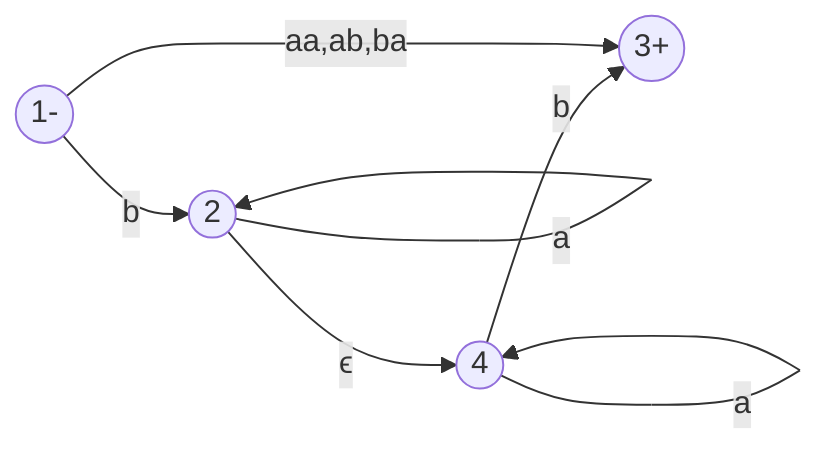
```mermaid
flowchart LR
  q1(("1-"))
  q2(("2"))
  q3(("3+"))
  q4((4))
  q1-->|b|q2
  q2-->|a|q2
  q2-->|ϵ|q4
  q4-->|a|q4
  q4-->|b|q3
  q1-->|"aa,ab,ba"|q3
```

五普

17.1
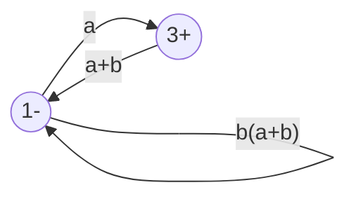
```mermaid
flowchart LR
  q1(("1-"))
  q3(("3+"))
  q1-->|a|q3
  q1-->|"b(a+b)"|q1
  q3-->|"a+b"|q1
```

```mermaid
flowchart LR
  q1(("1-"))
  q3(("3+"))
  q1-->|b|q3
  q1-->|"a(a+b)"|q1
  q3-->|"a+b"|q1
```

17.2

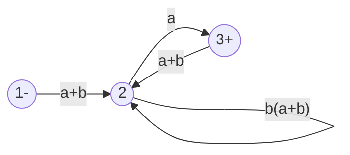
```mermaid
flowchart LR
  q1(("1-"))
  q2(("2"))
  q3(("3+"))
  q1-->|"a+b"|q2
  q2-->|a|q3
  q2-->|"b(a+b)"|q2
  q3-->|"a+b"|q2
```

17.3

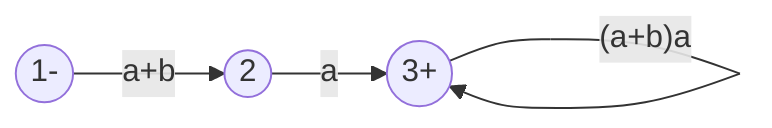
```mermaid
flowchart LR
  q1(("1-"))
  q2(("2"))
  q3(("3+"))
  q1-->|"a+b"|q2
  q2-->|a|q3
  q3-->|"(a+b)a"|q3
```

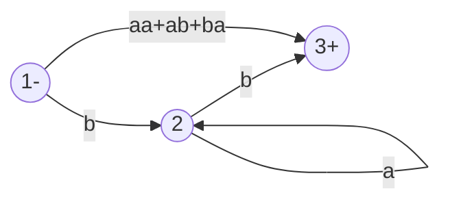
```mermaid
flowchart LR
  q1(("1-"))
  q2(("2"))
  q3(("3+"))
  q1-->|b|q2
  q2-->|a|q2
  q2-->|b|q3
  q1-->|"aa+ab+ba"|q3
```