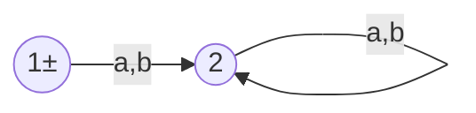
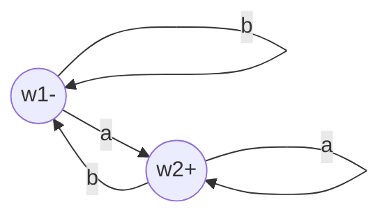
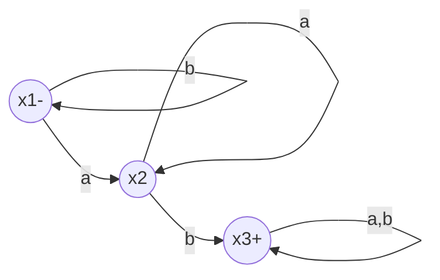

二
---
$FA_0$

$FA_1$

$FA_2$

---
FA1*
| z | a |b |
|:--:|:--:|:--:|
| z1± = w1+  | z3 = w2 or w1 | z2 = w1|
| z2 = w1 | z3 = w2 or w1 | z2 = w1 |
| z3+ = w2+ or w1 | z3 = w2 or w1 | z2 = w1 |

---
FA1FA1

| z | a |b |
|:--:|:--:|:--:|
| z1- = w1- | z2 = w2 or w1' | z1=w1 |
| z2 = w2 or w1' | z3 = w2 or w1' or w2' | z4 = w1 or w1' |
| z3+ = w2 or w1' or w2'+ | z3 = w2 or w1' or w2' | z4 = w1 or w1' |
| z4 = w1 or w1' | z3 = w2 or w1' or w2' | z4 = w1 or w1' |

---
FA1+FA2:

| z | a |b |
|:--:|:--:|:--:|
| z1- = x1- or w1- | z2 = x2 or w2+ | z1 = x1 or w1 |
| z2+ = x2 or w2+ | z2 = x2 or w2+ | z3 = x3+ or w1 |
| z3+ = x3+ or w1 | z4 = x3+ or w2+ | z3 = x3+ or w1 |
| z4+ = x3+ or w2+ | z4 = x3+ or w2+ | z3 = x3+ or w1 |

---

FA1FA2
| z | a |b |
|:--:|:--:|:--:|
| z1- = w1- | z2 = w2 or x1 | z1=w1 |
| z2 = w2 or x1 | z3 = w2 or x1 or x2 | z4 = w1 or x1 |
| z3 = w2 or x1 or x2 | z3 = w2 or x1 or x2 | z5 = w1 or x1 or x3+ |
| z4 = w1 or x1 | z3 = w2 or x1 or x2 | z4 = w1 or x1 |
| z5+ = w1 or x1 or x3+ | z6 = w2 or x1 or x2 or x3 | z5 = w1 or x1 or x3+ |
| z6+ = w2 or x1 or x2 or x3+ | z6 = w2 or x1 or x2 or x3 | z5 = w1 or x1 or x3 |