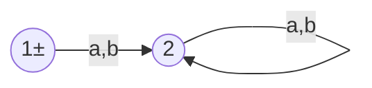
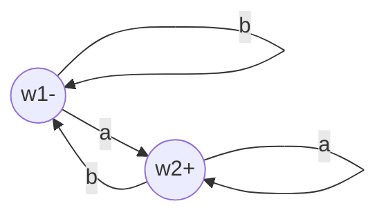
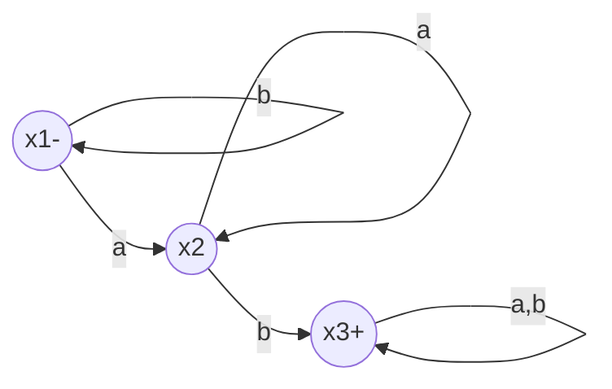

二
---
$FA_0$

$FA_1$

$FA_2$

---
FA1+FA2:

| z | a |b |
|:--:|:--:|:--:|
|z1- = x1- or w1- | z2 = x2 or w2+ | z1- = x1- or w1- |
| z2 = x2 or w2+ | z2 = x2 or w2+ | z3 = x3+ or w1- |
| z3 = x3+ or w1- | 